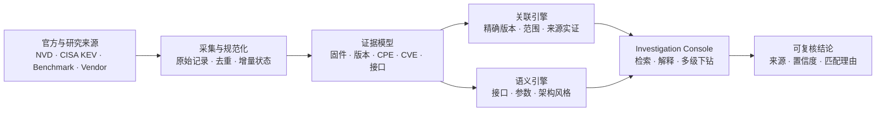

<div align="center">

<sub><b>FIRMWARE INTELLIGENCE / EVIDENCE OS</b></sub>

# FirmAtlas

### 把固件、版本、接口与漏洞放进同一张可追溯证据图谱

FirmAtlas 是一个证据驱动的一体化固件分析平台。它聚合固件样本与官方漏洞情报，提取通信接口和参数，按版本边界建立漏洞关联，并让每一个判断都能回到来源与匹配理由。

[](#快速开始)
[](./apps/console)
[](#能力矩阵)
[](./docs/security.md)

**[系统演示](#系统演示)** · **[能力矩阵](#能力矩阵)** · **[快速开始](#快速开始)** · **[技术架构](#技术架构)** · **[文档中心](#文档中心)**

</div>


## 为什么是 FirmAtlas

传统固件分析往往把“样本目录、静态分析、接口测绘、漏洞情报”拆成互不相通的工具。FirmAtlas 用统一领域模型连接这些证据，让分析者回答三个更重要的问题：

- **这个固件到底是什么？** 厂商、型号、候选版本、下载来源与制品状态分别记录，不把 URL 冒充成已验证样本。
- **它可能受哪些漏洞影响？** 精确版本、版本范围、产品范围与来源实证分层展示，并保留 CPE 边界、分值和匹配理由。
- **它的后端通信结构像谁？** 从漏洞描述中提取接口、参数与请求方式，按 `/goform`、CGI、HNAP/SOAP、动态页面控制器等架构风格聚类并推荐相似接口。

> [!IMPORTANT]
> FirmAtlas 输出的是带证据的分析线索。自动版本关联不等同于漏洞复现，候选下载地址也不等同于已下载、哈希校验的固件制品。

## 系统演示

### 调查栈：从固件一路追到漏洞证据

在固件详情中查看关联漏洞、版本边界和来源证据；继续打开漏洞时不会离开当前工作区。多级详情按调查栈展开，关闭后逐级回到原始列表与筛选状态。


### 接口智能关联：寻找相似后端通信架构

输入任意固件接口，系统优先返回原样命中和关键词命中，再根据路径命名空间、处理器命名及架构风格推荐相似接口，并同步聚合关联漏洞、厂商和固件型号。


## 能力矩阵

| 分析面 | 当前能力 | 输出证据 |
| --- | --- | --- |
| 漏洞情报 | NVD 年度 Feed、增量更新、CISA KEV、CVSS/CWE、EXP/PoC 信号 | 原始来源记录、同步状态、评分版本、更新时间 |
| 固件资产 | 公开 benchmark、研究数据集、厂商入口与候选下载地址统一检索 | 来源可信度、真实下载域名、候选版本身份、文件名与 URL |
| 版本关联 | 厂商 → 产品 → 版本三层匹配，支持精确版本与 NVD 范围边界 | 匹配类型、受影响边界、解释信号、相关性分值 |
| 接口测绘 | 从漏洞证据提取路径、CGI、HTTP 方法、参数与安全影响 | 接口原文、所属类别、参数上下文、关联 CVE |
| 架构聚类 | 表单处理器、CGI 网关、管理路由、动态页面、资源型 API、HNAP/SOAP | 相似接口、命中理由、厂商与固件型号分布 |
| 调查体验 | 固件 ↔ 漏洞 ↔ 接口多级下钻，不丢失列表与筛选上下文 | 分层面板、逐级回退、父级可见、移动端全屏层级 |
| 大规模检索 | SQLite FTS5、字段索引、服务端分页与输入防抖 | 17 万级候选无需全量加载到浏览器 |

<details>
<summary><b>当前演示数据快照</b></summary>

> 数据量会随本地同步状态变化；以下是仓库当前演示环境的快照。

| 指标 | 数量 |
| --- | ---: |
| 固件下载候选 | 173,878 |
| 已提取候选版本身份 | 115,672 |
| 实际下载域名 | 270 |
| 精确版本关联 | 515 |
| 版本范围关联 | 4,587 |
| 仅产品范围线索 | 2,420 |
| 固件—漏洞关联总数 | 7,617 |
| 已覆盖漏洞 | 647 |

</details>

## 技术架构



架构刻意区分三类对象：**外部地址**只是候选，**下载并校验后的文件**才是制品，**从制品或权威来源提取的结论**才进入证据链。更完整的边界、组件关系和部署视图见[总体架构](./docs/architecture.md)。

## 快速开始

要求 Python 3.9+。运行 Web 控制台还需要 Node.js 22.12+ 与 pnpm 10+。

```bash
git clone <your-fork-or-repository-url>
cd FirmAtlas

make test
make seed-demo
```

分别启动 API 与 Web 控制台：

```bash
# 终端 1
make api

# 终端 2
make web-install
make web-dev
```

打开 `http://127.0.0.1:5173`。只想查看领域内核的最小输出时，可运行 `make demo`。

查看新一代通信测绘 Snapshot 合同及 Tenda AC9 人工证据回放摘要：

```bash
make mapping-example
```

该命令验证版本化证据、实体、关系、覆盖账本和未决义务；它是可复现的合同示例，不代表无 seed 自动发现已经完成。设计进度和样本解释见[通信测绘引擎主控文档](./docs/firmware-mapping/README.md)。

对已解包的固件 rootfs 生成安全、确定性源制品清单：

```bash
make mapping-inventory ROOT=/path/to/extracted-root
```

输出包含清单 SHA-256、观察/处理数量、实际读取字节、归档展开字节和诊断。当前内置归档遍历以内容识别 ZIP；原始固件的 SquashFS/TAR/厂商封装解包尚未接入，输入必须是已解包目录。

原始固件解包将使用 Binwalk，但 Binwalk 只允许在隔离 extraction worker 中运行。当前仓库已经冻结父制品摘要、工具身份、`binwalk -Me` 命令证据、资源限制证明、派生 Inventory 和失败诊断的版本化合同；生产 worker 与真实原始镜像回放尚未完成，不能把该合同理解为本机已经提供 Binwalk 解包命令。

Inventory 条目现在可以通过统一的证据捕获 Interface 转换为 `firmatlas.mapping.evidence/v1alpha1` EvidenceAtom。文本与二进制证据都会校验源文件摘要、精确字节选区及选区摘要；文本另外保存可回放的 UTF-8 行列。真实 Tenda AC9 中间结果见 [M1-03 EvidenceAtom 样例](./docs/firmware-mapping/samples/tenda-ac9-m1-evidence-atoms.json)。

Frontend Request Producer 已能从声明范围内的 HTML Form、Tenda `R.pageModel/R.moduleModel` 和 jQuery `getJSON/post/ajax` 构造中恢复请求候选、方法、表示形式、参数与 operation selector，并以 EvidenceAtom 输出。它区分动态 URL 的 literal prefix、合并重复调用身份但保留多处证据；AC9、HNAP 与共享 CGI 的对比输出见 [M1-04 样例](./docs/firmware-mapping/samples/m1-04-frontend-producer-summary.json)。

Web Configuration Producer 已能从 nginx 配置和直接 POSIX shell 启动项恢复 listener、docroot、namespace mapping、auth requirement 与 service start finding。AC9 的真实配置回放确认了 `:8180 → /cgi-bin/luci/ → 127.0.0.1:8188 → app_data_center`，并明确保留 `/goform/*` 与主 `dhttpd/httpd` binding 为未知；完整中间输出见 [M1-05 样例](./docs/firmware-mapping/samples/m1-05-web-configuration-summary.json)。

<details>
<summary><b>同步完整 NVD 情报</b></summary>

获取最近一天的官方情报：

```bash
PYTHONPATH=src python3 -m firmatlas intelligence sync \
  --source nvd --source cisa-kev --days 1
```

需要完整本地 NVD 数据集时，先初始化年度 Feed，再周期执行统一增量更新：

```bash
# 首次：2002 至当前年份的 JSON 2.0 feeds
make intelligence-bootstrap

# 后续：按 META 判断变化并导入 modified feed
make intelligence-update
```

压缩包保存在 `var/nvd-feeds/`，规范化记录、原始来源、FTS5 索引和 Feed 状态保存在 `var/firmatlas.db`。命令可安全重跑；SHA-256 未变化且已成功导入的年度会被跳过。NVD API Key 可通过 `NVD_API_KEY` 提供，未提供时客户端自动使用更保守的分页间隔。完整导入需要数百 MB 下载空间和更大的 SQLite 空间。

详细机制见[情报采集实现](./docs/intelligence-acquisition.md)。

</details>

<details>
<summary><b>同步固件目录并重建版本关联</b></summary>

```bash
# 流式写入公开来源、样本候选与来源实证关系
make firmware-catalog-sync

# 根据本地 NVD CPE、精确版本与版本边界重建关联
make firmware-version-link

# 同时刷新目录和版本关联
make firmware-refresh
```

关联器从来源字段和文件名提取带证据的候选版本身份，再与 NVD vulnerable CPE 做厂商、产品和版本匹配：

- `exact_version`：候选版本等于 CPE 明确版本；
- `version_range`：版本方案兼容，且落在 NVD 起止边界内；
- `product_scope`：NVD 将该产品所有版本列为受影响，仅代表产品范围；
- `curated_evidence`：来自 benchmark 或研究仓库的明确环境映射。

版本方案不兼容时不会生成范围关联，避免把日期构建号与点分版本互相排序。每次更新漏洞 Feed 或固件目录后，应重新执行 `make firmware-version-link`；重建只替换自动派生关系，保留人工整理和来源实证关系。

数据来源、已验证 raw 地址、SHA-256 和数据质量异常见[固件样本来源研究](./docs/research-firmware-sample-sources.md)。

</details>

<details>
<summary><b>固件目录查询 API</b></summary>

| API | 用途 |
| --- | --- |
| `GET /api/firmware/overview` | 来源、候选、版本身份与各类漏洞关系总览 |
| `GET /api/firmware/sources` | 查询已登记来源；即使暂无具体样本也保留入口 |
| `GET /api/firmware/candidates` | 按 CVE、厂商、型号、版本、主机或文件名检索 |
| `GET /api/firmware/candidates/{candidate_id}` | 查看候选地址、来源证据和关联漏洞 |
| `GET /api/firmware/vulnerabilities/{CVE}/samples` | 从漏洞反查关联固件样本 |

候选查询支持 `vendor`、`source`、`host`、`has_vulnerability` 和 `match=version|exact_version|version_range|product_scope|curated_evidence`，并使用服务端分页。

</details>

## 当前状态与路线图

| 状态 | 模块 |
| --- | --- |
| **Available** | 漏洞情报同步与检索、固件候选目录、版本/CPE 关联、双向下钻、接口与参数语义分析、架构风格分类与推荐、Snapshot v1alpha1 合同、已解包 rootfs 的安全确定性清单、可回放 EvidenceAtom、声明范围内的 Frontend 与 nginx/启动项证据 Producer |
| **Next** | 脚本后端与 Native route/handler 绑定、无样例线索调度、固件上传与 SHA-256 制品去重、生产 Binwalk 隔离 worker、文件系统与组件 SBOM |
| **Later** | 同型号版本差异、通信拓扑、漏洞重评估与持续提醒、复现与人工复核工作流 |

首个完整纵向切片的目标是：**固件入库 → 隔离解包 → 组件/服务/接口测绘 → 历史漏洞关联 → 版本差异 → 情报变化重评估**。详见[功能范围与路线图](./docs/product-scope.md)。

## 文档中心

| 文档 | 内容 |
| --- | --- |
| [通信测绘引擎主控文档](./docs/firmware-mapping/README.md) | 无样例冷启动、线索传播、模块设计、当前里程碑与跨会话进度 |
| [领域词汇](./CONTEXT.md) | 固件版本、文件、候选、制品和漏洞命中的统一语义 |
| [总体架构](./docs/architecture.md) | 模块边界、数据流和部署视图 |
| [产品范围](./docs/product-scope.md) | 能力边界、阶段目标和路线图 |
| [安全基线](./docs/security.md) | 如何处理不可信固件输入 |
| [情报源与同步策略](./docs/intelligence-sources.md) | 官方来源、刷新策略与证据保留 |
| [情报采集实现](./docs/intelligence-acquisition.md) | NVD/CISA KEV 增量与全量同步机制 |
| [固件样本来源研究](./docs/research-firmware-sample-sources.md) | 来源清单、完整性验证和质量异常 |
| [历史漏洞固件研究构想](./docs/research-idea-historical-firmware-vulnerability-knowledge.md) | 通信结构、历史案例、漏洞机制和后续论文方向 |

## 仓库结构

```text
FirmAtlas/
├── src/firmatlas/     # 领域内核、情报同步、关联与 API
├── apps/web/          # React Intelligence Console
├── analyzers/         # 分析器接入约定与演进位置
├── tests/             # 领域与接口测试
├── deploy/            # 本地及生产部署定义
└── docs/              # 架构、安全、产品与来源研究
```

## 设计原则

1. **证据优先** — 每个结论都能回到原始制品、来源记录、路径或工具输出。
2. **事实与判断分离** — 提取事实保持稳定，漏洞匹配和相关性可以重复计算。
3. **可复现** — 报告绑定制品摘要、分析器版本、规则版本和运行参数。
4. **允许不确定性** — 版本、接口和漏洞匹配都保留置信度及复核状态。
5. **默认隔离** — 固件与解包内容是不可信输入，不在控制面进程内执行。

---

<div align="center">
<sub>FirmAtlas · Map the firmware. Preserve the evidence.</sub>
</div>
