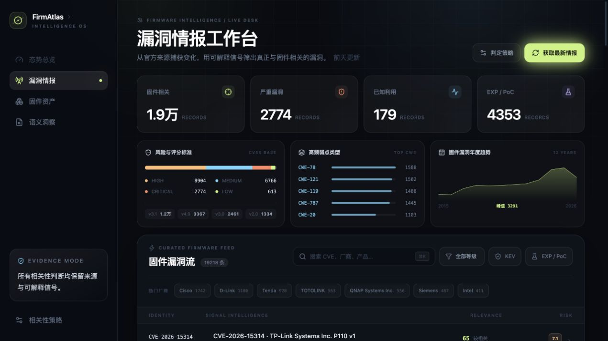
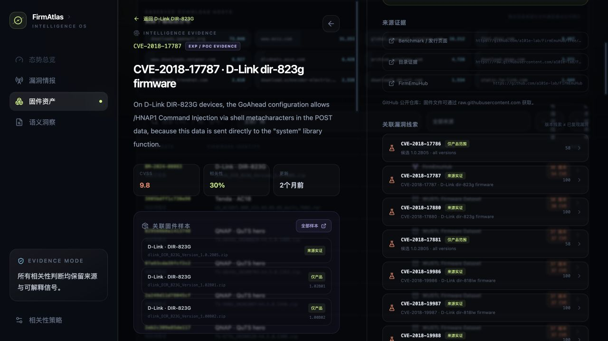
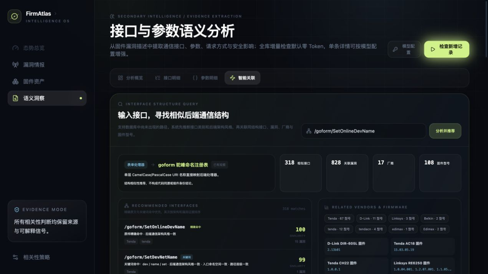
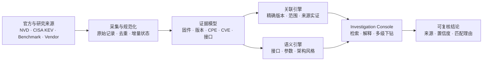

<div align="center">

<sub><b>FIRMWARE INTELLIGENCE / EVIDENCE OS</b></sub>

# FirmAtlas

### 把固件、版本、接口与漏洞放进同一张可追溯证据图谱

FirmAtlas 是一个证据驱动的一体化固件分析平台。它聚合固件样本与官方漏洞情报，提取通信接口和参数，按版本边界建立漏洞关联，并让每一个判断都能回到来源与匹配理由。

[](#快速开始)
[](./apps/console)
[](#能力矩阵)
[](./docs/security.md)

**[系统演示](#系统演示)** · **[能力矩阵](#能力矩阵)** · **[快速开始](#快速开始)** · **[技术架构](#技术架构)** · **[文档中心](#文档中心)**

</div>



## 为什么是 FirmAtlas

传统固件分析往往把“样本目录、静态分析、接口测绘、漏洞情报”拆成互不相通的工具。FirmAtlas 用统一领域模型连接这些证据，让分析者回答三个更重要的问题：

- **这个固件到底是什么？** 厂商、型号、候选版本、下载来源与制品状态分别记录，不把 URL 冒充成已验证样本。
- **它可能受哪些漏洞影响？** 精确版本、版本范围、产品范围与来源实证分层展示，并保留 CPE 边界、分值和匹配理由。
- **它的后端通信结构像谁？** 从漏洞描述中提取接口、参数与请求方式，按 `/goform`、CGI、HNAP/SOAP、动态页面控制器等架构风格聚类并推荐相似接口。

> [!IMPORTANT]
> FirmAtlas 输出的是带证据的分析线索。自动版本关联不等同于漏洞复现，候选下载地址也不等同于已下载、哈希校验的固件制品。

## 系统演示

### 调查栈：从固件一路追到漏洞证据

在固件详情中查看关联漏洞、版本边界和来源证据；继续打开漏洞时不会离开当前工作区。多级详情按调查栈展开，关闭后逐级回到原始列表与筛选状态。



### 接口智能关联：寻找相似后端通信架构

输入任意固件接口，系统优先返回原样命中和关键词命中，再根据路径命名空间、处理器命名及架构风格推荐相似接口，并同步聚合关联漏洞、厂商和固件型号。



## 能力矩阵

| 分析面 | 当前能力 | 输出证据 |
| --- | --- | --- |
| 漏洞情报 | NVD 年度 Feed、增量更新、CISA KEV、CVSS/CWE、EXP/PoC 信号 | 原始来源记录、同步状态、评分版本、更新时间 |
| 固件资产 | 公开 benchmark、研究数据集、厂商入口与候选下载地址统一检索 | 来源可信度、真实下载域名、候选版本身份、文件名与 URL |
| 版本关联 | 厂商 → 产品 → 版本三层匹配，支持精确版本与 NVD 范围边界 | 匹配类型、受影响边界、解释信号、相关性分值 |
| 接口测绘 | 从漏洞证据提取路径、CGI、HTTP 方法、参数与安全影响 | 接口原文、所属类别、参数上下文、关联 CVE |
| 架构聚类 | 表单处理器、CGI 网关、管理路由、动态页面、资源型 API、HNAP/SOAP | 相似接口、命中理由、厂商与固件型号分布 |
| 潜在隐藏接口 | 全固件 Native 注册减去 completed 客户端范围，默认选择每个固件最新目录 | 注册二进制、handler、覆盖 scope、证据 identity、运行时原因义务 |
| 固件版本结构差异 | 覆盖感知地对齐同型号不可变测绘目录，比较接口、参数与潜在隐藏接口 | 发行身份依据、coverage/profile 边界、增删改置信度、BASE/TARGET 证据 |
| 调查体验 | 固件 ↔ 漏洞 ↔ 接口多级下钻，不丢失列表与筛选上下文 | 分层面板、逐级回退、父级可见、移动端全屏层级 |
| 大规模检索 | SQLite FTS5、字段索引、服务端分页与输入防抖 | 17 万级候选无需全量加载到浏览器 |

<details>
<summary><b>当前演示数据快照</b></summary>

> 数据量会随本地同步状态变化；以下是仓库当前演示环境的快照。

| 指标 | 数量 |
| --- | ---: |
| 固件下载候选 | 173,878 |
| 已提取候选版本身份 | 115,672 |
| 实际下载域名 | 270 |
| 精确版本关联 | 515 |
| 版本范围关联 | 4,587 |
| 仅产品范围线索 | 2,420 |
| 固件—漏洞关联总数 | 7,617 |
| 已覆盖漏洞 | 647 |

</details>

## 技术架构



架构刻意区分三类对象：**外部地址**只是候选，**下载并校验后的文件**才是制品，**从制品或权威来源提取的结论**才进入证据链。更完整的边界、组件关系和部署视图见[总体架构](./docs/architecture.md)。

## 快速开始

要求 Python 3.9+。运行 Web 控制台还需要 Node.js 22.12+ 与 pnpm 10+。

```bash
git clone <your-fork-or-repository-url>
cd FirmAtlas

make test
make seed-demo
```

分别启动 API 与 Web 控制台：

```bash
# 终端 1
make api

# 终端 2
make web-install
make web-dev
```

打开 `http://127.0.0.1:5173`。只想查看领域内核的最小输出时，可运行 `make demo`。

查看新一代通信测绘 Snapshot 合同及 Tenda AC9 人工证据回放摘要：

```bash
make mapping-example
```

该命令验证版本化证据、实体、关系、覆盖账本和未决义务；它是可复现的合同示例，不代表无 seed 自动发现已经完成。设计进度和样本解释见[通信测绘引擎主控文档](./docs/firmware-mapping/README.md)。

对已解包的固件 rootfs 生成安全、确定性源制品清单：

```bash
make mapping-inventory ROOT=/path/to/extracted-root
```

对已解包 rootfs 执行统一冷启动测绘并保存完整运行清单：

```bash
PYTHONPATH=src python3 -m firmatlas.mapping analyze-root /path/to/rootfs \
  --artifact-sha256 <original-firmware-sha256> \
  --profile auto \
  --output mapping-analysis-run.json
```

该入口会自动建立 Source Plan，运行 Frontend、跨资源 Frontend Asset Graph、Web configuration、Script backend、Native shallow、Correlation 和 Scheduler，并按版本化 Profile/Registry 自动选择适用的 ARM PIC、Native ubus 等确定性深化 Adapter，最后发布不可变 Discovery Catalog；单个 producer 失败会保留为 partial stage/coverage，不会伪装成空成功。当前默认 `auto-v7` 在 `auto-v6` 基线上加入固件内 JSON response-fixture 契约恢复，把 endpoint clue 和嵌套 response JSON pointer 发布为明确的 `fixture_declared` Catalog candidate/parameter，并要求 route binding 或 runtime observation 才能晋级；`auto-v6` 及更早 Profile 继续冻结重放。首要样本最新结果见 [R2-10 原厂 Tenda AC9](./docs/firmware-mapping/progress/2026-08-09-r2-10-ac9-response-fixture-contracts.md)，同硬件 OpenWrt 对照见 [R2-02 OpenWrt AC9](./docs/firmware-mapping/samples/r2-02-tenda-ac9-auto-profile.json)。参数线索索引对已验证的前端请求参数执行有界同固件精确 token 检索，显式发布阳性、阴性与覆盖受限结果，但不会把字符串共现冒充数据流。

历史漏洞接口只能在声明版本与当前制品范围明确后用于测绘差异，不能直接当作固件真值：

```bash
PYTHONPATH=src python3 -m firmatlas.mapping compare-history /path/to/rootfs \
  --artifact-sha256 <original-firmware-sha256> \
  --expectations historical-expectations.json \
  --profile auto \
  --output historical-expectation-diff.json
```

输出区分接口/参数/method/dispatcher/coverage/artifact-scope 缺口，并保留 Catalog candidate 与 EvidenceAtom 引用。原厂 AC9 的 [R2-04 报告](./docs/firmware-mapping/samples/r2-04-vendor-tenda-ac9-framework-history.json)同时固化 13 条结构化 expectation、71 条产品级漏洞全集、30 条当前样本级复现关联和 route→handler 覆盖；产品同名记录不会被自动当作当前版本事实。

输出包含清单 SHA-256、观察/处理数量、实际读取字节、归档展开字节和诊断。Inventory v1alpha2 会在固件 chroot 内解析绝对与链式 symlink，但不会经链接打开或散列目标；普通缺失、循环、深度耗尽和越界仍进入 coverage ledger。内置 Inventory 只读取已解包目录并以内容识别 ZIP；原始固件的 SquashFS/TAR/厂商封装由独立 Container Extraction Worker 处理，不能把原始固件直接交给此命令。

原始固件解包使用 Binwalk，但 Binwalk 只允许在隔离 extraction worker 中运行。当前仓库已经实现只接受固定镜像摘要的 `ContainerBinwalkWorker`，强制禁网、只读根/输入、能力清空、`no-new-privileges`、PID/CPU/内存、输出和日志预算，并保留父制品、工具、命令、派生 Inventory 与失败诊断谱系。真实 DAP-3520 选定 rootfs 的 v1alpha2 重放处理 753 个节点并达到 completed，发布包含 `/HNAP1 → /usr/sbin/hnap` 和 PHP-XGI 页面控制器的 completed Catalog；DIR-882 的零产物回放则被明确标为 `extraction.no_output`。固定发布镜像重建仍在进行中，详见 [M1-02B 记录](./docs/firmware-mapping/progress/2026-08-09-m1-02b-container-binwalk-worker.md)和 [M1-13 记录](./docs/firmware-mapping/progress/2026-08-09-m1-13-chroot-symlink-inventory.md)。

Inventory 条目现在可以通过统一的证据捕获 Interface 转换为 `firmatlas.mapping.evidence/v1alpha1` EvidenceAtom。文本与二进制证据都会校验源文件摘要、精确字节选区及选区摘要；文本另外保存可回放的 UTF-8 行列。真实 Tenda AC9 中间结果见 [M1-03 EvidenceAtom 样例](./docs/firmware-mapping/samples/tenda-ac9-m1-evidence-atoms.json)。

Frontend Request Producer 已能从声明范围内的 HTML Form、Tenda `R.pageModel/R.moduleModel`、jQuery `getJSON/post/ajax`、对象式 `request`、同制品 shared-CGI wrapper 和 LuCI `rpc.declare` 中恢复请求候选、方法、表示形式、参数与 operation selector，并以 EvidenceAtom 输出。LuCI RPC 使用 `ubus://object/method` 表示逻辑操作，不伪造固定 HTTP URL；动态 object/method 会使覆盖保持 partial。AC9、HNAP 与共享 CGI 的对比输出见 [M1-04 样例](./docs/firmware-mapping/samples/m1-04-frontend-producer-summary.json)。

Web Configuration Producer 已能从 lighttpd、nginx、直接 POSIX shell 启动项和 proprietary httpd `Control/Alias/Location/External` 配置恢复 listener、docroot、namespace mapping、auth requirement、service start 与外部 handler binding。AC9 回放确认了 `:8180 → /cgi-bin/luci/ → 127.0.0.1:8188 → app_data_center`；DAP-3520 回放确认 `/HNAP1 → /www/HNAP1 → /usr/sbin/hnap`；X5000R 回放确认 `:80/:8080 → /www/ → /cgi-bin/ CGI executor`，均不从路径名称猜测未观察的处理器。

Native Shallow Producer 已能直接解析 ELF32/ELF64 metadata、printable route/server spans 与动态符号表，并为每条 hint 保存可回放二进制 EvidenceAtom。AC9 `httpd` 对 M1-04 的 6 个 action component 全部提供精确字符串佐证，而 `dhttpd` 为 0/6；这只用于选择深分析目标，不按名称猜测 handler binding。对照结果见 [M1-06A 样例](./docs/firmware-mapping/samples/m1-06a-native-shallow-summary.json)。

Frontend/Native Correlation Module 通过大小写敏感的完整 endpoint 或末段 action component 精确匹配生成 candidate association，并自动创建 `registers_route/binds_handler` 未决义务。AC9 两份前端源与 `httpd/dhttpd` 联合回放得到 7/7 candidate、全部指向 `httpd`、0 个名称猜测 binding；过程输出见 [M1-06C 样例](./docs/firmware-mapping/samples/m1-06c-frontend-native-correlation-summary.json)。

Script Backend Producer 已覆盖厂商 ASP、PHP、PHP-XGI、LuCI Lua 与 POSIX Shell CGI 的确定性语法，可区分请求参数、operation selector、显式 route、CGI program、配置状态访问与模板状态读取。D-Link DSL 样本恢复了 `admPass1 → Account_Entry0.web_passwd/console_passwd → commit`；DAP-3520 的 `ACTION_POST` 恢复 5 个操作选择值以及 266 个 `query/queryEnc/set/setEnc` 状态访问，同时保持变量来源未知时不冒充 HTTP 参数。

Obligation Scheduler 已将 route/handler 等未决能力变成确定性、预算受控的工作队列：每个义务与 Adapter 组合最多尝试一次，异常可降级，新增义务可去重，并明确区分 `fixed_point` 与 `budget_exhausted`。AC9 discover 回放在不启用高成本分析器时保留全部 14 个开放义务，而不是返回空成功；过程输出见 [M1-07 样例](./docs/firmware-mapping/samples/m1-07-obligation-scheduler-summary.json)。

Discovery Catalog 通过单一 Interface 组装 Frontend、配置、脚本、Native、关联和调度结果，同时验证 EvidenceAtom、参数归属与义务目标。AC9 无 seed 回放现恢复 395 个候选、6 个参数、398 个证据原子和 16 个开放义务；其中新增的固件升级接口被识别为 `POST /cgi-bin/upgrade + multipart_form + upgradeFile`，并与 `bin/httpd` 的完整 endpoint literal 精确关联。过程输出见 [M1-08 样例](./docs/firmware-mapping/samples/m1-08-ac9-discovery-catalog-summary.json)。

DAP-3520 HNAP/PHP-XGI Catalog 同样不使用漏洞文本或 seed，发布 273 个候选、1 个 selector 参数和 288 个可回放 EvidenceAtom。Catalog 会继承上游 Inventory coverage；chroot symlink 重放关闭原先误报缺口后，真实 HNAP/XGI 样本已晋级 `verified`。中间结果见 [M1-11A 样例](./docs/firmware-mapping/samples/m1-11a-dap3520-hnap-xgi-catalog-summary.json)。

Discovery Catalog 现在可不可变地发布到 SQLite，并通过“通信测绘”工作区按目录版本、候选类型、接口 token 和来源构造查询。页面采用目录 → 候选 → 证据详情的稳定三级布局，详情同步展示参数、跨层关联、EvidenceAtom 定位、覆盖账本和开放义务；浏览器只读取服务端投影，不重新推断事实。

“版本对比”视图会先核对不可变发行上下文和 Coverage Ledger，再按稳定身份比较候选、参数及潜在隐藏接口。真实 OpenWrt Tenda AC9 `18.06.7 → 19.07.8` 回放恢复了从旧 Lua 管理路由到 53 个 LuCI/ubus 逻辑操作（含 `hostapd.{dynamic}` 模板）的控制面迁移信号；系统继续把这些操作连接到 rpcd 执行主体、后端绑定、ACL 授权与未决归属。4 个 ARM32 rpcd 插件的原始注册表进一步证明 31 条 Native handler binding，并在 UI 中直接显示 handler identity；动态 owner 仍保持未决。报告见 [M1-24 双版本实证](./docs/firmware-mapping/samples/m1-24-openwrt-ac9-version-diff.json)、[M1-25 ubus 后端图](./docs/firmware-mapping/samples/m1-25-openwrt-ac9-ubus-backend.json)与 [M1-26 Native 注册表](./docs/firmware-mapping/samples/m1-26-openwrt-ac9-native-ubus-registration.json)。

Native Deep 的首个保守 Adapter 已支持命名 ELF `{route_ptr, handler_ptr}` 注册表：只有 route pointer、表项位置和 executable handler pointer 同时成立时，才发布 `native_route_binding` / `native_handler` 并关闭调度义务。合成 ARM ELF 展示了完整三段证据链；真实 AC9 因没有受信命名表保持 0 binding，明确转交后续 ARM PIC call-site Adapter。中间结果见 [M1-10 样例](./docs/firmware-mapping/samples/m1-10-native-deep-route-table-summary.json)。

ARM32 PIC Adapter 进一步从原始 ELF 验证 `.got` 基址、`R_ARM_GLOB_DAT`、`r0/r1` 参数装载与共同 `BL` registrar。真实 Tenda AC9 `online_list.js` 的 5 个接口已全部绑定到 5 个导出 handler，10/10 深分析义务关闭；这些绑定共享一个包含 131 个独立 route/handler 对的 registrar，形成可查询的后端注册架构信号。中间结果见 [M1-10B AC9 样例](./docs/firmware-mapping/samples/m1-10b-ac9-arm-pic-callsite-summary.json)。

复杂通信结构现在会进入内容寻址的研究案例库，而不是只留在阶段性说明中。AC9 案例保存了 `前端 /goform → nginx namespace 不相交 → ownership obligation → httpd/dhttpd shallow 对照 → ARM PIC call-site`；这说明不做跨层测绘，就无法从同一固件中并存的 nginx/FastCGI 链直接确定 `/goform` 的真实处理二进制。X5000R 案例从共享 `cstecgi.cgi`、MIPS inline table、参数—状态链和 multipart nested dispatch，继续跨到 `usr/sbin/lighttpd` 与 `sbin/rc`：系统既恢复了自定义保护范围，也证明 `init_router → start_services_once → start_httpd → lighttpd argv/config → /cgi-bin/ → cstecgi.cgi` 的静态服务装配。完成前端覆盖后仍有 10 个 native registration 没有已观察前端引用；它们作为“潜在隐藏接口”保存证据和未决原因，而不自动命名为后门。详见[研究案例库](./docs/firmware-mapping/research-casebook.md)、[机器可读案例](./docs/firmware-mapping/samples/m1-12-research-case-corpus.json)、[请求保护范围](./docs/firmware-mapping/samples/m1-21-x5000r-request-protection.json)、[静态服务装配](./docs/firmware-mapping/samples/m1-22-x5000r-service-assembly.json)与[潜在隐藏接口报告](./docs/firmware-mapping/samples/m1-23-x5000r-potential-hidden-interfaces.json)。

遇到复杂 Native 控制流时，规划使用隔离的 Ghidra Candidate Worker 枚举 xref、call-site 与 P-code value-flow，再由核心 Validator 从原始 ELF 重放后才发布事实。AC9 当前 Profile 可由确定性解码器完成，因此不会为了工具统一而引入不必要的 Ghidra 信任面；接入合同见 [Ghidra Adapter 设计](./docs/firmware-mapping/native-ghidra-adapter.md)。

代表性 corpus gate 会把真实固件、旧解包派生源码、合成合同 fixture 与外部漏洞线索分层统计，只有带预期 Firmware Artifact SHA-256、覆盖完成、能力满足且无开放义务的真实目录才能把架构类别标为 `verified`。当前报告如实为 `partial`：AC9 `/goform`、DAP-3520 HNAP/XGI 和 X5000R 共享 CGI 已验证；脚本后端和 Native-only 分别保留发布与样本缺口。可重复生成并与[机器可读报告](./docs/firmware-mapping/samples/m1-11-representative-corpus-report.json)比较：

```bash
PYTHONPATH=src python3 scripts/build_mapping_corpus_report.py \
  --ac9-root /path/to/tenda-ac9/squashfs-root \
  --x5000r-root /path/to/x5000r/squashfs-root

# 重放 X5000R frontend selector 与 MIPS inline handler 的双向差集
PYTHONPATH=src python3 scripts/build_x5000r_mips_dispatch_report.py \
  --root /path/to/x5000r/squashfs-root

# 重放 setLanCfg 无分支前缀的请求参数 → NVRAM 状态映射
PYTHONPATH=src python3 scripts/build_x5000r_mips_value_flow_report.py \
  --root /path/to/x5000r/squashfs-root

# 归因 frontend/native 差集，不用字符串相似性填平未知
PYTHONPATH=src python3 scripts/build_x5000r_set_difference_report.py \
  --root /path/to/x5000r/squashfs-root

# 扩展到页面与 kr.js，恢复缺省 URL、payload variable 和 upload 两级 selector
PYTHONPATH=src python3 scripts/build_x5000r_expanded_frontend_report.py \
  --root /path/to/x5000r/squashfs-root

# 重放 upload mode → nested selector → set_handle_t → exact handler
PYTHONPATH=src python3 scripts/build_x5000r_nested_dispatch_report.py \
  --root /path/to/x5000r/squashfs-root

# 对照页面与 CGI 的自定义 SESSION_ID 请求保护范围
PYTHONPATH=src python3 scripts/build_x5000r_request_protection_report.py \
  --root /path/to/x5000r/squashfs-root

# 重放 init → service group → argv/config → CGI target 静态装配
PYTHONPATH=src python3 scripts/build_x5000r_service_assembly_report.py \
  --root /path/to/x5000r/squashfs-root
```

```bash
# 发布 Producer/Scheduler 生成的完整目录 JSON；同一内容可安全重跑
PYTHONPATH=src python3 -m firmatlas mapping publish-catalog \
  --database var/firmatlas.db path/to/discovery-catalog.json

# 查看已发布目录及候选/参数/关联/未决义务计数
PYTHONPATH=src python3 -m firmatlas mapping list-catalogs \
  --database var/firmatlas.db
```

<details>
<summary><b>同步完整 NVD 情报</b></summary>

获取最近一天的官方情报：

```bash
PYTHONPATH=src python3 -m firmatlas intelligence sync \
  --source nvd --source cisa-kev --days 1
```

需要完整本地 NVD 数据集时，先初始化年度 Feed，再周期执行统一增量更新：

```bash
# 首次：2002 至当前年份的 JSON 2.0 feeds
make intelligence-bootstrap

# 后续：按 META 判断变化并导入 modified feed
make intelligence-update
```

压缩包保存在 `var/nvd-feeds/`，规范化记录、原始来源、FTS5 索引和 Feed 状态保存在 `var/firmatlas.db`。命令可安全重跑；SHA-256 未变化且已成功导入的年度会被跳过。NVD API Key 可通过 `NVD_API_KEY` 提供，未提供时客户端自动使用更保守的分页间隔。完整导入需要数百 MB 下载空间和更大的 SQLite 空间。

详细机制见[情报采集实现](./docs/intelligence-acquisition.md)。

</details>

<details>
<summary><b>同步固件目录并重建版本关联</b></summary>

```bash
# 流式写入公开来源、样本候选与来源实证关系
make firmware-catalog-sync

# 根据本地 NVD CPE、精确版本与版本边界重建关联
make firmware-version-link

# 同时刷新目录和版本关联
make firmware-refresh
```

关联器从来源字段和文件名提取带证据的候选版本身份，再与 NVD vulnerable CPE 做厂商、产品和版本匹配：

- `exact_version`：候选版本等于 CPE 明确版本；
- `version_range`：版本方案兼容，且落在 NVD 起止边界内；
- `product_scope`：NVD 将该产品所有版本列为受影响，仅代表产品范围；
- `curated_evidence`：来自 benchmark 或研究仓库的明确环境映射。

版本方案不兼容时不会生成范围关联，避免把日期构建号与点分版本互相排序。每次更新漏洞 Feed 或固件目录后，应重新执行 `make firmware-version-link`；重建只替换自动派生关系，保留人工整理和来源实证关系。

数据来源、已验证 raw 地址、SHA-256 和数据质量异常见[固件样本来源研究](./docs/research-firmware-sample-sources.md)。

</details>

<details>
<summary><b>固件目录查询 API</b></summary>

| API | 用途 |
| --- | --- |
| `GET /api/firmware/overview` | 来源、候选、版本身份与各类漏洞关系总览 |
| `GET /api/firmware/sources` | 查询已登记来源；即使暂无具体样本也保留入口 |
| `GET /api/firmware/candidates` | 按 CVE、厂商、型号、版本、主机或文件名检索 |
| `GET /api/firmware/candidates/{candidate_id}` | 查看候选地址、来源证据和关联漏洞 |
| `GET /api/firmware/vulnerabilities/{CVE}/samples` | 从漏洞反查关联固件样本 |

候选查询支持 `vendor`、`source`、`host`、`has_vulnerability` 和 `match=version|exact_version|version_range|product_scope|curated_evidence`，并使用服务端分页。

</details>

<details>
<summary><b>通信测绘目录查询 API</b></summary>

| API | 用途 |
| --- | --- |
| `GET /api/mappings/catalogs` | 查询不可变目录版本及候选、参数、关联和未决义务计数 |
| `GET /api/mappings/catalogs/{catalog_id}` | 读取完整版本化 Discovery Catalog 文档 |
| `GET /api/mappings/catalogs/{catalog_id}/candidates` | 按 `q`、`kind` 和分页参数查询候选投影 |
| `GET /api/mappings/catalogs/{catalog_id}/candidates/{candidate_id}` | 聚合参数、EvidenceAtom、关联、覆盖与开放义务 |

`q` 会规范化路径分隔符和 CamelCase token，因此 `online dev` 能命中 `/goform/SetOnlineDevName`。目录发布是内容寻址且幂等的；同一 `catalog_id` 对应不同内容会被拒绝。

</details>

## 当前状态与路线图

| 状态 | 模块 |
| --- | --- |
| **Available** | 漏洞情报同步与检索、固件候选目录、版本/CPE 关联、双向下钻、接口与参数语义分析、架构风格分类与推荐、Snapshot v1alpha1 合同、已解包 rootfs 的安全确定性 Inventory v1alpha2（含固件 chroot symlink 与空运行时树）、固定摘要/禁网/只读输入的 Container Binwalk Worker、可回放 EvidenceAtom、Frontend shared-CGI/custom-request、跨资源默认 URL、局部 payload variable、multipart 嵌套 selector 与 Asset Graph、lighttpd/nginx/启动项/proprietary httpd、ASP/PHP-XGI/Lua/Shell Backend、ELF Native Shallow、ARM32 PIC、MIPS32 inline-table、MIPS CGI nested-dispatch、MIPS handler-prefix parameter→state、frontend/native 集合差异归因、静态服务装配、全固件潜在隐藏接口投影/API/可视化、固定点调度、继承 Inventory coverage 的无 seed Discovery Catalog、SQLite 不可变发布/查询、三级通信测绘 UI、证据分层的代表性 corpus report |
| **Next** | 独立运行时可达验证、通用 HTML script dependency scope Planner、同型号版本差异、剩余 77/11 差集因果验证、MIPS CFG-aware DHCP/sink value-flow、动态 method 恢复、脚本后端/Native-only 真实固件覆盖、固定 Binwalk 发布镜像重建、固件上传与 SHA-256 制品去重、文件系统与组件 SBOM |
| **Later** | 同型号版本差异、通信拓扑、漏洞重评估与持续提醒、复现与人工复核工作流 |

首个完整纵向切片的目标是：**固件入库 → 隔离解包 → 组件/服务/接口测绘 → 历史漏洞关联 → 版本差异 → 情报变化重评估**。详见[功能范围与路线图](./docs/product-scope.md)。

## 文档中心

| 文档 | 内容 |
| --- | --- |
| [通信测绘引擎主控文档](./docs/firmware-mapping/README.md) | 无样例冷启动、线索传播、模块设计、当前里程碑与跨会话进度 |
| [领域词汇](./CONTEXT.md) | 固件版本、文件、候选、制品和漏洞命中的统一语义 |
| [总体架构](./docs/architecture.md) | 模块边界、数据流和部署视图 |
| [产品范围](./docs/product-scope.md) | 能力边界、阶段目标和路线图 |
| [安全基线](./docs/security.md) | 如何处理不可信固件输入 |
| [情报源与同步策略](./docs/intelligence-sources.md) | 官方来源、刷新策略与证据保留 |
| [情报采集实现](./docs/intelligence-acquisition.md) | NVD/CISA KEV 增量与全量同步机制 |
| [固件样本来源研究](./docs/research-firmware-sample-sources.md) | 来源清单、完整性验证和质量异常 |
| [历史漏洞固件研究构想](./docs/research-idea-historical-firmware-vulnerability-knowledge.md) | 通信结构、历史案例、漏洞机制和后续论文方向 |

## 仓库结构

```text
FirmAtlas/
├── src/firmatlas/     # 领域内核、情报同步、关联与 API
├── apps/web/          # React Intelligence Console
├── analyzers/         # 分析器接入约定与演进位置
├── tests/             # 领域与接口测试
├── deploy/            # 本地及生产部署定义
└── docs/              # 架构、安全、产品与来源研究
```

## 设计原则

1. **证据优先** — 每个结论都能回到原始制品、来源记录、路径或工具输出。
2. **事实与判断分离** — 提取事实保持稳定，漏洞匹配和相关性可以重复计算。
3. **可复现** — 报告绑定制品摘要、分析器版本、规则版本和运行参数。
4. **允许不确定性** — 版本、接口和漏洞匹配都保留置信度及复核状态。
5. **默认隔离** — 固件与解包内容是不可信输入，不在控制面进程内执行。

---

<div align="center">
<sub>FirmAtlas · Map the firmware. Preserve the evidence.</sub>
</div>
