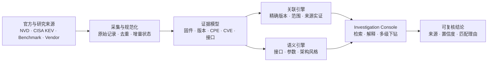

<div align="center">

<sub><b>FIRMWARE INTELLIGENCE / EVIDENCE OS</b></sub>

# FirmAtlas

### 把固件、版本、接口与漏洞放进同一张可追溯证据图谱

FirmAtlas 是一个证据驱动的一体化固件分析平台。它聚合固件样本与官方漏洞情报，提取通信接口和参数，按版本边界建立漏洞关联，并让每一个判断都能回到来源与匹配理由。

[](#快速开始)
[](./apps/console)
[](#能力矩阵)
[](./docs/security.md)

**[系统演示](#系统演示)** · **[能力矩阵](#能力矩阵)** · **[通信测绘功能手册](./docs/firmware-mapping/product-guide.md)** · **[快速开始](#快速开始)** · **[技术架构](#技术架构)** · **[文档中心](#文档中心)**

</div>


## 为什么是 FirmAtlas

传统固件分析往往把“样本目录、静态分析、接口测绘、漏洞情报”拆成互不相通的工具。FirmAtlas 用统一领域模型连接这些证据，让分析者回答三个更重要的问题：

- **这个固件到底是什么？** 厂商、型号、候选版本、下载来源与制品状态分别记录，不把 URL 冒充成已验证样本。
- **它可能受哪些漏洞影响？** 精确版本、版本范围、产品范围与来源实证分层展示，并保留 CPE 边界、分值和匹配理由。
- **它的后端通信结构像谁？** 从漏洞描述中提取接口、参数与请求方式，按 `/goform`、CGI、HNAP/SOAP、动态页面控制器等架构风格聚类并推荐相似接口。

> [!IMPORTANT]
> FirmAtlas 输出的是带证据的分析线索。自动版本关联不等同于漏洞复现，候选下载地址也不等同于已下载、哈希校验的固件制品。

## 系统演示

### 调查栈：从固件一路追到漏洞证据

在固件详情中查看关联漏洞、版本边界和来源证据；继续打开漏洞时不会离开当前工作区。多级详情按调查栈展开，关闭后逐级回到原始列表与筛选状态。


### 接口智能关联：寻找相似后端通信架构

输入任意固件接口，系统优先返回原样命中和关键词命中，再根据路径命名空间、处理器命名及架构风格推荐相似接口，并同步聚合关联漏洞、厂商和固件型号。


## 能力矩阵

| 分析面 | 当前能力 | 输出证据 |
| --- | --- | --- |
| 漏洞情报 | NVD 年度 Feed、增量更新、CISA KEV、CVSS/CWE、EXP/PoC 信号 | 原始来源记录、同步状态、评分版本、更新时间 |
| 固件资产 | 公开 benchmark、研究数据集、厂商入口与候选下载地址统一检索 | 来源可信度、真实下载域名、候选版本身份、文件名与 URL |
| 版本关联 | 厂商 → 产品 → 版本三层匹配，支持精确版本与 NVD 范围边界 | 匹配类型、受影响边界、解释信号、相关性分值 |
| 接口测绘 | 从漏洞证据提取路径、CGI、HTTP 方法、参数与安全影响 | 接口原文、所属类别、参数上下文、关联 CVE |
| 固件冷启动通信测绘 | 原始固件上传、隔离解包、多 Producer、义务调度、不可变 Catalog 与通信图 | SHA-256、EvidenceAtom、Coverage Ledger、开放义务、可复核子图 |
| 动态接口力导图 | 以固件为根，只展示真实二进制 → Web 接口 → 参数；支持拖拽回弹、矩形碰撞分离、悬停邻接高亮、滚轮缩放、搜索与折叠 | 二进制 owner、HTTP 方法、handler、参数类型依据、代码约束、依赖与 EvidenceAtom；静态前端资源仅保留为证据 locator |
| 架构聚类 | 表单处理器、CGI 网关、管理路由、动态页面、资源型 API、HNAP/SOAP | 相似接口、命中理由、厂商与固件型号分布 |
| 潜在隐藏接口 | 全固件 Native 注册减去 completed 客户端范围，默认选择每个固件最新目录 | 注册二进制、handler、覆盖 scope、证据 identity、运行时原因义务 |
| 固件版本结构差异 | 覆盖感知地对齐同型号不可变测绘目录，比较接口、参数与潜在隐藏接口 | 发行身份依据、coverage/profile 边界、增删改置信度、BASE/TARGET 证据 |
| 历史漏洞图谱对照 | 将版本化历史接口/参数期望作为只读覆盖层投影到通信图，分别呈现“是否发现”和“是否适用于当前制品” | 精确图节点/边、参数与 handler、漏检原因、版本边界、漏洞全集分母 |
| 调查体验 | 固件 ↔ 漏洞 ↔ 接口多级下钻，不丢失列表与筛选上下文 | 分层面板、逐级回退、父级可见、移动端全屏层级 |
| 大规模检索 | SQLite FTS5、字段索引、服务端分页与输入防抖 | 17 万级候选无需全量加载到浏览器 |

<details>
<summary><b>当前演示数据快照</b></summary>

> 数据量会随本地同步状态变化；以下是仓库当前演示环境的快照。

| 指标 | 数量 |
| --- | ---: |
| 固件下载候选 | 173,878 |
| 已提取候选版本身份 | 115,672 |
| 实际下载域名 | 270 |
| 精确版本关联 | 515 |
| 版本范围关联 | 4,587 |
| 仅产品范围线索 | 2,420 |
| 固件—漏洞关联总数 | 7,617 |
| 已覆盖漏洞 | 647 |

</details>

## 技术架构



架构刻意区分三类对象：**外部地址**只是候选，**下载并校验后的文件**才是制品，**从制品或权威来源提取的结论**才进入证据链。更完整的边界、组件关系和部署视图见[总体架构](./docs/architecture.md)。

## 快速开始

要求 Python 3.9+。运行 Web 控制台还需要 Node.js 22.12+ 与 pnpm 10+。

```bash
git clone <your-fork-or-repository-url>
cd FirmAtlas

make test
make seed-demo
```

分别启动 API 与 Web 控制台：

```bash
# 终端 1
make api

# 终端 2
make web-install
make web-dev
```

打开 `http://127.0.0.1:5173`。只想查看领域内核的最小输出时，可运行 `make demo`。

查看新一代通信测绘 Snapshot 合同及 Tenda AC9 人工证据回放摘要：

```bash
make mapping-example
```

该命令验证版本化证据、实体、关系、覆盖账本和未决义务；它是可复现的合同示例。当前原始固件冷启动 MVP、页面操作、截图和最新验收结果见[通信测绘产品功能与验收手册](./docs/firmware-mapping/product-guide.md)，设计进度和样本解释见[通信测绘引擎主控文档](./docs/firmware-mapping/README.md)。

对已解包的固件 rootfs 生成安全、确定性源制品清单：

```bash
make mapping-inventory ROOT=/path/to/extracted-root
```

对已解包 rootfs 执行统一冷启动测绘并保存完整运行清单：

```bash
PYTHONPATH=src python3 -m firmatlas.mapping analyze-root /path/to/rootfs \
  --artifact-sha256 <original-firmware-sha256> \
  --profile auto \
  --output mapping-analysis-run.json \
  --graph-output communication-graph.json \
  --graph-focus goform/GetDlnaCfg \
  --graph-max-hops 4
```

该入口会自动建立 Source Plan，运行 Frontend、跨资源 Frontend Asset Graph、Frontend Feature Gate、Frontend Invocation Reachability、Web configuration、Script backend、Native shallow、Correlation 和 Scheduler，并按版本化 Profile/Registry 自动选择适用的确定性深化 Adapter，最后发布不可变 Discovery Catalog；单个 producer 失败会保留为 partial stage/coverage，不会伪装成空成功。可选 `--graph-output` 会从同一 Catalog 生成确定性的通信架构图 read model。当前默认冻结为 `auto-v21`：它继承 `auto-v20` 的 AC9 `/cgi-bin` selector、URL IPC/文档和配置状态边界，并新增 Native UBUS registration 的直接 Catalog 投影；该 Adapter 不依赖前端种子，也不重新反汇编 ELF。FRITZ!Box 4040 独立 holdout 因此从 4 个 rpcd 插件完整发布 24 个静态方法，补回前端驱动链漏掉的 4 个 `iwinfo` 操作。静态注册不等于运行时可达、访问授权、漏洞或可利用性；完整固件 Catalog 仍可因其他义务保持 partial。历史 Profile 均保留冻结回放。首要样本最新结果见 [R2-34 FRITZ native Catalog](./docs/firmware-mapping/progress/2026-08-18-r2-34-fritz4040-native-catalog.md)、[R2-28 CGI namespace 与 selector transport](./docs/firmware-mapping/progress/2026-08-14-r2-28-ac9-cgi-selector-transport.md)与 [R2-27 URL 日常 IPC 与跨状态域消费者](./docs/firmware-mapping/progress/2026-08-13-r2-27-ac9-configuration-url-ipc.md)。

对原始固件制品执行同一条链路时，不需要人工挑选解包目录：

```bash
PYTHONPATH=src python3 -m firmatlas.mapping analyze-artifact /path/to/firmware.bin \
  --destination var/mapping-work/my-firmware/extraction \
  --runtime /usr/local/bin/docker \
  --image-ref registry.example/binwalk@sha256:<pinned-image-digest> \
  --expected-version 3.1.0 \
  --output firmware-artifact-analysis.json \
  --graph-output communication-graph.json
```

该入口在隔离容器中提取制品、自动计算原始 SHA-256，并只在唯一且有根文件系统标记的
`squashfs-root`/`rootfs` 目录上执行 AnalyzeRun。若提取失败、没有根文件系统或存在并列根目录，
仍写出内容寻址的结构化结果且不猜测目标。成功或部分成功的结果可直接作为 Catalog 来源发布到
Console：`mapping publish-graph --catalog-document firmware-artifact-analysis.json communication-graph.json`。
OpenWrt Tenda AC9 原始 `.trx` 的实际回放见 [R2-30 原始制品报告](./docs/firmware-mapping/samples/r2-30-openwrt-ac9-raw-artifact-analysis.json)。

要让用户直接从 Console 上传原始固件并持续查看异步作业、Catalog 与 Graph 生命周期，可在 API
启动时显式配置固定摘要的 Binwalk 镜像：

```bash
PYTHONPATH=src python3 -m firmatlas intelligence serve \
  --database var/firmatlas.db \
  --host 127.0.0.1 --port 8787 \
  --static-dir apps/console/dist \
  --mapping-workspace var/mapping-jobs \
  --mapping-runtime /usr/local/bin/docker \
  --mapping-binwalk-image-ref registry.example/binwalk@sha256:<pinned-image-digest> \
  --mapping-binwalk-version 3.1.0 \
  --mapping-upload-max-bytes 67108864 \
  --mapping-analysis-max-seconds 900
```

未提供 `--mapping-binwalk-image-ref` 时上传入口只显示为未配置，不会回退到宿主机直接执行
Binwalk。上传使用 `application/octet-stream`，按 SHA-256 内容寻址；HTTP 请求仅排队，单独的有界
worker 负责隔离提取、AnalyzeRun 和不可变 Catalog/Graph 发布。Console 同时要求填写厂商、产品、
设备型号和固件版本；这些身份进入作业快照与 Catalog release context，并参与作业幂等身份，避免
同一字节制品的不同发行语境被误合并。重启时未完成作业会显式转为 `job.interrupted`，不会伪装成
成功。真实 AC9 页面回放见[产品功能与验收手册](./docs/firmware-mapping/product-guide.md)。

完整 Console 必须使用同时保存漏洞情报、固件资产与测绘投影的主库 `var/firmatlas.db`。单轮
`var/mapping-work/<round>/firmatlas.db` 仅用于隔离研究回放，不能替代产品服务数据库；服务恢复时
除 `/api/health` 外，还必须同时验证 intelligence、firmware、mapping catalog/graph 与 corpus 数据域非空。

要为已发布 Catalog 的开放义务生成 MiniMax 待验证建议，必须显式给出模型并从环境变量读取 Key：

```bash
export MINIMAX_API_KEY='<rotated-secret>'
PYTHONPATH=src python3 -m firmatlas intelligence serve \
  --database var/firmatlas.db \
  --host 127.0.0.1 --port 8787 \
  --static-dir apps/console/dist \
  --mapping-reasoning-model MiniMax-M3 \
  --mapping-reasoning-base-url https://api.minimaxi.com/v1 \
  --mapping-reasoning-api-key-env MINIMAX_API_KEY
```

默认不启用模型能力；未配置时确定性测绘和图谱仍可完整使用。Console 的 MiniMax 区只展示
`model_suggested` proposal、引用的既有 EvidenceAtom 及仍需补充的确定性佐证。模型不能修改 Catalog、
关闭义务或把接口/参数提升为事实。发送内容是有界脱敏证据包，不包含完整固件或凭据；失败后可以
创建新 attempt，历史运行不会被覆盖。设计、安全边界及当前官方协议核验见
[大模型推理设计](./docs/firmware-mapping/model-reasoning.md)和
[R2-32 记录](./docs/firmware-mapping/progress/2026-08-18-r2-32-minimax-evidence-proposals.md)。

将 AnalyzeRun 与图发布到本地 SQLite，并用与后续 HTTP/Console 相同的语义查询：

```bash
PYTHONPATH=src python3 -m firmatlas.cli mapping publish-graph \
  --database var/firmatlas.db \
  --catalog-document mapping-analysis-run.json \
  communication-graph.json

PYTHONPATH=src python3 -m firmatlas.cli mapping query-graph \
  --database var/firmatlas.db <graph-id> \
  --preset parameter_state \
  --focus-identity goform/SetDlnaCfg \
  --max-hops 2
```

发布会验证 graph 与源 Catalog 的 firmware、coverage 和 EvidenceAtom 闭包；查询返回无悬空边的
节点/边、facet、Coverage Ledger 与完整 EvidenceAtom。AC9 实证见 [R2-18 持久化图查询](./docs/firmware-mapping/progress/2026-08-11-r2-18-ac9-persisted-graph-query.md)。

本地产品服务默认进入“通信测绘 → 接口调查”：以当前固件为力导图根节点，只沿有 Native 归属的
真实二进制、Web 接口和参数逐层展开；JavaScript、HTML、CSS 等静态资源不作为组件节点展示，只在
证据 locator 中保留。节点可拖拽并在释放后自动回弹分离，矩形碰撞约束避免卡片重叠，悬停高亮
邻接关系，滚轮缩放；搜索只保留命中分支及其祖先，自动布局可随时重置。点击
参数后，右侧固定面板展示所属接口、handler、语义、数据类型及其证据依据、代码约束、依赖和
EvidenceAtom。`ubus://`、IPC 等内部逻辑操作不会作为 Web URL 混入默认接口图，需要时可从
“高级图谱”或“原始证据”取证。后端读模型由
`GET /api/mappings/catalogs/<catalog-id>/interface-force-graph` 提供，浏览器不二次猜测事实。
AC9 真实页面回放、截图和解释边界见[产品功能与验收手册](./docs/firmware-mapping/product-guide.md)。
此后每轮通信测绘实现都必须在最终代码上启动本地服务，并从真实页面完成导航、焦点查询、视图
切换、证据下钻和浏览器 Console 检查；页面验收后的代码变化会触发服务重启与完整交互重放。

历史漏洞接口只能在声明版本与当前制品范围明确后用于测绘差异，不能直接当作固件真值：

```bash
PYTHONPATH=src python3 -m firmatlas.mapping compare-history /path/to/rootfs \
  --artifact-sha256 <original-firmware-sha256> \
  --expectations historical-expectations.json \
  --expectations historical-expectation-supplement.json \
  --profile auto \
  --output historical-expectation-diff.json \
  --graph-output communication-graph.json \
  --overlay-output historical-graph-overlay.json \
  --vulnerability-scope historical-vulnerability-scope.json \
  --semantic-clues historical-semantic-clues.json \
  --coverage-queue-output historical-coverage-queue.json \
  --coverage-ledger-output historical-coverage-ledger.json
```

输出区分接口/参数/method/dispatcher/coverage/artifact-scope 缺口，并保留 Catalog candidate 与 EvidenceAtom 引用。`--expectations` 可重复，用不可变 supplement 扩展旧基线；semantic clues 与漏洞分母可进一步生成内容寻址的优先队列，显式区分 HTTP 参数、配置键、route token、来源确认的 path 和当前制品 Catalog clue。`--coverage-ledger-output` 将结构化 overlay 与互补 queue 合并为完整漏洞分母读模型，但不会从历史文本创建固件事实。可选的 graph/overlay 输出把比较链接到精确图节点和语义边。原厂 AC9 的 [R2-29 报告](./docs/firmware-mapping/samples/r2-29-vendor-tenda-ac9-historical-coverage-ledger.json)逐项覆盖全部 71 条记录：9 observed、2 partial、60 not assessable；接口结构出现仍不等同于当前版本存在漏洞。

```bash
PYTHONPATH=src python3 -m firmatlas.cli mapping publish-history-overlay \
  --database var/firmatlas.db historical-graph-overlay.json

PYTHONPATH=src python3 -m firmatlas.cli mapping query-history-overlay \
  --database var/firmatlas.db <graph-id> \
  --status observed --applicability exact_artifact

PYTHONPATH=src python3 -m firmatlas.cli mapping publish-history-ledger \
  --database var/firmatlas.db historical-coverage-ledger.json

PYTHONPATH=src python3 -m firmatlas.cli mapping query-history-ledger \
  --database var/firmatlas.db <graph-id> \
  --status partial --audit-category parameter_only
```

输出包含清单 SHA-256、观察/处理数量、实际读取字节、归档展开字节和诊断。Inventory v1alpha2 会在固件 chroot 内解析绝对与链式 symlink，但不会经链接打开或散列目标；普通缺失、循环、深度耗尽和越界仍进入 coverage ledger。内置 Inventory 只读取已解包目录并以内容识别 ZIP；原始固件的 SquashFS/TAR/厂商封装由独立 Container Extraction Worker 处理，不能把原始固件直接交给此命令。

原始固件解包使用 Binwalk，但 Binwalk 只允许在隔离 extraction worker 中运行。当前仓库已经实现只接受固定镜像摘要的 `ContainerBinwalkWorker`，强制禁网、只读根/输入、能力清空、`no-new-privileges`、PID/CPU/内存、输出和日志预算，并保留父制品、工具、命令、派生 Inventory 与失败诊断谱系。仓库固定配方已完成 arm64 冷构建；真实 AC9 由第一方 Binwalk 3.1.0 镜像从原始 `.trx` 进入 AnalyzeRun，恢复 1,278 candidates / 8,121 evidence 及 1,741 nodes / 2,421 edges。提取 Inventory 仍为 partial，因此不会伪装成整固件全覆盖。真实 DAP-3520 选定 rootfs 的 v1alpha2 重放处理 753 个节点并达到 completed，发布包含 `/HNAP1 → /usr/sbin/hnap` 和 PHP-XGI 页面控制器的 completed Catalog；DIR-882 的零产物回放则被明确标为 `extraction.no_output`。详见 [R2-36 收敛审计](./docs/firmware-mapping/progress/2026-08-20-r2-36-convergence-audit.md)、[M1-02B 记录](./docs/firmware-mapping/progress/2026-08-09-m1-02b-container-binwalk-worker.md)和 [M1-13 记录](./docs/firmware-mapping/progress/2026-08-09-m1-13-chroot-symlink-inventory.md)。

Inventory 条目现在可以通过统一的证据捕获 Interface 转换为 `firmatlas.mapping.evidence/v1alpha1` EvidenceAtom。文本与二进制证据都会校验源文件摘要、精确字节选区及选区摘要；文本另外保存可回放的 UTF-8 行列。真实 Tenda AC9 中间结果见 [M1-03 EvidenceAtom 样例](./docs/firmware-mapping/samples/tenda-ac9-m1-evidence-atoms.json)。

Frontend Request Producer 已能从声明范围内的 HTML Form、Tenda `R.pageModel/R.moduleModel`、jQuery `getJSON/post/ajax`、对象式 `request`、同制品 shared-CGI wrapper 和 LuCI `rpc.declare` 中恢复请求候选、方法、表示形式、参数与 operation selector，并以 EvidenceAtom 输出。LuCI RPC 使用 `ubus://object/method` 表示逻辑操作，不伪造固定 HTTP URL；动态 object/method 会使覆盖保持 partial。AC9、HNAP 与共享 CGI 的对比输出见 [M1-04 样例](./docs/firmware-mapping/samples/m1-04-frontend-producer-summary.json)。

Web Configuration Producer 已能从 lighttpd、nginx、直接 POSIX shell 启动项和 proprietary httpd `Control/Alias/Location/External` 配置恢复 listener、docroot、namespace mapping、auth requirement、service start 与外部 handler binding。AC9 回放确认了 `:8180 → /cgi-bin/luci/ → 127.0.0.1:8188 → app_data_center`；DAP-3520 回放确认 `/HNAP1 → /www/HNAP1 → /usr/sbin/hnap`；X5000R 回放确认 `:80/:8080 → /www/ → /cgi-bin/ CGI executor`，均不从路径名称猜测未观察的处理器。

Native Shallow Producer 已能直接解析 ELF32/ELF64 metadata、printable route/server spans 与动态符号表，并为每条 hint 保存可回放二进制 EvidenceAtom。AC9 `httpd` 对 M1-04 的 6 个 action component 全部提供精确字符串佐证，而 `dhttpd` 为 0/6；这只用于选择深分析目标，不按名称猜测 handler binding。对照结果见 [M1-06A 样例](./docs/firmware-mapping/samples/m1-06a-native-shallow-summary.json)。

Frontend/Native Correlation Module 通过大小写敏感的完整 endpoint 或末段 action component 精确匹配生成 candidate association，并自动创建 `registers_route/binds_handler` 未决义务。AC9 两份前端源与 `httpd/dhttpd` 联合回放得到 7/7 candidate、全部指向 `httpd`、0 个名称猜测 binding；过程输出见 [M1-06C 样例](./docs/firmware-mapping/samples/m1-06c-frontend-native-correlation-summary.json)。

Script Backend Producer 已覆盖厂商 ASP、PHP、PHP-XGI、LuCI Lua 与 POSIX Shell CGI 的确定性语法，可区分请求参数、operation selector、显式 route、CGI program、配置状态访问与模板状态读取。D-Link DSL 样本恢复了 `admPass1 → Account_Entry0.web_passwd/console_passwd → commit`；DAP-3520 的 `ACTION_POST` 恢复 5 个操作选择值以及 266 个 `query/queryEnc/set/setEnc` 状态访问，同时保持变量来源未知时不冒充 HTTP 参数。

Obligation Scheduler 已将 route/handler 等未决能力变成确定性、预算受控的工作队列：每个义务与 Adapter 组合最多尝试一次，异常可降级，新增义务可去重，并明确区分 `fixed_point` 与 `budget_exhausted`。AC9 discover 回放在不启用高成本分析器时保留全部 14 个开放义务，而不是返回空成功；过程输出见 [M1-07 样例](./docs/firmware-mapping/samples/m1-07-obligation-scheduler-summary.json)。

Discovery Catalog 通过单一 Interface 组装 Frontend、配置、脚本、Native、关联和调度结果，同时验证 EvidenceAtom、参数归属与义务目标。AC9 无 seed 回放现恢复 395 个候选、6 个参数、398 个证据原子和 16 个开放义务；其中新增的固件升级接口被识别为 `POST /cgi-bin/upgrade + multipart_form + upgradeFile`，并与 `bin/httpd` 的完整 endpoint literal 精确关联。过程输出见 [M1-08 样例](./docs/firmware-mapping/samples/m1-08-ac9-discovery-catalog-summary.json)。

DAP-3520 HNAP/PHP-XGI Catalog 同样不使用漏洞文本或 seed，发布 273 个候选、1 个 selector 参数和 288 个可回放 EvidenceAtom。Catalog 会继承上游 Inventory coverage；chroot symlink 重放关闭原先误报缺口后，真实 HNAP/XGI 样本已晋级 `verified`。中间结果见 [M1-11A 样例](./docs/firmware-mapping/samples/m1-11a-dap3520-hnap-xgi-catalog-summary.json)。

Discovery Catalog 现在可不可变地发布到 SQLite，并通过“通信测绘”工作区按目录版本、候选类型、接口 token 和来源构造查询。页面采用目录 → 候选 → 证据详情的稳定三级布局，详情同步展示参数、跨层关联、EvidenceAtom 定位、覆盖账本和开放义务；浏览器只读取服务端投影，不重新推断事实。

“版本对比”视图会先核对不可变发行上下文和 Coverage Ledger，再按稳定身份比较候选、参数及潜在隐藏接口。真实 OpenWrt Tenda AC9 `18.06.7 → 19.07.8` 回放恢复了从旧 Lua 管理路由到 53 个 LuCI/ubus 逻辑操作（含 `hostapd.{dynamic}` 模板）的控制面迁移信号；系统继续把这些操作连接到 rpcd 执行主体、后端绑定、ACL 授权与未决归属。4 个 ARM32 rpcd 插件的原始注册表进一步证明 31 条 Native handler binding，并在 UI 中直接显示 handler identity；动态 owner 仍保持未决。报告见 [M1-24 双版本实证](./docs/firmware-mapping/samples/m1-24-openwrt-ac9-version-diff.json)、[M1-25 ubus 后端图](./docs/firmware-mapping/samples/m1-25-openwrt-ac9-ubus-backend.json)与 [M1-26 Native 注册表](./docs/firmware-mapping/samples/m1-26-openwrt-ac9-native-ubus-registration.json)。

Native Deep 的首个保守 Adapter 已支持命名 ELF `{route_ptr, handler_ptr}` 注册表：只有 route pointer、表项位置和 executable handler pointer 同时成立时，才发布 `native_route_binding` / `native_handler` 并关闭调度义务。合成 ARM ELF 展示了完整三段证据链；真实 AC9 因没有受信命名表保持 0 binding，明确转交后续 ARM PIC call-site Adapter。中间结果见 [M1-10 样例](./docs/firmware-mapping/samples/m1-10-native-deep-route-table-summary.json)。

ARM32 PIC Adapter 进一步从原始 ELF 验证 `.got` 基址、`R_ARM_GLOB_DAT`、`r0/r1` 参数装载与共同 `BL` registrar。真实 Tenda AC9 `online_list.js` 的 5 个接口已全部绑定到 5 个导出 handler，10/10 深分析义务关闭；这些绑定共享一个包含 131 个独立 route/handler 对的 registrar，形成可查询的后端注册架构信号。中间结果见 [M1-10B AC9 样例](./docs/firmware-mapping/samples/m1-10b-ac9-arm-pic-callsite-summary.json)。

复杂通信结构现在会进入内容寻址的研究案例库，而不是只留在阶段性说明中。AC9 案例保存了 `前端 /goform → nginx namespace 不相交 → ownership obligation → httpd/dhttpd shallow 对照 → ARM PIC call-site`；这说明不做跨层测绘，就无法从同一固件中并存的 nginx/FastCGI 链直接确定 `/goform` 的真实处理二进制。X5000R 案例从共享 `cstecgi.cgi`、MIPS inline table、参数—状态链和 multipart nested dispatch，继续跨到 `usr/sbin/lighttpd` 与 `sbin/rc`：系统既恢复了自定义保护范围，也证明 `init_router → start_services_once → start_httpd → lighttpd argv/config → /cgi-bin/ → cstecgi.cgi` 的静态服务装配。完成前端覆盖后仍有 10 个 native registration 没有已观察前端引用；它们作为“潜在隐藏接口”保存证据和未决原因，而不自动命名为后门。详见[研究案例库](./docs/firmware-mapping/research-casebook.md)、[机器可读案例](./docs/firmware-mapping/samples/m1-12-research-case-corpus.json)、[请求保护范围](./docs/firmware-mapping/samples/m1-21-x5000r-request-protection.json)、[静态服务装配](./docs/firmware-mapping/samples/m1-22-x5000r-service-assembly.json)与[潜在隐藏接口报告](./docs/firmware-mapping/samples/m1-23-x5000r-potential-hidden-interfaces.json)。

遇到复杂 Native 控制流时，规划使用隔离的 Ghidra Candidate Worker 枚举 xref、call-site 与 P-code value-flow，再由核心 Validator 从原始 ELF 重放后才发布事实。AC9 当前 Profile 可由确定性解码器完成，因此不会为了工具统一而引入不必要的 Ghidra 信任面；接入合同见 [Ghidra Adapter 设计](./docs/firmware-mapping/native-ghidra-adapter.md)。

代表性 corpus gate 会把真实固件、旧解包派生源码、合成合同 fixture 与外部漏洞线索分层统计，只有带预期 Firmware Artifact SHA-256、覆盖完成、能力满足且无开放义务的真实目录才能把架构类别标为 `verified`。v1alpha3 支持在混合 Catalog 中显式限定候选范围，并冻结 capability alias policy，避免借用另一架构的 evidence/obligation 或让分类语义静默漂移。当前五类 required category 已通过：DAP-3520 脚本后端子集为 268 candidates/276 evidence，X5000R native-only 子集为 10 candidates/40 evidence；独立 FRITZ!Box 4040 holdout 为 24 candidates/60 evidence，独立 DAP-2695 holdout 从原始固件的 485 个 PHP 文件形成 completed scoped Catalog（3,978 candidates/4,021 evidence）。DAP-2695 整固件 AnalyzeRun 仍诚实保留悬空 symlink 与非 UTF-8 前端输入造成的 `partial`，不与脚本作用域完成状态混淆。可重复生成、发布、查询并与[机器可读报告](./docs/firmware-mapping/samples/m1-11-representative-corpus-report.json)比较：

```bash
PYTHONPATH=src python3 scripts/build_mapping_corpus_report.py \
  --ac9-root /path/to/tenda-ac9/squashfs-root \
  --x5000r-root /path/to/x5000r/squashfs-root

PYTHONPATH=src python -m firmatlas mapping publish-corpus-report \
  --database var/firmatlas.db docs/firmware-mapping/samples/m1-11-representative-corpus-report.json
PYTHONPATH=src python -m firmatlas mapping query-corpus-report \
  --database var/firmatlas.db

# 重放 X5000R frontend selector 与 MIPS inline handler 的双向差集
PYTHONPATH=src python3 scripts/build_x5000r_mips_dispatch_report.py \
  --root /path/to/x5000r/squashfs-root

# 重放 setLanCfg 无分支前缀的请求参数 → NVRAM 状态映射
PYTHONPATH=src python3 scripts/build_x5000r_mips_value_flow_report.py \
  --root /path/to/x5000r/squashfs-root

# 归因 frontend/native 差集，不用字符串相似性填平未知
PYTHONPATH=src python3 scripts/build_x5000r_set_difference_report.py \
  --root /path/to/x5000r/squashfs-root

# 扩展到页面与 kr.js，恢复缺省 URL、payload variable 和 upload 两级 selector
PYTHONPATH=src python3 scripts/build_x5000r_expanded_frontend_report.py \
  --root /path/to/x5000r/squashfs-root

# 重放 upload mode → nested selector → set_handle_t → exact handler
PYTHONPATH=src python3 scripts/build_x5000r_nested_dispatch_report.py \
  --root /path/to/x5000r/squashfs-root

# 对照页面与 CGI 的自定义 SESSION_ID 请求保护范围
PYTHONPATH=src python3 scripts/build_x5000r_request_protection_report.py \
  --root /path/to/x5000r/squashfs-root

# 重放 init → service group → argv/config → CGI target 静态装配
PYTHONPATH=src python3 scripts/build_x5000r_service_assembly_report.py \
  --root /path/to/x5000r/squashfs-root
```

```bash
# 发布 Producer/Scheduler 生成的完整目录 JSON；同一内容可安全重跑
PYTHONPATH=src python3 -m firmatlas mapping publish-catalog \
  --database var/firmatlas.db path/to/discovery-catalog.json

# 查看已发布目录及候选/参数/关联/未决义务计数
PYTHONPATH=src python3 -m firmatlas mapping list-catalogs \
  --database var/firmatlas.db
```

<details>
<summary><b>同步完整 NVD 情报</b></summary>

获取最近一天的官方情报：

```bash
PYTHONPATH=src python3 -m firmatlas intelligence sync \
  --source nvd --source cisa-kev --days 1
```

需要完整本地 NVD 数据集时，先初始化年度 Feed，再周期执行统一增量更新：

```bash
# 首次：2002 至当前年份的 JSON 2.0 feeds
make intelligence-bootstrap

# 后续：按 META 判断变化并导入 modified feed
make intelligence-update
```

压缩包保存在 `var/nvd-feeds/`，规范化记录、原始来源、FTS5 索引和 Feed 状态保存在 `var/firmatlas.db`。命令可安全重跑；SHA-256 未变化且已成功导入的年度会被跳过。NVD API Key 可通过 `NVD_API_KEY` 提供，未提供时客户端自动使用更保守的分页间隔。完整导入需要数百 MB 下载空间和更大的 SQLite 空间。

详细机制见[情报采集实现](./docs/intelligence-acquisition.md)。

</details>

<details>
<summary><b>同步固件目录并重建版本关联</b></summary>

```bash
# 流式写入公开来源、样本候选与来源实证关系
make firmware-catalog-sync

# 根据本地 NVD CPE、精确版本与版本边界重建关联
make firmware-version-link

# 同时刷新目录和版本关联
make firmware-refresh
```

关联器从来源字段和文件名提取带证据的候选版本身份，再与 NVD vulnerable CPE 做厂商、产品和版本匹配：

- `exact_version`：候选版本等于 CPE 明确版本；
- `version_range`：版本方案兼容，且落在 NVD 起止边界内；
- `product_scope`：NVD 将该产品所有版本列为受影响，仅代表产品范围；
- `curated_evidence`：来自 benchmark 或研究仓库的明确环境映射。

版本方案不兼容时不会生成范围关联，避免把日期构建号与点分版本互相排序。每次更新漏洞 Feed 或固件目录后，应重新执行 `make firmware-version-link`；重建只替换自动派生关系，保留人工整理和来源实证关系。

数据来源、已验证 raw 地址、SHA-256 和数据质量异常见[固件样本来源研究](./docs/research-firmware-sample-sources.md)。

</details>

<details>
<summary><b>固件目录查询 API</b></summary>

| API | 用途 |
| --- | --- |
| `GET /api/firmware/overview` | 来源、候选、版本身份与各类漏洞关系总览 |
| `GET /api/firmware/sources` | 查询已登记来源；即使暂无具体样本也保留入口 |
| `GET /api/firmware/candidates` | 按 CVE、厂商、型号、版本、主机或文件名检索 |
| `GET /api/firmware/candidates/{candidate_id}` | 查看候选地址、来源证据和关联漏洞 |
| `GET /api/firmware/vulnerabilities/{CVE}/samples` | 从漏洞反查关联固件样本 |

候选查询支持 `vendor`、`source`、`host`、`has_vulnerability` 和 `match=version|exact_version|version_range|product_scope|curated_evidence`，并使用服务端分页。

</details>

<details>
<summary><b>通信测绘目录查询 API</b></summary>

| API | 用途 |
| --- | --- |
| `GET /api/mappings/catalogs` | 查询不可变目录版本及候选、参数、关联和未决义务计数 |
| `GET /api/mappings/corpus-report` | 查询最新不可变代表性语料门禁、类别、范围样本与解释边界 |
| `GET /api/mappings/catalogs/{catalog_id}` | 读取完整版本化 Discovery Catalog 文档 |
| `GET /api/mappings/catalogs/{catalog_id}/candidates` | 按 `q`、`kind` 和分页参数查询候选投影 |
| `GET /api/mappings/catalogs/{catalog_id}/candidates/{candidate_id}` | 聚合参数、EvidenceAtom、关联、覆盖与开放义务 |
| `GET /api/mappings/graphs` | 查询已发布通信架构图及 firmware、coverage、节点/边规模 |
| `GET /api/mappings/graphs/{graph_id}` | 按 `q`、preset、kind、status、evidence、focus 与预算查询证据闭合子图 |

`q` 会规范化路径分隔符和 CamelCase token，因此 `online dev` 能命中 `/goform/SetOnlineDevName`。目录发布是内容寻址且幂等的；同一 `catalog_id` 对应不同内容会被拒绝。

</details>

## 当前状态与路线图

| 状态 | 模块 |
| --- | --- |
| **Available** | 漏洞情报同步与检索、固件候选目录、版本/CPE 关联、双向下钻、接口与参数语义分析、架构风格分类与推荐、Snapshot v1alpha1 合同、已解包 rootfs 的安全确定性 Inventory v1alpha2（含固件 chroot symlink 与空运行时树）、固定摘要/禁网/只读输入的 Container Binwalk Worker、可回放 EvidenceAtom、Frontend shared-CGI/custom-request、跨资源默认 URL、局部 payload variable、multipart 嵌套 selector 与 Asset Graph、lighttpd/nginx/启动项/proprietary httpd、ASP/PHP-XGI/Lua/Shell Backend、ELF Native Shallow、ARM32 PIC route registrar 与 CGI string-switch dispatch、MIPS32 inline-table、MIPS CGI nested-dispatch、MIPS handler-prefix parameter→state、frontend/native 集合差异归因、静态服务装配、全固件潜在隐藏接口投影/API/可视化、固定点调度、继承 Inventory coverage 的无 seed Discovery Catalog、SQLite 不可变发布/统一 HTTP 查询、接口/组件/参数/义务/EvidenceAtom 通信图谱、三级通信测绘 UI、scope-aware 五类代表性 corpus gate 与可视化 |
| **Next** | 独立运行时可达验证、通用 HTML script dependency scope Planner、同型号版本差异、剩余 77/11 差集因果验证、MIPS CFG-aware DHCP/sink value-flow、动态 method 恢复、固定 Binwalk 发布镜像重建、非 ARM 原生注册 holdout、文件系统与组件 SBOM |
| **Later** | 同型号版本差异、通信拓扑、漏洞重评估与持续提醒、复现与人工复核工作流 |

首个完整纵向切片的目标是：**固件入库 → 隔离解包 → 组件/服务/接口测绘 → 历史漏洞关联 → 版本差异 → 情报变化重评估**。详见[功能范围与路线图](./docs/product-scope.md)。

## 文档中心

| 文档 | 内容 |
| --- | --- |
| [通信测绘引擎主控文档](./docs/firmware-mapping/README.md) | 无样例冷启动、线索传播、模块设计、当前里程碑与跨会话进度 |
| [领域词汇](./CONTEXT.md) | 固件版本、文件、候选、制品和漏洞命中的统一语义 |
| [总体架构](./docs/architecture.md) | 模块边界、数据流和部署视图 |
| [产品范围](./docs/product-scope.md) | 能力边界、阶段目标和路线图 |
| [安全基线](./docs/security.md) | 如何处理不可信固件输入 |
| [情报源与同步策略](./docs/intelligence-sources.md) | 官方来源、刷新策略与证据保留 |
| [情报采集实现](./docs/intelligence-acquisition.md) | NVD/CISA KEV 增量与全量同步机制 |
| [固件样本来源研究](./docs/research-firmware-sample-sources.md) | 来源清单、完整性验证和质量异常 |
| [历史漏洞固件研究构想](./docs/research-idea-historical-firmware-vulnerability-knowledge.md) | 通信结构、历史案例、漏洞机制和后续论文方向 |

## 仓库结构

```text
FirmAtlas/
├── src/firmatlas/     # 领域内核、情报同步、关联与 API
├── apps/web/          # React Intelligence Console
├── analyzers/         # 分析器接入约定与演进位置
├── tests/             # 领域与接口测试
├── deploy/            # 本地及生产部署定义
└── docs/              # 架构、安全、产品与来源研究
```

## 设计原则

1. **证据优先** — 每个结论都能回到原始制品、来源记录、路径或工具输出。
2. **事实与判断分离** — 提取事实保持稳定，漏洞匹配和相关性可以重复计算。
3. **可复现** — 报告绑定制品摘要、分析器版本、规则版本和运行参数。
4. **允许不确定性** — 版本、接口和漏洞匹配都保留置信度及复核状态。
5. **默认隔离** — 固件与解包内容是不可信输入，不在控制面进程内执行。

---

<div align="center">
<sub>FirmAtlas · Map the firmware. Preserve the evidence.</sub>
</div>
