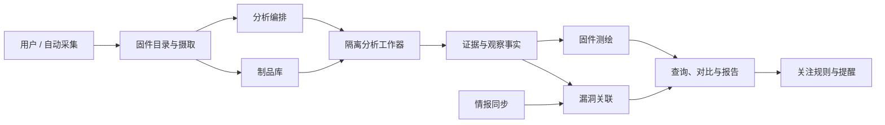

# 总体架构

> 新一代无样例冷启动通信测绘引擎的理论、深模块、证据模型、集成方式和实施进度由[固件通信测绘引擎主控文档](./firmware-mapping/README.md)统一维护。本文继续描述 FirmAtlas 系统级架构。

## 1. 架构结论

首版采用“模块化单体控制面 + 隔离分析工作器”。目录、任务编排、查询和漏洞关联先保持在一个可独立测试的控制面中；解析不同文件格式、反编译和动态分析由多个工作器承担。工作器只通过一个版本化的分析结果接口提交观察事实和证据。

这是一项可演进的初始设计，不是永久部署约束。只有当某类分析在资源、隔离或扩缩容上表现出真实差异时，才独立部署。

## 2. 核心模块及接口

“接口”表示调用者需要知道的完整使用约定，不等同于 HTTP 路由。每个模块应隐藏内部工具链和存储细节。

| 模块 | 对外接口 | 隐藏的复杂度 |
| --- | --- | --- |
| 固件目录 | 登记发行版、绑定型号、查询版本谱系 | 厂商命名差异、版本别名、多制品映射 |
| 制品摄取 | 摄取来源并返回内容摘要 | 流式下载、去重、格式嗅探、大小限制、来源审计 |
| 分析编排 | 请求分析并取得不可变报告 | 任务图、重试、超时、资源配额、分析器版本选择 |
| 制品展开 | 返回派生制品树 | 多层容器、分区、文件系统、压缩炸弹和损坏恢复 |
| 组件清单 | 返回带证据的软件组件清单 | 包管理器、字符串、符号、哈希和模糊版本归一化 |
| 通信测绘 | 返回执行主体、端点和通信关系图 | 启动脚本、服务配置、IPC、套接字和调用交叉验证 |
| 接口测绘 | 返回暴露接口和参数 | Web/RPC/CLI/消息/设备接口识别、认证与参数推断 |
| 漏洞知识 | 同步并查询规范化漏洞记录 | 多源合并、撤回、修订、别名和版本范围语义 |
| 漏洞关联 | 评估一个分析快照并返回匹配 | CPE/purl/厂商规则、证据加权、冲突和人工结论 |
| 版本对比 | 比较两个分析快照 | 身份对齐、组件增删、接口变化、漏洞状态变化 |
| 情报监测 | 执行关注规则并产生提醒候选 | 增量游标、去重、相关性评分和再评估触发 |
| 查询报告 | 查询固件知识图并导出视图 | 图关系、权限过滤、分页、统计和报告格式 |

## 3. 稳定分析结果接口

所有分析器都输出同一类 `AnalysisReport`：

- 输入固件制品的 SHA-256；
- 分析器名称、版本和规则版本；
- 开始/结束时间和最终状态；
- 零个或多个观察事实；
- 每个观察事实的类型、主体、属性、置信度和证据；
- 可诊断错误；失败不得伪装成“没有发现”。

该接口是分析器与控制面的真实接缝：文件系统、组件、端点等多个分析器都适配它，测试则使用内存中的固定报告。首版 Python 类型位于 `src/firmatlas/domain.py`。

## 4. 数据分层

| 层 | 内容 | 更新方式 |
| --- | --- | --- |
| Blob | 原始固件、派生制品、工具原始输出 | 按摘要只写一次 |
| Provenance | 来源、父子制品关系、分析运行、工具版本 | 追加，不原地改写历史 |
| Facts | 组件、执行主体、端点、接口、参数、关系及证据 | 随分析运行新增 |
| Knowledge | 漏洞记录、受影响声明、外部标识、风险信号 | 按来源修订历史同步 |
| Decisions | 漏洞匹配、验证结论、抑制与人工批注 | 版本化，可重算 |
| Views | 最新快照、版本差异、风险看板和搜索索引 | 从上述层重建 |

推荐的初始持久化组合是 PostgreSQL 保存目录、事实和关系，S3 兼容对象存储保存 Blob。全文或图查询出现可测量瓶颈后，再增加搜索或图数据库适配器；它们不应成为事实来源。

## 5. 分析流水线

1. **摄取**：流式计算摘要、去重、记录来源，不信任扩展名。
2. **识别**：检测容器、分区表、CPU 架构、端序、签名和可能的加密。
3. **展开**：递归产生派生制品树，应用深度、体积和文件数量预算。
4. **静态测绘**：文件系统、SBOM、密钥材料、启动项、服务、端点、接口与参数。
5. **关系重建**：将组件、执行主体、配置、端点和接口合并为通信图。
6. **漏洞关联**：先生成候选，再按版本、配置和可达性证据打分。
7. **发布快照**：允许部分成功，明确展示覆盖度和失败项。
8. **持续再评估**：新情报或规则更新只重算关联判断，不重复无关的解包。

## 6. 关键设计约束

- 分析运行不可变；“最新结果”只是指针。
- 同一字节内容只存一份，但不同获取来源都保留。
- 观察事实必须引用证据；推断必须标注置信度。
- 漏洞匹配不是漏洞记录的属性，而是可被新证据推翻的独立判断。
- 版本字符串保留原值，规范化值只用于辅助比较。
- 分析器失败、超时和不支持必须可区分。
- 动态分析产生的网络访问默认关闭，并由显式策略开放。

## 7. 部署演进

### MVP

- 一个控制面进程；
- PostgreSQL + S3 兼容对象存储；
- 一个任务队列；
- 多个受限容器工作器；
- 单租户、基于角色的基本权限。

### 规模化触发条件

- 解包与反编译资源曲线明显不同：分离工作器池；
- 情报同步影响交互查询：独立情报进程，但保留模块接口；
- 关系查询达到数据库瓶颈：增加可重建图投影；
- 多团队共享：引入租户隔离、配额、审计导出和密钥管理。
