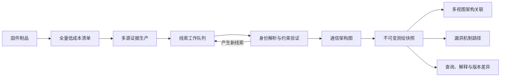

# 固件通信测绘引擎主控文档

> 文档 ID：FM-MASTER
> 当前阶段：M1 冷启动发现
> 当前状态：M1-11 代表性架构 corpus 出口门进行中；M1-15 X5000R 跨资源 Frontend Asset Graph 已验证；当前 gate 为 `partial`
> 最近更新：2026-08-09
> 下一出口门：M1-GATE（在不提供报文、PoC 或已知接口的条件下生成可解释接口候选目录）

本文档是 FirmAtlas 新一代固件通信测绘工具的唯一主控入口。后续会话或 Agent 开始相关工作时，必须先阅读本文、仓库根目录 `AGENTS.md`、根目录 `CONTEXT.md`，再阅读当前里程碑指向的设计和进度记录。

本文不把计划描述成已经实现的能力。功能和缺陷修复的“完成”必须同时具有实现、回归记录、Git 修订、部署修订和远端验证证据；仅规划文档且用户明确排除部署时，进度记录必须将部署标为不适用并保留依据。

## 1. 目标

在 FirmAtlas 中建设一个从固件自身冷启动的通信测绘深模块，使其能够：

1. 不依赖人工提供的初始请求报文、接口或参数；
2. 从前端、脚本后端、配置、Native 二进制和可选运行时信息中发现线索；
3. 恢复暴露接口、共享端点内的接口操作、完整参数身份和约束；
4. 恢复从外部输入到后端处理、状态位置和敏感行为的通信架构图；
5. 生成可解释的多视图通信架构指纹，用于跨版本、跨型号和跨厂商关联；
6. 将历史漏洞、补丁和固件内部证据对齐，支持漏洞机制路径分析；
7. 对所有结论保留证据、覆盖状态、冲突和未决义务；
8. 在不改变生产安全边界的前提下，为后续定向验证和论文研究提供稳定输入。

准确的研究表述是“**从无样例输入冷启动，并可基于恢复结构自动合成后续输入**”，而不是宣称测试过程完全不维护语料的绝对 seedless。

## 2. 不可破坏的原则

| 原则 | 约束 |
| --- | --- |
| 线索不是结论 | 线索只能触发后续分析；只有满足证据能力要求的主张才能晋级 |
| Seed 是可选证据 | 请求样例、PoC 和流量不得决定固件的基础分析范围或实体身份 |
| 身份先于相似性 | 先稳定接口、操作、参数和处理位置的身份，再做聚类和关联 |
| 路径风格是弱证据 | `/goform`、`.cgi`、`/HNAP1` 等不能单独证明实现同源或后端架构相同 |
| 事实只追加 | 分析运行和测绘快照不可变；新规则产生新快照，不覆盖历史主张 |
| 失败不是空结果 | 超时、不支持、预算耗尽和分析失败必须进入覆盖账本 |
| 模型不能创造事实 | 模型只能处理已枚举义务，输出必须引用既有实体和精确来源 |
| 静态与主动验证隔离 | 生产测绘模块不直接生成或执行利用；动态验证使用独立、授权的研究 Adapter |

## 3. 文档导航

建议按以下顺序阅读：

| 文档 | 作用 | 何时更新 |
| --- | --- | --- |
| [理论与研究模型](./theory-and-research.md) | 形式化“线索传播”、研究问题、创新点和论文边界 | 研究假设或主张改变时 |
| [领域与证据模型](./domain-and-evidence-model.md) | 实体、身份、关系、状态和不变量 | 领域语义或持久化合同改变时 |
| [模块与分析架构](./architecture.md) | 深模块、Interface、Seam、Adapter、流水线和目录组织 | 模块职责或依赖方向改变时 |
| [FirmAtlas 集成设计](./firmatlas-integration.md) | 数据、任务、查询、UI 和旧能力迁移方式 | 集成合同或用户工作流改变时 |
| [大模型与 MiniMax 接入](./model-reasoning.md) | 模型义务、证据门限、Adapter、安全和评测 | 模型任务、供应商或策略改变时 |
| [评测与回归体系](./evaluation-and-regression.md) | 数据集、指标、回归矩阵和发布门禁 | 测试范围、数据切分或指标改变时 |
| [交付与协作手册](./delivery-playbook.md) | 里程碑、跨会话工作模式、记录模板和完成定义 | 交付流程或里程碑改变时 |
| [M0 设计基线记录](./progress/2026-08-08-m0-design-baseline.md) | 本轮研究、证据和决策记录 | 此记录只追加勘误，不重写历史 |
| [M1-01 Snapshot 合同记录](./progress/2026-08-08-m1-01-snapshot-contract.md) | 合同、TDD 证据、AC9 重放和未决义务 | 回归、修订或发布状态变化时 |
| [M1-02 源制品清单记录](./progress/2026-08-08-m1-02-source-inventory.md) | 安全不变量、TDD、完整 AC9 rootfs 回放 | 回归、样本或发布状态变化时 |
| [M1-02A Binwalk worker 合同记录](./progress/2026-08-08-m1-02a-binwalk-worker-contract.md) | 隔离边界、派生制品谱系与失败语义 | worker 合同或生产 Adapter 变化时 |
| [M1-02B Container Binwalk 记录](./progress/2026-08-09-m1-02b-container-binwalk-worker.md) | 固定工具链、容器强制边界、真实原始固件正负回放 | 生产镜像、解包策略或真实样本变化时 |
| [M1-03 EvidenceAtom 记录](./progress/2026-08-08-m1-03-replayable-evidence.md) | 类型化 Span、稳定身份、回放与 AC9 实证 | 证据合同或 Producer 输入变化时 |
| [M1-04 Frontend Producer 记录](./progress/2026-08-09-m1-04-frontend-request-producer.md) | 请求形状、参数、selector、覆盖与跨架构 fixture | 前端语法或候选合同变化时 |
| [M1-05 Web 配置 Producer 记录](./progress/2026-08-09-m1-05-web-configuration-producer.md) | nginx、启动项、监听、namespace、认证与 AC9 实证 | 配置格式、语义或覆盖合同变化时 |
| [M1-06A Native Shallow 记录](./progress/2026-08-09-m1-06a-native-shallow-producer.md) | ELF string/symbol hint、误报控制与 AC9 httpd/dhttpd 对照 | Native hint 合同、规则或格式变化时 |
| [M1-06B 文本后端 Producer 记录](./progress/2026-08-09-m1-06b-script-backend-producer.md) | ASP/PHP/LuCI/Shell CGI 参数、分发、状态访问与保守路由边界 | 后端语法、能力或覆盖合同变化时 |
| [M1-06C Frontend/Native 关联记录](./progress/2026-08-09-m1-06c-frontend-native-correlation.md) | 精确候选关联、负面对照与可调度深分析义务 | 关联规则、身份或义务合同变化时 |
| [M1-07 义务调度记录](./progress/2026-08-09-m1-07-obligation-scheduler.md) | 稳定队列、Adapter 隔离、预算和固定点终止 | 调度策略、义务合同或终止语义变化时 |
| [M1-08 无 seed 候选目录记录](./progress/2026-08-09-m1-08-discovery-catalog.md) | 多 Producer 投影、覆盖账本、参数、关联、固定点与 AC9 端到端输出 | 目录 schema、投影或发布不变量变化时 |
| [M1-09 持久化查询与 UI 记录](./progress/2026-08-09-m1-09-persistence-query-ui.md) | SQLite 不可变发布、HTTP 查询、CLI 和目录三级工作区 | 查询投影、发布冲突或 UI 下钻语义变化时 |
| [M1-10A Native Deep 路由表记录](./progress/2026-08-09-m1-10a-native-deep-route-table.md) | 命名 route table Profile、三段证据链、Scheduler 关闭和 AC9 负例 | Native Deep Profile、证据门限或义务关闭语义变化时 |
| [M1-10B ARM PIC 调用点记录](./progress/2026-08-09-m1-10b-arm-pic-callsite.md) | Worker/Validator seam、共同调用点证明、AC9 实证与误绑定控制 | Call-site Profile、Worker 合同或证据门限变化时 |
| [M1-11 代表性 corpus gate 记录](./progress/2026-08-09-m1-11-representative-corpus-gate.md) | 证据层级、类别 gate、当前缺口与可重复报告 | corpus 类别、门限或样本证据层级变化时 |
| [M1-11A DAP-3520 HNAP/XGI 记录](./progress/2026-08-09-m1-11a-dap3520-hnap-xgi.md) | proprietary httpd、PHP-XGI、Inventory coverage 传播与真实 Catalog | HNAP/XGI 语法、上游 coverage 或 DAP-3520 样本变化时 |
| [通信测绘研究案例库](./research-casebook.md) | 复杂架构的证据时间线、反事实、局限和论文用途 | 新复杂架构或旧案例证据状态变化时 |
| [Native Ghidra Adapter 设计](./native-ghidra-adapter.md) | 相邻项目经验、Worker/Validator seam、候选合同与实现触发器 | Ghidra Worker、Profile 或证据门限变化时 |
| [M1-12 研究案例合同记录](./progress/2026-08-09-m1-12-research-casebook.md) | TDD、AC9 首例、Ghidra 调研与回归证据 | 案例 schema、准入 gate 或案例 corpus 变化时 |
| [M1-13 chroot symlink Inventory 记录](./progress/2026-08-09-m1-13-chroot-symlink-inventory.md) | 固件内绝对/链式链接、安全边界、DAP-3520 重放与 corpus 晋级 | Inventory symlink 语义、运行时 namespace 或代表样本变化时 |
| [M1-14 X5000R 共享 CGI 记录](./progress/2026-08-09-m1-14-x5000r-shared-cgi.md) | 隔离解包、lighttpd CGI、selector、MIPS 目标与研究义务 | shared-CGI、跨资源前端或 Native dispatcher 证据变化时 |
| [M1-15 X5000R Frontend Asset Graph](./progress/2026-08-09-m1-15-frontend-asset-graph.md) | config.js → topicurl.js、199 operations、双来源证据与义务演进 | asset graph、动态 method 或 Native handler 证据变化时 |
| [代表性样本基线](./samples/README.md) | 平台类别分布、样本角色、缺口和每轮验证流程 | 样本、类别或数据角色改变时 |
| [历史漏洞知识研究构想](../research-idea-historical-firmware-vulnerability-knowledge.md) | 上层历史案例、漏洞关联与 PoC 研究方向 | 研究方向演进时 |

仓库级领域词汇以 [`CONTEXT.md`](../../CONTEXT.md) 为准。本文档中的术语若与其冲突，必须先修改领域词汇并记录理由，不能在局部文档中创造同义词。

## 4. 总体工作流



系统先完整记录可见制品范围，再用前端、后端、配置和二进制证据生产器生成第一批证据原子。线索调度器根据证据能力和分析预算选择下一步，不以某个 seed 切出唯一局部范围。分析结束意味着工作队列达到固定点或预算边界，并不意味着所有未知均已解决。

## 5. 里程碑总览

状态只允许：`未开始`、`进行中`、`已验证`、`受阻`。其中 `已验证` 必须满足 [交付与协作手册](./delivery-playbook.md) 的完成定义。

| 里程碑 | 状态 | 核心产物 | 出口门 | 证据记录 |
| --- | --- | --- | --- | --- |
| M0 设计基线 | 已验证 | 理论、领域、架构、集成、评测和协作设计 | 文档互链、领域一致性、本地回归、GitHub 发布；本次不部署 | [M0 记录](./progress/2026-08-08-m0-design-baseline.md) |
| M1 冷启动发现 | 进行中 | 制品清单、证据原子、前端/配置/脚本入口候选 | 不提供 seed 生成可解释候选目录 | [M1-01](./progress/2026-08-08-m1-01-snapshot-contract.md) / [M1-02](./progress/2026-08-08-m1-02-source-inventory.md) / [M1-02A](./progress/2026-08-08-m1-02a-binwalk-worker-contract.md) / [M1-02B](./progress/2026-08-09-m1-02b-container-binwalk-worker.md) / [M1-03](./progress/2026-08-08-m1-03-replayable-evidence.md) / [M1-04](./progress/2026-08-09-m1-04-frontend-request-producer.md) |
| M2 身份与参数 | 未开始 | Interface/Operation/Parameter 身份及别名、约束 | 共享端点正确拆分，参数有来源与 namespace | 待创建 |
| M3 Native 绑定 | 未开始 | route/handler/getter/call-site 定向绑定 | Native 失败不阻断部分快照，义务清晰 | 待创建 |
| M4 通信架构恢复 | 未开始 | 执行主体、接口、解析、状态和响应关系图 | 标注集上的关键节点和路径达到门限 | 待创建 |
| M5 架构关联 | 未开始 | 六视图指纹、固件族和接口族检索 | 血缘隔离测试的 Recall@K/MRR 达标 | 待创建 |
| M6 漏洞机制 | 未开始 | 输入到危险行为的机制路径、版本/补丁差异 | 历史案例可解释且不把相似性当确认 | 待创建 |
| M7 授权动态研究 | 未开始 | 自动输入合成、仿真反馈和验证 Adapter | 与生产隔离、审计完整、无目标 PoC 泄漏 | 待创建 |

## 6. 当前里程碑：M1 冷启动发现

M1 开工前必须先冻结最小 Snapshot schema 和标注集。建议第一个纵向样本覆盖：

- 一个直接 `/goform/<Action>` 固件；
- 一个共享 CGI selector 固件；
- 一个 HNAP/SOAP 固件；
- 一个 PHP、ASP 或 Lua 脚本后端固件；
- 至少一个只有 Native 路由证据、缺少完整前端的固件。

M1 工作项：

| ID | 工作项 | 状态 | 依赖 | 验收证据 |
| --- | --- | --- | --- | --- |
| M1-01 | 建立版本化 `FirmwareMappingSnapshot` 最小合同 | 已验证 | M0 | schema contract tests + Tenda AC9 replay |
| M1-02 | 建立安全、可复现的制品文件清单 | 已验证 | M1-01 | archive/symlink/budget fixtures + AC9 full-root replay |
| M1-02A | 冻结隔离 Binwalk worker 合同与派生制品谱系 | 已验证 | M1-02 | 8 fake worker contract tests + versioned result fixture |
| M1-02B | 实现生产 Binwalk worker 并回放原始固件镜像 | 进行中 | M1-02A | 19 contract tests + pinned local v3.1.0 image + DIR-882 negative/DAP-3520 757-entry replay；正式镜像重建待完成 |
| M1-03 | 建立不可变 `EvidenceAtom` 与来源定位 | 已验证 | M1-01/02 | 8 capture/replay tests + AC9 exact-span replay |
| M1-04 | HTML/Form/JS 请求构造证据生产器 | 已验证 | M1-02/03 | 14 producer tests + AC9 JS/ASP replay + HNAP/CGI fixtures |
| M1-05 | Web 配置、docroot、rewrite、启动项证据生产器 | 已验证 | M1-02/03 | 11 contract tests + AC9 nginx/startup replay + full regression |
| M1-06A | ELF Native Shallow 证据生产器 | 已验证 | M1-02/03/04 | 8 contract tests + AC9 httpd/dhttpd replay + full regression |
| M1-06B | PHP/ASP/Lua/Shell/CGI 文本后端证据生产器 | 已验证 | M1-02/03 | 12 contract tests + D-Link DSL ASP/Shell CGI replay + full regression |
| M1-06C | Frontend/Native 候选关联与深分析义务 | 已验证 | M1-04/06A | 11 contract tests + AC9 7/7 correlation + full regression |
| M1-07 | 线索调度与固定点终止 | 已验证 | M1-04/05/06A/06B/06C | 13 contract tests + AC9 14-open-obligation fixed point + full regression |
| M1-08 | 发布候选目录、覆盖账本和未决义务 | 已验证 | M1-07 | 11 contract tests + AC9 395-candidate no-seed replay + full regression |
| M1-09 | FirmAtlas 查询与最小 UI 纵向接入 | 已验证 | M1-08 | repository/API tests + React test + browser regression |
| M1-10A | Native 命名 route-table 深绑定 Adapter | 已验证 | M1-09 | 10 contract tests + synthetic ARM ELF + AC9 negative control + obligation closure |
| M1-10B | ARM PIC call-site deterministic Adapter | 已验证 | M1-10A | 12 contract tests + AC9 5/5 binding + 10/10 obligation closure + browser regression |
| M1-11 | 代表性架构 corpus 出口门 | 进行中 | M1-04/06B/10B | `/goform`、共享 CGI、HNAP/SOAP、脚本后端、Native-only 的可重复 coverage report；当前 `partial` |
| M1-11A | DAP-3520 proprietary httpd / PHP-XGI Catalog | 已验证 | M1-02B/05/06B/08/11 | 273 candidates + 288 replayable evidence + completed Inventory/Catalog propagation |
| M1-12 | 复杂通信架构研究案例合同与案例库 | 已验证 | M1-03/05/06A/10B | 12 contract tests + 内容寻址 AC9 跨层案例 + 7 EvidenceAtom 重放 + full regression |
| M1-13 | 固件 chroot symlink Inventory | 已验证 | M1-02/02B/11A | Inventory v1alpha2 + escape/cycle/missing/depth tests + DAP-3520 753-node completed replay |
| M1-14 | X5000R shared-CGI 真实固件链 | 已验证 | M1-02B/04/05/06A/11/12/13 | completed 912-node Inventory + lighttpd/selector/MIPS evidence + verified CGI category + research case |
| M1-15 | X5000R 跨资源 Frontend Asset Graph | 已验证 | M1-04/08/11/12/14 | 唯一符号绑定 + 双来源 EvidenceAtom + 199 operation + frontend 义务关闭 |

**下一项建议**：继续 M1-11。M1-15 已用 `config.js → topicurl.js` Asset Graph 恢复 199 个 shared-CGI operation，并关闭跨资源 endpoint 义务；下一步为 MIPS selector dispatcher 尝试确定性 Profile，无法关闭 handler/value-flow 义务时才触发隔离 Ghidra Candidate Worker。同时摄取真实脚本后端与 Native-only 样本。M1-02B 还需从仓库固定 Dockerfile 独立重建正式镜像并记录摘要。

## 7. 跨会话无缝工作协议

每个新会话或 Agent 按固定顺序工作：

1. 阅读 `AGENTS.md`、本文、`CONTEXT.md` 和当前里程碑最近一条进度记录；
2. 执行 `git status --short --branch`、查看最近提交和现有测试结果，不依赖对话记忆；
3. 从当前里程碑选择一个明确 ID，在主控表中标记为“进行中”；
4. 在实现前写出该工作项的输入、输出、不变量、失败模式和验收证据；
5. 只通过目标深模块的 Interface 编写回归测试，不穿透内部实现；
6. 实现并执行受影响矩阵以及全量发布门禁；
7. 创建一条 `progress/YYYY-MM-DD-<milestone>-<slug>.md`，记录测试、提交、部署和遗留义务；
8. 更新本文状态、下一项建议以及受影响的设计文档；
9. 若出现复杂分支、dispatcher、误导候选或跨阶段义务，按[研究案例库](./research-casebook.md)评估准入并保存认识时间线；
10. 提交、推送；普通产品功能按 `AGENTS.md` 部署，用户明确排除的通信测绘研究范围记录为不适用。

如果工作中发现设计与代码不一致，应先在进度记录中列为偏差；不能只修改代码而让主控文档继续陈述旧设计。

## 8. 可追溯交付链

每个较大工作项必须形成以下链路：

```text
工作项 ID
→ 设计条款/领域不变量
→ 测试或标注用例
→ 本地回归结果
→ Git revision
→ satc_cloud release revision
→ 远端健康、前端和行为验证
→ 未决义务
```

任何一环缺失时，状态最多为“进行中”。如果某个分析范围不支持，必须在覆盖账本和进度记录中明确，不允许写成“未发现接口”。

## 9. 主控文档维护规则

- 本文只保存当前状态、里程碑出口和下一动作，不复制其他设计文档全文；
- 设计原则改变时，先更新 ADR，再更新受影响文档和本文摘要；
- 实现细节不进入 `CONTEXT.md`；领域词汇必须短、稳定、无技术选型；
- 进度记录追加保存，不能用新的成功结果覆盖旧失败或旧限制；
- 每个里程碑结束执行一次文档链接、状态、测试证据和部署修订审计；
- 论文主张必须能映射到具体评测和可复现实验，不把产品规划写成实验结论。

## 10. 已接受的架构决策

- [ADR-0001：Seed 是可选证据源](../adr/0001-seed-as-optional-evidence.md)
- [ADR-0002：发布不可变固件测绘快照](../adr/0002-immutable-firmware-mapping-snapshots.md)
- [ADR-0003：生产测绘与主动验证隔离](../adr/0003-separate-mapping-from-active-verification.md)
