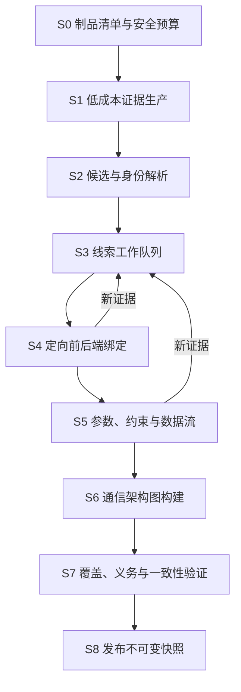

# 模块与分析架构

## 1. 设计选择

评估过两种主要方案：

### 方案 A：继续改造旧 seed-first 流水线

优点是可以快速复用既有 Fusion 和产物；缺点是分析范围、身份、前端切片和融合合同都已围绕 seed-local context 建立。把 seed 改成可选参数不会消除结构耦合，只会引入大量空上下文和兼容分支。

### 方案 B：FirmAtlas 原生重建，选择性提炼纯分析能力

新模块以固件制品和分析策略为输入，Seed/PoC/流量通过可选 Adapter 进入证据图。旧仓库只提供纯算法、fixtures 和对照基线，巨型 Fusion、Runner 和中间产物编排不迁移。

**选择方案 B。** 它的初期成本更高，但能建立清晰 Seam，并把复杂度集中到少量深模块中；这也是后续支持新语言、新后端和论文消融实验的前提。

## 2. 外部深模块

### 2.1 Firmware Mapping Module

这是控制面和分析实现之间的主 Seam。

```python
class FirmwareMapper(Protocol):
    def analyze(self, request: MappingRequest) -> FirmwareMappingSnapshot:
        """执行或恢复一次版本化分析，并返回不可变快照。"""

    def deepen(self, request: DeepenRequest) -> FirmwareMappingSnapshot:
        """针对既有快照中的实体或义务增加分析深度，返回新快照。"""

    def explain(self, request: ExplainRequest) -> EvidenceBundle:
        """展开实体、关系或判断的完整证据路径。"""
```

Interface 包含的不变量：

- 输入必须引用内容摘要稳定的 Firmware Artifact；
- `analyze` 幂等键由制品、策略、预算、分析器清单和 schema 版本组成；
- `deepen` 不修改父快照；
- 部分成功是正常返回，基础设施不可用才是调用级错误；
- 所有结果必须通过 schema、引用和证据能力验证；
- 调用者无需了解 Ghidra、解析器、工作队列或中间文件。

这一 Module 具有高 Depth：三个入口隐藏制品清单、多源分析、线索调度、身份解析、关系验证、持久化和诊断。

### 2.2 Firmware Association Module

```python
class FirmwareAssociator(Protocol):
    def search(self, query: AssociationQuery) -> AssociationResult:
        ...

    def explain(self, hypothesis_id: str) -> AssociationEvidence:
        ...
```

它消费已发布 Snapshot，不读取分析器内部产物。Implementation 隐藏多视图指纹、覆盖校准、候选召回、重排和固件谱系约束。

### 2.3 Vulnerability Mechanism Module

```python
class VulnerabilityMechanismAnalyzer(Protocol):
    def analyze(self, request: MechanismRequest) -> MechanismReport:
        ...

    def compare(self, request: MechanismComparisonRequest) -> MechanismDiff:
        ...
```

它把漏洞外部证据与 Snapshot 实体对齐，输出候选因果路径、前置条件、冲突和缺失义务。它不执行利用代码。

## 3. 依赖分类与 Seam

| 依赖 | 类别 | 设计 |
| --- | --- | --- |
| 身份解析、约束闭包、图验证 | in-process | 直接置于深模块 Implementation，纯函数测试 |
| 文件清单、SQLite、对象内容 | local-substitutable | 生产使用本地/对象存储 Adapter，测试使用临时文件和内存库 |
| FirmAtlas 任务控制面 | remote but owned（部署拆分后） | 只在真实跨进程时定义任务 Port；初期保持进程内调用 |
| Ghidra worker | remote but owned | 定义分析 Port；生产进程 Adapter + 测试 fixture Adapter |
| 模型提供方 | true external | 注入 Model Port；生产 CodexManager/模型 Adapter + deterministic fake |
| 动态仿真平台 | remote but owned / research | 独立授权 Adapter，不进入生产 Mapper 的必需依赖 |

遵循“一种 Adapter 只是想象中的 Seam，两种 Adapter 才是真实 Seam”。HTML、PHP 等 producer 初期是 Module 内部策略，不为每个类建立公开 Port；只有出现独立工具链或测试替代需求时才形成内部 Seam。

## 4. 内部分析阶段



### S0 制品清单

- 原始固件由隔离 Extraction Worker 中的 Binwalk Adapter 识别和解包；
- Binwalk 只生成带父子摘要、工具版本和执行诊断的 Derived Artifact，不直接发布测绘事实；
- Inventory Module 只读取隔离 worker 的输出目录，不在自身 Implementation 中启动 Binwalk；
- 不信任扩展名；
- 规范路径并保留原始路径；
- 处理 symlink、hardlink、archive member；
- 限制递归深度、展开体积、文件数和单文件大小；
- 记录所有跳过与失败。

### S1 低成本证据生产

优先扫描能够建立 namespace 和入口范围的内容：Web 配置、HTML/JS、脚本、启动项、字符串索引。该阶段不得因“相关性低”删除候选；排序只决定深分析顺序。

### S2 身份解析

把路径提及、请求构造、route registration 和 handler getter 等不同能力的证据聚合为候选实体。身份解析规则版本化，冲突保留并产生义务。

### S3 线索调度

调度单位是 Unresolved Obligation。优先级可由信息增益、预计成本、下游影响和当前证据覆盖共同确定：

```text
priority = expected_information_gain
         × downstream_impact
         × evidence_diversity
         ÷ estimated_cost
```

该表达用于调度研究，不作为实体真实性分数。

### S4 定向绑定

根据前序锚点执行 route/handler/xref 分析，避免对所有二进制无差别深反编译。文本侧或 Native 侧单独成功时允许发布部分结果。

### S5 参数与数据流

恢复 namespace、alias、约束、状态和 source-to-sink 关系。复杂控制流不能确定时，发布候选关系和明确义务。

### S6–S8 图构建与发布

统一验证身份引用、关系证据、循环推导、覆盖状态和 schema。发布只写新 Snapshot；查询投影可重建。

## 5. Evidence Producer 组织

| Producer | 主要输入 | 主要证据能力 |
| --- | --- | --- |
| Frontend | HTML、JS、模板、source map | constructs_request、serializes、mentions_endpoint |
| Web Configuration | server config、rewrite、docroot、auth zone | exposes、maps_namespace、requires_auth |
| Script Backend | PHP、ASP、Lua、Shell、CGI | reads_parameter、dispatches、calls、writes_state |
| Native Shallow | strings、symbols、imports、sections | mentions_endpoint、mentions_parameter、server_hint |
| Native Deep | route table、xref、decompile、data flow | registers_route、binds_handler、flows_to |
| Startup/IPC | init、service、process config | starts、listens_on、connects_to |
| Intelligence | CVE、公告、补丁、PoC metadata | external_claim、mechanism_hint |
| Runtime | trace、HTTP capture、coverage | runtime_observed、runtime_reached |

请求样例属于 Runtime/Intelligence 类 Evidence Adapter，不是特殊入口。

## 6. 模型使用边界

模型适合：

- 在已枚举源码片段中解析混淆/压缩 JS 的请求形状；
- 对反编译控制流提出参数别名或约束候选；
- 为聚类生成可读标签；
- 对冲突证据生成下一步义务建议；
- 生成面向分析员的证据摘要。

模型不得：

- 创建源文件中没有的 endpoint、parameter 或 handler 身份；
- 使用不可定位的“常识”晋级固件事实；
- 自行改变 evidence capability/status；
- 绕过 deterministic validator；
- 把其他固件中的实体直接复制为目标固件事实。

模型请求只携带最小 Evidence Bundle，响应必须满足版本化 schema，引用允许列表内的 entity/span ID。失败时降级为未决义务，不阻断确定性结果。

## 7. 建议代码目录

初期保持一个聚合内的 Locality，不预先拆成微服务：

```text
src/firmatlas/mapping/
├── __init__.py
├── domain.py              # Snapshot、实体、关系、覆盖和义务类型
├── service.py             # FirmwareMapper 外部 Interface 的实现入口
├── policy.py              # 模式、预算和晋级策略
├── inventory.py           # 安全制品清单
├── evidence.py            # EvidenceAtom、span、能力验证
├── identity.py            # Interface/Operation/Parameter 身份解析
├── scheduler.py           # 义务与固定点调度
├── relations.py           # 关系 IR、验证和闭包
├── graph.py               # 通信架构图与路径查询
├── fingerprint.py         # 六视图指纹
├── producers/             # 真实存在差异的内部 producer
│   ├── frontend.py
│   ├── web_config.py
│   ├── script_backend.py
│   ├── native.py
│   └── runtime.py
└── adapters/              # 跨真实 Seam 的 Adapter
    ├── persistence.py
    ├── binwalk_extractor.py
    ├── ghidra_worker.py
    └── model_provider.py
```

当单文件职责或变化原因出现真实分离后再拆包。禁止复制旧仓库“每种产物一个 wrapper”的目录爆炸。

控制面集成建议：

```text
src/firmatlas/
├── mapping/               # 上述深模块
├── intelligence/          # 现有漏洞情报与文本语义
├── firmware/              # 现有样本候选与发行版目录
├── association/           # Snapshot 级固件/漏洞关联
└── api/                   # HTTP Adapter，不承载领域规则
```

## 8. 持久化

首期继续使用 SQLite 作为本地/演示 Adapter，数据表按职责分离：

- mapping_runs；
- mapping_snapshots；
- mapping_entities；
- mapping_relations；
- evidence_atoms/spans；
- coverage_entries；
- unresolved_obligations；
- architecture_fingerprints；
- association_hypotheses。

原始制品与大型工具输出存 Blob，关系表只保存摘要和引用。关系型数据库是事实来源；搜索、FTS 和图投影均可重建。未证明关系查询瓶颈前不引入图数据库。

## 9. 性能模式

| 模式 | 目标 | 默认分析 |
| --- | --- | --- |
| discover | 快速建立候选目录 | inventory + text/config + shallow native |
| standard | 发布可用通信测绘 | discover + identity + targeted binding + parameters |
| deep | 解决选定高价值义务 | decompile/data-flow/model/runtime adapters by policy |

所有模式共享 Snapshot Interface，不产生三套互不兼容的数据模型。缓存键必须包含制品摘要、producer 版本、策略和输入范围；缓存命中也写入运行诊断。

## 10. 失败和安全

- 固件、脚本和二进制默认不执行；
- 解包防止路径穿越、符号链接逃逸、压缩炸弹和资源耗尽；
- Ghidra/解析器在受限工作器中运行，设置 CPU、内存和时间预算；
- 单个 producer 失败不导致其他证据丢失；
- 任何异常都转换成结构化 diagnostic 和 coverage status；
- 动态网络默认关闭，仅由授权策略和隔离环境开放；
- 研究 PoC 产物不得进入普通产品查询和公开导出。
