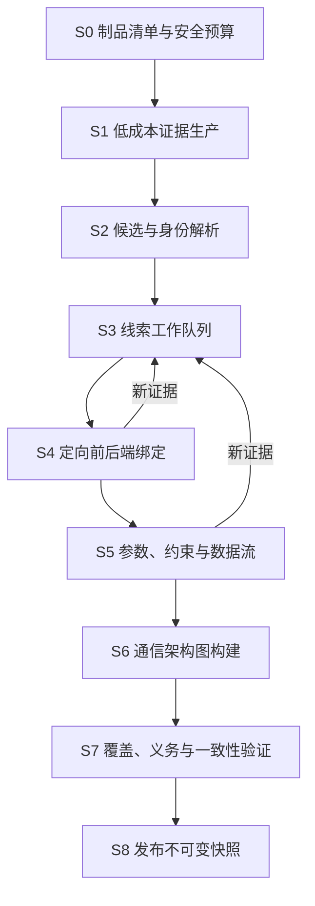

# 模块与分析架构

## 1. 设计选择

评估过两种主要方案：

### 方案 A：继续改造旧 seed-first 流水线

优点是可以快速复用既有 Fusion 和产物；缺点是分析范围、身份、前端切片和融合合同都已围绕 seed-local context 建立。把 seed 改成可选参数不会消除结构耦合，只会引入大量空上下文和兼容分支。

### 方案 B：FirmAtlas 原生重建，选择性提炼纯分析能力

新模块以固件制品和分析策略为输入，Seed/PoC/流量通过可选 Adapter 进入证据图。旧仓库只提供纯算法、fixtures 和对照基线，巨型 Fusion、Runner 和中间产物编排不迁移。

**选择方案 B。** 它的初期成本更高，但能建立清晰 Seam，并把复杂度集中到少量深模块中；这也是后续支持新语言、新后端和论文消融实验的前提。

## 2. 外部深模块

### 2.1 Firmware Mapping Module

这是控制面和分析实现之间的主 Seam。

```python
class FirmwareMapper(Protocol):
    def analyze(self, request: MappingRequest) -> FirmwareMappingSnapshot:
        """执行或恢复一次版本化分析，并返回不可变快照。"""

    def deepen(self, request: DeepenRequest) -> FirmwareMappingSnapshot:
        """针对既有快照中的实体或义务增加分析深度，返回新快照。"""

    def explain(self, request: ExplainRequest) -> EvidenceBundle:
        """展开实体、关系或判断的完整证据路径。"""
```

Interface 包含的不变量：

- 输入必须引用内容摘要稳定的 Firmware Artifact；
- `analyze` 幂等键由制品、策略、预算、分析器清单和 schema 版本组成；
- `deepen` 不修改父快照；
- 部分成功是正常返回，基础设施不可用才是调用级错误；
- 所有结果必须通过 schema、引用和证据能力验证；
- 调用者无需了解 Ghidra、解析器、工作队列或中间文件。

这一 Module 具有高 Depth：三个入口隐藏制品清单、多源分析、线索调度、身份解析、关系验证、持久化和诊断。

### 2.2 Firmware Association Module

```python
class FirmwareAssociator(Protocol):
    def search(self, query: AssociationQuery) -> AssociationResult:
        ...

    def explain(self, hypothesis_id: str) -> AssociationEvidence:
        ...
```

它消费已发布 Snapshot，不读取分析器内部产物。Implementation 隐藏多视图指纹、覆盖校准、候选召回、重排和固件谱系约束。

### 2.3 Vulnerability Mechanism Module

```python
class VulnerabilityMechanismAnalyzer(Protocol):
    def analyze(self, request: MechanismRequest) -> MechanismReport:
        ...

    def compare(self, request: MechanismComparisonRequest) -> MechanismDiff:
        ...
```

它把漏洞外部证据与 Snapshot 实体对齐，输出候选因果路径、前置条件、冲突和缺失义务。它不执行利用代码。

## 3. 依赖分类与 Seam

| 依赖 | 类别 | 设计 |
| --- | --- | --- |
| 身份解析、约束闭包、图验证 | in-process | 直接置于深模块 Implementation，纯函数测试 |
| 文件清单、SQLite、对象内容 | local-substitutable | 生产使用本地/对象存储 Adapter，测试使用临时文件和内存库 |
| FirmAtlas 任务控制面 | remote but owned（部署拆分后） | 只在真实跨进程时定义任务 Port；初期保持进程内调用 |
| Ghidra worker | remote but owned | 定义分析 Port；生产进程 Adapter + 测试 fixture Adapter |
| 模型提供方 | true external | 注入 Model Port；生产 CodexManager/模型 Adapter + deterministic fake |
| 动态仿真平台 | remote but owned / research | 独立授权 Adapter，不进入生产 Mapper 的必需依赖 |

遵循“一种 Adapter 只是想象中的 Seam，两种 Adapter 才是真实 Seam”。HTML、PHP 等 producer 初期是 Module 内部策略，不为每个类建立公开 Port；只有出现独立工具链或测试替代需求时才形成内部 Seam。

## 4. 内部分析阶段



### S0 制品清单

- 原始固件由隔离 Extraction Worker 中的 Binwalk Adapter 识别和解包；
- Binwalk 只生成带父子摘要、工具版本和执行诊断的 Derived Artifact，不直接发布测绘事实；
- Inventory Module 只读取隔离 worker 的输出目录，不在自身 Implementation 中启动 Binwalk；
- 生产 Container Adapter 只接受固定 `sha256:` 镜像身份，并强制禁网、只读根、只读输入、能力清空、`no-new-privileges`、PID/CPU/内存和有界日志；
- wall time、派生文件数与派生字节是监督预算；worker 退出后必须再次复核，快速退出不能绕过预算；
- 退出码 0 但零派生产物属于 `extraction.no_output`，不能发布空成功；
- 不信任扩展名；
- 规范路径并保留原始路径；
- 处理 symlink、hardlink、archive member；
- symlink 的 `/...` 目标在选定固件 root 内按 chroot 语义词法解析，只逐段
  `lstat`，不经链接读取或散列目标；普通缺失、循环、深度耗尽和越界进入覆盖账本，
  未物化 `/dev/*` 作为运行时设备 namespace 单独记录；
- 限制递归深度、展开体积、文件数和单文件大小；
- 记录所有跳过与失败。

### S1 低成本证据生产

优先扫描能够建立 namespace 和入口范围的内容：Web 配置、HTML/JS、脚本、启动项、字符串索引。该阶段不得因“相关性低”删除候选；排序只决定深分析顺序。

### S2 身份解析

把路径提及、请求构造、route registration 和 handler getter 等不同能力的证据聚合为候选实体。身份解析规则版本化，冲突保留并产生义务。

### S3 线索调度

调度单位是 Unresolved Obligation。优先级可由信息增益、预计成本、下游影响和当前证据覆盖共同确定：

```text
priority = expected_information_gain
         × downstream_impact
         × evidence_diversity
         ÷ estimated_cost
```

该表达用于调度研究，不作为实体真实性分数。

M1-07 Scheduler 的公开 Interface 是 `run_obligation_scheduler(initial_obligations, analyzers, policy)`。它以 `(obligation_id, analyzer_name)` 为幂等尝试身份，按 priority/identity 稳定选择，隔离 Adapter 异常和冲突输出，并在没有可执行组合时发布 `fixed_point`。开放义务不妨碍“调度 coverage completed”；它们必须保留在结果中。step 或 obligation 预算耗尽则是 `partial + budget_exhausted`。Scheduler 不读取源码，也不直接运行 Native 工具、模型、固件或 Binwalk。

M1-08 Discovery Catalog 的公开 Interface 是 `assemble_discovery_catalog(DiscoveryCatalogInput)`。它把版本化 Producer Batch、Correlation 和 Scheduler 投影到一个稳定目录，验证所有 candidate/parameter/evidence/association/obligation 引用，并发布 coverage ledger 与 `seed_input_count=0`。不同能力的候选不因 canonical value 相同而合并；Producer 专属的 method、representation、namespace、upstream、language、hint kind 和 machine 进入稳定 attributes。required batch 缺失是 failed coverage，不能是空成功。Catalog identity 与输出同时绑定 `source_inventory_coverage_status`；上游 Inventory 非 completed 时，局部 Producer 成功不能使整机 Catalog 晋级 completed。

M1-09 的持久化 Adapter 是 `DiscoveryCatalogRepository`。它将完整目录 JSON 作为不可变、内容摘要校验的发布对象保存，同时生成可重建的候选查询投影；投影不产生新主张。重复发布相同文档是幂等操作，同一 `catalog_id` 若内容摘要不同则拒绝。候选详情从同一目录文档聚合参数、EvidenceAtom、关联、Coverage Ledger 与开放义务，避免 UI 侧再次推断。SQLite 表使用 `mapping_discovery_*` 命名空间，与情报/固件目录共享数据库文件但保持独立 Module 边界。

M1-10A 的 Native Deep Interface 是 `discover_native_route_bindings(source, content, anchors, profile, policy)`。首个 Adapter 只解析版本化 Profile 允许的命名 ELF route-table section，要求 route pointer 指向 allocated/non-executable 字符串、handler pointer 指向 allocated/executable section，并发布 route literal、registration entry、handler entry 三段 EvidenceAtom。`native_deep_scheduler_analyzer(result)` 只按 exact target/capability 消费这些 proof。普通 `.data` 指针对、字符串/符号共现和不可执行 handler 地址均不能关闭义务。

M1-10B 在同一 Native Deep Module 增加 `discover_arm_pic_callsite_bindings(source, content, anchors, profile, policy)`。ARM32 Profile 验证函数内 PIC `.got` 基址、route relative literal、handler `R_ARM_GLOB_DAT` relocation、`r0/r1` 参数数据流与紧随其后的 `BL`；只有同一 callee 至少形成两个独立 route/handler 对时才把它识别为 registrar。当前规则可直接从原始 ELF 确定性验证，因此没有引入外部反编译 Worker；复杂控制流、间接调用和其他 ISA 后续再通过候选 Worker Adapter 接入，但仍必须由核心 Validator 重放原始字节。

M1-16 增加 `discover_mips_inline_route_bindings(source, content, anchors, profile, policy)`。MIPS32 Profile 只接受 profile allowlist 中带地址和大小的 defined dynamic symbol，要求符号完整位于 allocated/non-executable section、大小可整除 `route_field_bytes + pointer_size`、route 字段 NUL 终止且其余 padding 为零、handler pointer 落入 allocated/executable section。每条 binding 发布 route literal、dynamic table symbol、完整 entry 与 handler 四线 EvidenceAtom；部分坏项降级为 `partial`。X5000R 真实回放由此绑定 123/199 个 selector，并把 76/14 双向差集保留为覆盖和归因输入，而不是用字符串共现填平。

M1-17 增加 `discover_mips_handler_value_flows(source, content, handler_address, profile, policy)`。首个 Profile 只验证 MIPS32 handler 的无分支前缀：从 dynamic MIPS GOT 元数据解析 `jalr` callee，重放 GP 的 stack save/restore、delay slot、常量寄存器和 getter 返回值 provenance，并在首个条件分支停止。只有参数字面量、getter call、状态键字面量、setter call 和 `parameter->state` 映射五线同时成立，才发布 `native_parameter_state_flow`。`completed` 只覆盖声明的 branch-free scope；分支后缀仍产生显式义务。

M1-18 增加 `attribute_frontend_native_set_difference(frontend, native_inventory, artifacts, policy)`。该 Module 对已发布的 Frontend Asset Graph 与 Native binding inventory 做双向集合差异，再在有界 Web/ELF 辅助制品中收集 exact identifier evidence。Frontend-only 区分“辅助页面实际消费”和“仅 wrapper 声明”；Native-only 区分“原前端范围缺口”“跨 Native token 变体”和“无前端引用注册”。suffix/prefix 变体不能晋级 exact，所有归因只发布 `set_difference_attribution` 和开放义务，不会生成 `binds_handler`。

M1-19 深化既有 `discover_frontend_asset_graph(assets, policy)` Interface，不增加样本专属入口。Implementation 能把 constructor-backed `.request` 默认 URL 绑定到全局 receiver，并只解析同一函数作用域内到达调用点的 object-literal payload；还可恢复被 `.fileUpload({data, url:this.property})` 唯一消费的 multipart URL，将 `action=upload&setting/setUploadSetting` 保留为两级 selector。默认 URL、消费调用、参数名和 selector 均保存独立 EvidenceAtom。跨函数同名变量、无 payload upload、歧义属性和未证明的 helper 语义必须 fail closed。

未来 Ghidra Adapter 采用 `Candidate Worker → Core Validator`，而不是让反编译器成为事实来源。Worker 的 versioned manifest 固定 Ghidra/script/input SHA、language ID、image base、预算、xref/call-site/P-code candidates 与 coverage；stdout、自由文本反编译和启发式置信度都不能直接关闭义务。详细合同及从相邻项目吸收/拒绝的实现经验见 [Native Ghidra Adapter 设计](./native-ghidra-adapter.md)。

M1-11 Corpus Report Module 的公开 Interface 是 `build_corpus_report(CorpusReportInput) -> CorpusReport`。它只读取不可变 Discovery Catalog 与显式研究样本定义，不重新分析源码，也不从路径风格推断架构类别。Module 分开记录 `real_firmware`、`derived_firmware`、`contract_fixture` 与 `external_lead`；只有 real firmware 的预期制品摘要与 Catalog 一致、coverage completed、所需 Evidence Capability 全部满足、禁止能力未出现且没有开放义务时，类别才能成为 `verified`。样本编排脚本是 benchmark Adapter，不属于 Mapper 核心 Interface。

M1-12 Research Case Module 的公开 Interface 是 `build_research_case(ResearchCaseInput) -> ResearchCase` 和 `validate_research_case_corpus(cases) -> CorpusValidation`。它不生成新的固件事实，只引用既有 EvidenceAtom 或 Coverage Ledger，保存 Claim 的 `supported/unresolved/rejected` 状态、分析 Stage、Obligation 创建/关闭时间线、反事实、论文用途和局限。内容寻址 identity 绑定完整案例叙事；未知引用、阶段乱序和无证据关闭会拒绝。该 Module 与 Corpus Report 不合并：Corpus Report 回答类别覆盖是否达到 gate，Research Case 回答一个复杂现象如何被证据逐步解释以及论文可以负责任地使用什么。

### S4 定向绑定

根据前序锚点执行 route/handler/xref 分析，避免对所有二进制无差别深反编译。文本侧或 Native 侧单独成功时允许发布部分结果。

### S5 参数与数据流

恢复 namespace、alias、约束、状态和 source-to-sink 关系。复杂控制流不能确定时，发布候选关系和明确义务。

### S6–S8 图构建与发布

统一验证身份引用、关系证据、循环推导、覆盖状态和 schema。发布只写新 Snapshot；查询投影可重建。

## 5. Evidence Producer 组织

| Producer | 主要输入 | 主要证据能力 |
| --- | --- | --- |
| Frontend | HTML、JS、模板、source map | constructs_request、serializes、mentions_endpoint |
| Web Configuration | nginx、startup、proprietary httpd Control | exposes、maps_namespace、requires_auth、binds_handler |
| Script Backend | PHP、PHP-XGI、ASP、Lua、Shell、CGI | reads_parameter、selects_operation、reads/writes_configuration |
| Native Shallow | strings、symbols、imports、sections | mentions_endpoint、mentions_parameter、server_hint |
| Native Deep | route table、xref、decompile、data flow | registers_route、binds_handler、maps_parameter_to_state、flows_to |
| Startup/IPC | init、service、process config | starts、listens_on、connects_to |
| Intelligence | CVE、公告、补丁、PoC metadata | external_claim、mechanism_hint |
| Runtime | trace、HTTP capture、coverage | runtime_observed、runtime_reached |

请求样例属于 Runtime/Intelligence 类 Evidence Adapter，不是特殊入口。

M1-04 Frontend Producer 当前声明的能力范围是 `R.pageModel`、`R.moduleModel.getSubmitData`、jQuery `getJSON/post/ajax` 与 HTML Form。`completed` 表示这些声明构造已在文件内完整执行，不表示任意动态 JavaScript、框架封装或混淆代码都已恢复。结果保留 exact literal 与 literal prefix 的差别；完全动态 URL 必须在后续 Producer 或模型义务中保持 unknown。

M1-05 Web Configuration Producer 的公开 Interface 是 `discover_web_configuration(source_entry, source_bytes, policy)`。当前声明支持 nginx、直接 POSIX shell 的 `nginx`/`spawn-fcgi` 启动形式，以及模板中的 proprietary httpd `Control/Alias/Location/External` 静态块，发布 listener、document root、namespace mapping、auth requirement、service start 和 external handler binding。嵌入 PHP 会先被等长屏蔽而不会执行或作为静态配置；配置事实与 frontend candidate 保持不同身份。`completed` 只表示声明格式和构造执行完成，不表示任意 Web server 配置、模板控制流或运行时可达性均已恢复。

M1-06B Script Backend Producer 的公开 Interface 是 `discover_script_backend(source_entry, source_bytes, policy)`。当前声明支持厂商 ASP 的 `Request_Form/TCWebApi_*`、PHP superglobal 与显式框架 route、PHP-XGI `ACTION_POST/query/queryEnc/set/setEnc`、LuCI `entry/formvalue`、Shell CGI shebang与环境变量。它分别发布 CGI program、显式 route、parameter、selector、configuration access 和 template read；文件路径、扩展名和模板读取不能产生 `registers_route`。PHP-XGI 扫描要求同一源码存在 `$ACTION_POST` dialect anchor，复杂 set 表达式不发明参数身份；组合 LuCI 路径或规范化 HTTP header 使用 `deterministic_derived` 证据，仍保留精确来源 span。

M1-06A Native Shallow Producer 的公开 Interface 是 `discover_native_hints(source_entry, source_bytes, policy)`。Implementation 直接读取 ELF section 与 dynamic symbol table，并从受控 printable spans 发布 endpoint literal、route token、symbol 与 server hint。普通字符串扫描排除 ELF string-table 区域，避免把链接符号重复误判为 route token。该 Producer 只用于候选召回和深分析调度；名字相似或同一制品中的字符串与符号不能产生 `binds_handler` 关系。

M1-06C Correlation Module 的公开 Interface 是 `correlate_frontend_native(frontend_results, native_results, policy)`。它只使用 exact endpoint 或 case-sensitive exact action component 形成 candidate association，稳定去重并传播上游 coverage；不读取源文件、不调用模型、不比较 symbol 名称。匹配结果产生 `registers_route/binds_handler` 义务，未匹配 frontend 结果产生 `registers_route` 义务，因此关联层提供调度线索但不越权发布实现关系。

## 6. 模型使用边界

模型适合：

- 在已枚举源码片段中解析混淆/压缩 JS 的请求形状；
- 对反编译控制流提出参数别名或约束候选；
- 为聚类生成可读标签；
- 对冲突证据生成下一步义务建议；
- 生成面向分析员的证据摘要。

模型不得：

- 创建源文件中没有的 endpoint、parameter 或 handler 身份；
- 使用不可定位的“常识”晋级固件事实；
- 自行改变 evidence capability/status；
- 绕过 deterministic validator；
- 把其他固件中的实体直接复制为目标固件事实。

模型请求只携带最小 Evidence Bundle，响应必须满足版本化 schema，引用允许列表内的 entity/span ID。失败时降级为未决义务，不阻断确定性结果。

## 7. 建议代码目录

初期保持一个聚合内的 Locality，不预先拆成微服务：

```text
src/firmatlas/mapping/
├── __init__.py
├── domain.py              # Snapshot、实体、关系、覆盖和义务类型
├── service.py             # FirmwareMapper 外部 Interface 的实现入口
├── policy.py              # 模式、预算和晋级策略
├── inventory.py           # 安全制品清单
├── evidence.py            # EvidenceAtom、span、能力验证
├── identity.py            # Interface/Operation/Parameter 身份解析
├── scheduler.py           # 义务与固定点调度
├── relations.py           # 关系 IR、验证和闭包
├── graph.py               # 通信架构图与路径查询
├── fingerprint.py         # 六视图指纹
├── research_case.py       # 证据时间线、反事实、论文案例准入
├── producers/             # 真实存在差异的内部 producer
│   ├── frontend.py
│   ├── web_config.py
│   ├── script_backend.py
│   ├── native.py
│   └── runtime.py
└── adapters/              # 跨真实 Seam 的 Adapter
    ├── persistence.py
    ├── binwalk_extractor.py
    ├── ghidra_worker.py
    └── model_provider.py
```

当单文件职责或变化原因出现真实分离后再拆包。禁止复制旧仓库“每种产物一个 wrapper”的目录爆炸。

控制面集成建议：

```text
src/firmatlas/
├── mapping/               # 上述深模块
├── intelligence/          # 现有漏洞情报与文本语义
├── firmware/              # 现有样本候选与发行版目录
├── association/           # Snapshot 级固件/漏洞关联
└── api/                   # HTTP Adapter，不承载领域规则
```

## 8. 持久化

首期继续使用 SQLite 作为本地/演示 Adapter，数据表按职责分离：

- mapping_runs；
- mapping_snapshots；
- mapping_entities；
- mapping_relations；
- evidence_atoms/spans；
- coverage_entries；
- unresolved_obligations；
- architecture_fingerprints；
- association_hypotheses。

原始制品与大型工具输出存 Blob，关系表只保存摘要和引用。关系型数据库是事实来源；搜索、FTS 和图投影均可重建。未证明关系查询瓶颈前不引入图数据库。

## 9. 性能模式

| 模式 | 目标 | 默认分析 |
| --- | --- | --- |
| discover | 快速建立候选目录 | inventory + text/config + shallow native |
| standard | 发布可用通信测绘 | discover + identity + targeted binding + parameters |
| deep | 解决选定高价值义务 | decompile/data-flow/model/runtime adapters by policy |

所有模式共享 Snapshot Interface，不产生三套互不兼容的数据模型。缓存键必须包含制品摘要、producer 版本、策略和输入范围；缓存命中也写入运行诊断。

## 10. 失败和安全

- 固件、脚本和二进制默认不执行；
- 解包防止路径穿越、符号链接逃逸、压缩炸弹和资源耗尽；
- Ghidra/解析器在受限工作器中运行，设置 CPU、内存和时间预算；
- 单个 producer 失败不导致其他证据丢失；
- 任何异常都转换成结构化 diagnostic 和 coverage status；
- 动态网络默认关闭，仅由授权策略和隔离环境开放；
- 研究 PoC 产物不得进入普通产品查询和公开导出。
