# 领域与证据模型

本文定义固件通信测绘模块的概念合同。规范词汇以仓库根目录 [`CONTEXT.md`](../../CONTEXT.md) 为准；本文补充结构、关系和不变量，但不创造同义术语。

## 1. 聚合关系

```mermaid
classDiagram
    FirmwareArtifact "1" --> "*" SourceArtifact : contains
    FirmwareArtifact "1" --> "*" FirmwareMappingSnapshot : mapped_as
    FirmwareMappingSnapshot "1" --> "*" MappingEntity : publishes
    FirmwareMappingSnapshot "1" --> "*" SemanticRelation : publishes
    FirmwareMappingSnapshot "1" --> "*" CoverageEntry : qualifies
    FirmwareMappingSnapshot "1" --> "*" UnresolvedObligation : leaves
    EvidenceAtom "*" --> "1" SourceArtifact : locates
    SemanticRelation "*" --> "1..*" EvidenceAtom : supported_by
    MappingEntity "*" --> "1..*" EvidenceAtom : identified_by
    ExposedInterface "1" --> "*" InterfaceOperation : contains
    InterfaceOperation "1" --> "*" ParameterIdentity : accepts_or_returns
    InterfaceOperation "*" --> "*" HandlerIdentity : binds_to
    HandlerIdentity "*" --> "*" StateLocation : reads_or_writes
    HandlerIdentity "*" --> "*" SensitiveBehavior : reaches
```



一个 Snapshot 是发布边界，不是所有实体的永久所有者。相同制品的新分析策略会生成新 Snapshot；实体可以通过稳定的内容派生身份跨 Snapshot 对齐，但历史 Snapshot 不被修改。

## 2. 核心实体

### 2.1 SourceArtifact

分析范围内可定位内容的身份：

- `artifact_id`：由父制品、规范路径和内容摘要派生；
- `kind`：file、symlink、archive-member、filesystem-node、tool-output；
- `content_digest`；
- `canonical_path` 与原始路径；
- `parent_artifact_id`；
- 大小、文件类型和安全展开状态。

路径不能作为唯一身份。同一路径在两个固件版本中是两个 SourceArtifact；同一内容可通过摘要建立复用关系。

### 2.2 EvidenceSpan

证据在 SourceArtifact 中的精确定位：

- 文本行列或字符区间；
- 二进制 byte range；
- 函数、基本块、地址或符号；
- 结构化文档中的节点路径；
- 运行时 trace 的事件区间。

定位信息必须足以在相同输入和工具版本下回放。只保存截断摘要而没有原始位置，不构成可回放证据。

### 2.3 EvidenceAtom

建议最小合同：

```text
EvidenceAtom
  id
  subject_ref
  predicate
  object_value_or_ref
  source_span
  producer
  producer_version
  observation_kind
  capability
  confidence
  extraction_context
```

`observation_kind`：

- `direct_static`：直接存在于原始内容；
- `deterministic_derived`：由可重放规则推导；
- `model_suggested`：模型对既有证据提出的结构化建议；
- `runtime_observed`：隔离运行中实际观察；
- `human_asserted`：人工结论，必须保留操作者与理由。

`capability` 示例：

- `mentions_endpoint`；
- `constructs_request`；
- `registers_route`；
- `binds_handler`；
- `reads_parameter`；
- `validates_value`；
- `controls_reachability`；
- `reaches_sensitive_behavior`。

证据能力是晋级规则的输入。例如描述中出现 `/goform/x` 可以支撑 `mentions_endpoint`，不能支撑 `binds_handler`。

### 2.4 MappingEntity

所有图实体的公共字段：

- 稳定 `entity_id`；
- `entity_kind`；
- canonical identity；
- aliases；
- identity status；
- supporting/refuting evidence references；
- first/last observed snapshot references。

重要实体类型：

| 实体 | 关键身份字段 |
| --- | --- |
| Execution Principal | artifact/process role/interpreter |
| Communication Endpoint | transport/address/port or local endpoint |
| Exposed Interface | protocol/endpoint/method/representation/selector schema/auth context |
| Interface Operation | interface/selector assignment/request shape/response shape |
| Parameter Identity | operation/namespace/canonical name/direction |
| Handler Identity | artifact/function or script block/entry semantics |
| State Location | storage kind/key/scope/lifetime |
| Sensitive Behavior | behavior kind/target/side-effect class |
| Workflow State | protocol or application state identity |

### 2.5 SemanticRelation

关系是独立、可证据化的事实或主张，不嵌入实体属性。建议关系词表：

```text
contains, exposes, selects, constructs, serializes, deserializes,
binds_to, calls, reads, writes, validates, transforms, aliases,
requires_state, transitions_to, controls, flows_to, responds_with,
listens_on, connects_to, persists_to, derived_from
```

关系至少包含：source、predicate、target/value、status、evidence、rule version。派生关系必须能够展开到不可变证据原子。

## 3. 多轴状态

不能用一个 `confirmed` 表达所有维度。每个接口或操作至少分别记录：

| 维度 | 示例值 |
| --- | --- |
| discovery | candidate / supported / observed |
| identity | unresolved / partial / stable / conflict |
| exposure | internal / potentially_exposed / exposed / unknown |
| binding | unbound / candidate / supported / runtime_verified |
| semantics | names_only / parameters / constraints / flows / complete_for_scope |
| reachability | not_analyzed / static_candidate / blocked / runtime_reached |

状态晋级由证据能力规则决定，通用 confidence 不能跨维度代替状态。

## 4. 参数语义

参数应支持：

- namespace：path、query、form、json、xml、header、cookie、multipart、binary-field；
- direction：request、response、bidirectional；
- value shape：scalar、object、array、blob、union；
- primitive type、format、encoding；
- required、default、enum、range、length、pattern；
- presence dependency、value dependency、ordering dependency；
- aliases、transformations；
- input source、internal flow、state location、sensitive behavior；
- authentication/role/state precondition。

约束使用关系 IR 表达，不把不可组合的自然语言塞进 `attributes`。无法表达的内容保留证据和未决义务，不猜测默认值。

## 5. 通信架构图

图至少覆盖五层：

1. **制品层**：文件、脚本、二进制、配置、模板；
2. **运行层**：进程角色、服务、监听端点、解释器；
3. **交互层**：接口、操作、参数、请求/响应结构；
4. **实现层**：dispatcher、handler、parser、callee；
5. **状态与影响层**：认证、session、持久化状态、敏感行为。

前端 UI 页面不是接口身份的一部分，但它与请求构造关系是重要证据。漏洞记录也不是固件图实体的身份来源，而是通过证据映射连接。

## 6. Snapshot 合同

```text
FirmwareMappingSnapshot
  schema_version
  snapshot_id
  firmware_artifact_digest
  parent_snapshot_id?
  policy
  budget
  analyzer_manifest
  source_inventory_digest
  entities[]
  relations[]
  evidence_atoms[]
  coverage_ledger[]
  unresolved_obligations[]
  diagnostics[]
  fingerprints[]
  started_at / completed_at
  status
```

Snapshot 允许 `partial_success`。只有以下条件同时满足才可以是 `success`：

- 声明范围内的必需 producer 均完成或明确不适用；
- 没有破坏结果有效性的诊断；
- schema 与关系验证通过；
- 所有已发布实体和关系的证据引用可解析。

`success` 不代表完整恢复固件所有真实接口，只代表成功完成所声明的分析策略。

## 7. Coverage Ledger

Coverage Entry 建议维度：

- scope：artifact subtree、language、producer、architecture capability；
- status：completed、partial、failed、skipped_by_policy、unsupported、not_applicable；
- observed count 与 processed count；
- budget consumed；
- diagnostics；
- analyzer version。

“0 个接口”只有在相关范围 `completed` 且 producer 能力覆盖目标类型时，才可以解释为负面观察。其他情况必须表述为 unknown。

## 8. Unresolved Obligation

未决义务是可调度对象而不是“待复核”标签：

```text
Obligation
  target_claim_or_entity
  required_capability
  reason
  candidate_analyzers[]
  priority
  estimated_cost
  blocked_by[]
  status
```

示例：

- 已观察路径字符串，但需要 `registers_route` 或 `constructs_request` 证据确认暴露；
- 已识别共享 CGI，但 selector 值集合未解析；
- 参数 getter 已观察，但无法绑定到具体 Operation；
- 危险 sink 已观察，但缺少外部输入可达关系。

## 9. 领域不变量

1. 每个已发布实体至少有一个身份证据；
2. 每个已发布关系至少有一个证据原子或一条可展开的确定性推导链；
3. `model_suggested` 不能单独将 discovery、binding 或 reachability 晋级到 confirmed/verified；
4. Seed、PoC、CVE 描述不得成为 SourceArtifact 中不存在实体的唯一确认来源；
5. Interface Operation 必须从 Exposed Interface 派生，不允许只以 handler 名作为外部身份；
6. 参数别名必须指向明确 namespace，不能跨 Operation 按字符串全局合并；
7. Snapshot 一经发布不得原地修改；
8. 分析失败必须进入 Coverage Ledger 和 Diagnostics；
9. 相似度和聚类结果不得作为被聚类实体自身的身份确认依据；
10. 漏洞机制路径中的每一跳都必须标明证据状态，不能用 CWE 标签补齐缺失路径。

## 10. 边界场景

| 场景 | 正确建模 |
| --- | --- |
| `/HNAP1` 由 30 个 SOAPAction 共享 | 1 个 Interface，30 个 Operation |
| `/goform/SetX` 和 `/goform/SetY` 使用同一 dispatcher | 两个 Interface/Operation，通过共享 dispatch 指纹关联 |
| `.cgi` 路径只存在于帮助文本 | candidate + mentions evidence，不确认 exposed |
| 前端字段 `devName` 到后端 `name` 再到 `wl_alias` | 一个 Parameter Identity，三类 alias/flow relation |
| Native 分析超时 | 保留文本结果，Native coverage=failed，产生 binding obligation |
| 两个固件路径完全相同但 handler 不同 | wire 相似；binding/code 不相似，不宣称同架构 |
| 危险函数存在但 auth 分支阻断 | sink 存在；reachability=blocked，不生成已确认漏洞匹配 |
