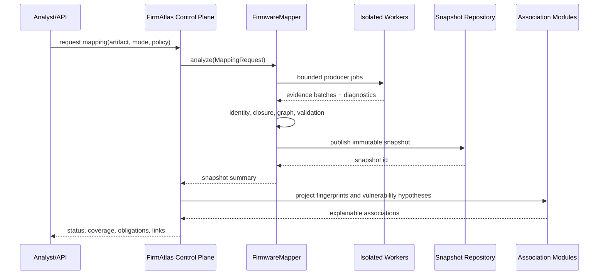

# FirmAtlas 集成设计

## 1. 当前能力与目标能力的差距

FirmAtlas 当前已经具备：

- 固件样本候选、来源和候选版本身份；
- NVD/CISA KEV 等漏洞情报；
- 候选版本与漏洞受影响声明的可解释关联；
- 从 CVE 标题/描述提取接口、参数和攻击语义；
- 基于路径结构的接口风格与后端通信架构风格推荐；
- 固件、漏洞和语义接口的多级调查 UI。

但当前漏洞语义分析的输入是漏洞文本，不是固件文件。它产生的是外部情报观察，不等同于固件测绘证据。新 Module 要补齐中间核心：

```text
Firmware Artifact
→ Firmware Mapping Snapshot
→ Interface/Operation/Parameter/Architecture entities
→ External intelligence alignment
→ Version-aware vulnerability mechanism hypotheses
```

## 2. 集成原则

### 2.1 不破坏现有情报能力

现有 `Vulnerability Semantic Analysis` 保留，定位调整为 `ExternalIntelligenceEvidenceAdapter`。它提供：

- endpoint/parameter/mechanism hint；
- 历史漏洞案例检索的查询特征；
- 对固件 Snapshot 的候选实体对齐。

它不能单独确认目标固件确实暴露某接口，也不能直接把漏洞描述中的厂商和产品覆盖到固件内部身份。

### 2.2 绞杀式迁移

不复制旧工具的顶层 Pipeline。每迁移一个能力必须满足：

1. 以新领域类型输入和输出；
2. 不读取旧工具全局 `out/` 布局；
3. 通过新 Module Interface 的 contract test；
4. 旧实现只作为对照或 fixture 生成器；
5. 新实现达到出口门后才移除对应临时 Adapter。

### 2.3 Snapshot 是集成合同

控制面、查询、UI、关联和论文实验只消费已发布 Snapshot，不依赖 producer 中间文件。这保证分析器替换不会扩散到调用者，提高 Locality。

## 3. 控制面流程



运行状态建议：queued、running、partial_success、success、failed、cancelled。`partial_success` 可以进入查询，但 UI 必须显示覆盖缺口。

## 4. 数据接入

### 4.1 从候选到制品

现有 Firmware Sample Candidate 不能直接分析。必须经过：

1. 下载策略与许可检查；
2. 内容嗅探和大小限制；
3. SHA-256 去重；
4. 登记 Firmware Artifact；
5. 绑定 Candidate、Release 和 Acquisition Source；
6. 创建 Mapping Run。

候选 URL 失效不影响已保存 Artifact；同一 Artifact 可关联多个 Candidate/Release，但每个来源证据保留。

### 4.2 表与版本策略

Snapshot 表使用不可变 payload version。关系、实体和证据可以规范化存储以支持查询，同时保留完整序列化 Snapshot 作为重放合同。

推荐迁移顺序：

1. schema_version + run/snapshot；
2. evidence + coverage + obligation；
3. entity + relation；
4. fingerprints + association；
5. read model/FTS projections。

写入新表不应扩展现有大型 Repository 的条件分支。为 Mapping 聚合建立独立 Repository Adapter；HTTP handler 通过 Application Module 调用，不直接执行 SQL。

## 5. 查询 Interface

HTTP 只是 Adapter，建议资源合同如下：

| 路由 | 用途 |
| --- | --- |
| `POST /api/firmware/artifacts/{id}/mappings` | 请求 discover/standard/deep 分析 |
| `GET /api/mappings/{snapshot_id}` | 快照摘要、状态、覆盖和版本 |
| `GET /api/mappings/{snapshot_id}/interfaces` | 分页查询 Interface/Operation |
| `GET /api/mappings/{snapshot_id}/parameters` | 按接口、namespace、方向和状态过滤参数 |
| `GET /api/mappings/{snapshot_id}/architecture` | 查询通信架构子图 |
| `GET /api/mapping/entities/{entity_id}/evidence` | 展开证据路径 |
| `GET /api/mappings/{snapshot_id}/obligations` | 查询未决义务和可执行深分析 |
| `POST /api/mappings/{snapshot_id}/deepen` | 针对实体或义务创建子快照 |
| `POST /api/interface-associations/search` | 多视图接口/固件关联检索 |
| `GET /api/vulnerabilities/{id}/mechanisms` | 漏洞机制路径和固件差异 |

查询规则：

- 列表默认只返回摘要，不传输完整证据图；
- 每个筛选均在服务端分页；
- 排序区分原样身份命中、别名命中、结构命中和语义命中；
- 相似关联必须返回 view-level score、coverage 和理由；
- API 不把 unknown 转成空数组或 0 分。

## 6. UI 工作台

### 6.1 固件详情

新增“通信测绘”工作区：

- Snapshot 选择器和版本/策略信息；
- 分析覆盖雷达：前端、配置、脚本、Native、运行时；
- 接口与 Operation 目录；
- 参数、约束、认证和状态摘要；
- 通信架构图；
- 未决义务及“深化分析”入口；
- 同版本历史 Snapshot 差异。

### 6.2 接口调查面板

沿用现有多级调查栈，不发生左侧导航跳转。层级建议：

```text
Firmware Detail
← Interface/Operation Detail
← Parameter/Handler/Evidence Detail
← Vulnerability Mechanism or Associated Firmware Detail
```

每一级保留父级可见性、筛选和滚动位置。深层面板按右侧锚点向左展开，宽度不得交叉；达到视口上限后使用当前层全屏，而不是继续覆盖父层。

### 6.3 通信架构可视化

默认使用分层视图而不是一次展示全部图节点：

- 外部入口；
- dispatcher/handler；
- 参数与状态；
- 敏感行为/响应。

节点颜色表达实体类型，边线型表达证据状态，透明度表达覆盖而非“风险”。点击任意关系打开 Evidence Bundle，允许在源码位置、漏洞描述和运行时事件之间切换。

### 6.4 关联解释

“可能同类”展示六视图：

- wire；
- dispatch；
- binding；
- parser；
- state；
- code。

用户可选择严格条件，例如“至少 dispatch + parser supported”。路径表面匹配单独列为“结构候选”，避免与强关联混排。

## 7. 与漏洞关联的协作

现有版本关联回答“发行版是否落在来源声明的受影响范围”。新机制关联回答“固件内部是否存在相似入口、实现和可达机制”。两者并行存在：

```text
Version Association Lead
+ Mapping Entity Alignment
+ Mechanism Path Evidence
+ Patch/Runtime Evidence
→ Vulnerability Match / Validation Verdict
```

不能用内部机制相似性覆盖权威版本范围，也不能用 CPE 命中覆盖固件内的反证。冲突进入独立判断记录。

## 8. 版本差异

比较两个 Snapshot 时先按稳定身份和证据对齐：

- 新增/删除 Interface 与 Operation；
- 参数和约束变化；
- auth/state guard 变化；
- handler binding 和危险 sink 变化；
- 六视图指纹变化；
- Coverage 差异。

如果两个 Snapshot 的 producer/策略覆盖不同，差异必须标记“可能由分析覆盖造成”，不能直接解释为固件代码变化。

## 9. 旧工具能力迁移表

| 旧能力 | 处理方式 | 新位置 |
| --- | --- | --- |
| 物理文件 inventory / symlink 去重 | 提炼与重测 | `mapping.inventory` |
| filesystem URL namespace | 提炼为确定性规则 | `mapping.identity` / web config producer |
| evidence graph / canonical identity | 迁移概念与纯实现 | `mapping.evidence` / `mapping.identity` |
| relation IR / validator / closure | 提炼为核心 Implementation | `mapping.relations` |
| frontend semantic extractors | 按语言逐个迁移 | `mapping.producers.frontend` |
| text backend statement semantics | 迁移 IR，不迁移旧编排 | `mapping.producers.script_backend` |
| binary route inventory | 拆成 shallow/deep producer | `mapping.producers.native` |
| seed-local discovery | 不迁移 | optional evidence Adapter 取代 |
| Fusion / Runner / artifact wrappers | 不迁移 | FirmwareMapper 内部编排 + Snapshot |
| harness/PoC materialization | 研究隔离 | runtime/research Adapter |

## 10. 兼容与发布

- 新表和新路由以 additive migration 引入；
- 现有漏洞情报、固件候选和版本关联 API 保持可用；
- UI 在没有 Snapshot 时显示“尚未测绘”，不伪造空接口列表；
- 旧路径风格分类继续作为 `wire` 弱特征，结果标注来源；
- 每个里程碑发布后同时验证旧工作台回归与新纵向行为；
- 部署遵守根目录 `AGENTS.md`，使用 `make deploy`，除非明确替换远端数据库才使用 `make deploy-with-data`。
