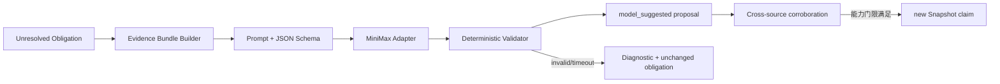

# 大模型推理与 MiniMax 接入设计

## 1. 阶段策略

设计和初始实现由 GPT 辅助研究、编码和审查。自 R2-32 起，MiniMax 只作为持续业务运行的外部
Adapter，为已发布 Catalog 的未决义务生成待验证建议；它不参与 Snapshot 合同、确定性 inventory、
基础证据提取或事实晋级。

这样可以避免在基础模型尚未稳定时，把规则缺口、身份混乱或测试缺失误包装成“模型能力问题”。

## 2. 模型适合承担的义务

| 场景 | 模型输入 | 允许输出 |
| --- | --- | --- |
| 压缩/混淆 JS 请求恢复 | 有限源码 span、候选实体 | request shape 和引用既有 span 的候选关系 |
| 反编译语义判读 | 目标函数、字符串、调用上下文 | 参数别名、约束、状态读写候选 |
| 证据冲突分析 | 已枚举 claims/evidence | 冲突解释和下一步 Obligation |
| Message Shape 恢复 | 序列化/反序列化片段 | 结构化字段、容器和依赖候选 |
| 架构聚类命名 | 六视图指纹摘要 | 可读标签和解释，不改变聚类成员 |
| 漏洞机制解释 | 已验证路径和历史案例 | 机制摘要、差异和待验证条件 |

不适合交给模型：全量文件清单、摘要计算、精确字符串定位、路由规则确定性匹配、Snapshot 引用验证、状态晋级和安全预算。

## 3. 推理 Seam

模型位于 `Evidence Reasoning` 内部 Seam，而不是 `FirmwareMapper` 外部 Interface。R2-32 的生产合同为：

```python
class MappingReasonerAdapter(Protocol):
    def propose(self, request: MappingReasoningRequest) -> dict:
        ...
```

生产 `MiniMaxReasonerAdapter` 与测试 Fake Adapter 满足同一 Interface。`MappingReasoningService` 从不可变
Catalog 建立最小证据包，执行 Adapter，再按 target/evidence 白名单校验并持久化独立 ReasoningRun。
重复成功请求去重；失败后产生新的 attempt，旧失败记录不被覆盖。

`ReasoningRequest` 必须包含：

- Catalog ID、coverage 和优先 obligation；
- 允许引用的 entity/evidence/span ID 白名单；
- 有界候选摘要与精确 EvidenceAtom locator，不发送完整固件；
- schema、prompt 和 policy 版本；
- 最大 token、超时和数据分类。

`MappingReasoningProposal` 只允许：

- 引用白名单实体；
- 保持 `model_suggested`，不伪装成 EvidenceAtom；
- 建议分析步骤、候选关系、参数别名、冲突解释或缺失证据；
- 提供结构化警告和 token 使用量。

它不能直接发布 Snapshot 或把状态改成 supported/runtime_verified。

## 4. MiniMax 配置

Adapter 使用 MiniMax 当前官方 Chat Completions endpoint：

```text
MINIMAX_BASE_URL=https://api.minimaxi.com/v1
MINIMAX_API_KEY=<secret>
MINIMAX_MODEL=<explicit model id>
```

安全规则：

- Key 只从环境变量或部署 secret provider 注入；
- Key 不写入 Git、SQLite、Snapshot、分析日志、progress 或错误消息；
- HTTP/API 设置只返回 `has_api_key`，不返回值或前后缀；
- prompt cache fingerprint 包含 provider、base URL、model、prompt/schema 版本，不包含 Key；
- Key 缺失时模型能力进入 `skipped_by_policy` 或 `unsupported` Coverage，不阻断确定性结果；
- 在模型和协议版本正式核验前不硬编码默认模型名。
- 请求使用 `max_completion_tokens`；当前官方 OpenAPI 未声明 `response_format`，因此本地严格解析 JSON，
  不发送或依赖该字段；
- HTTP 码与响应体 `base_resp.status_code` 均须检查，只有明确瞬态错误使用有界重试；
- 供应商公开材料没有给出适用于本流程的零保留/不训练承诺，因此只发送最小脱敏证据包。

用户提供的凭证未写入仓库、数据库或文档，也未用于本轮在线调用。由于凭证已经出现在对话上下文，
正式接入前应轮换。官方协议与数据边界核验见
[R2-32 原始来源研究](./research/2026-08-18-minimax-mapping-reasoning-primary-sources.md)。

## 5. 调用流程



模型输出本身永远停留在 suggested，并与 Catalog 分库存储。只有后续确定性分析器或运行时来源满足
capability rule 后，新的 Catalog/Snapshot 才能发布 supported 关系；R2-32 不实现自动晋级。

## 6. 成本和可靠性

- 按 Obligation 调用，不按文件调用；
- 相同 evidence bundle + model/prompt/schema 使用幂等缓存；
- 批量任务设置并发、QPS、token 和日预算；
- 429/5xx 使用有上限的指数退避；
- schema 错误最多进行一次结构修复，不做无限自反思；
- 超时返回诊断并保留原义务；
- 敏感证书、密钥、凭据和无关用户数据在 bundle 构建时剔除；
- 大型固件只发送最小 span，不上传整个 rootfs。

## 7. 模型专项评测

必须与确定性主链分开报告：

- schema-valid rate；
- evidence citation precision；
- unsupported entity hallucination rate；
- obligation resolution precision/recall；
- token/latency/cost per resolved obligation；
- 不同模型/关闭模型的消融；
- provider outage 下 Snapshot 可用性；
- prompt injection fixture 和敏感信息泄漏测试。

模型业务能力只有在固定离线 fixture 上通过上述门限后才允许默认开启。生产默认建议先关闭，由策略对指定 deep analysis 任务显式开启。
