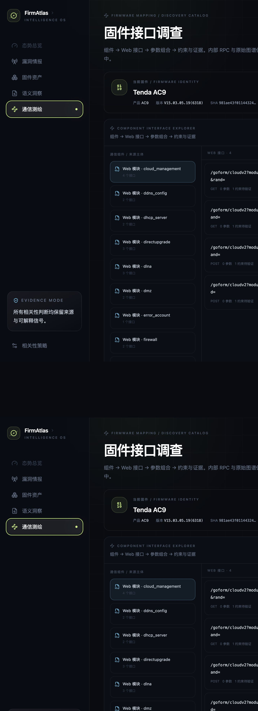
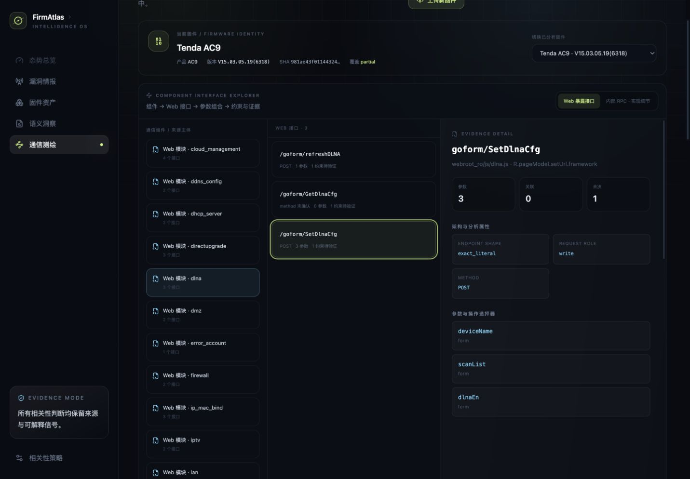
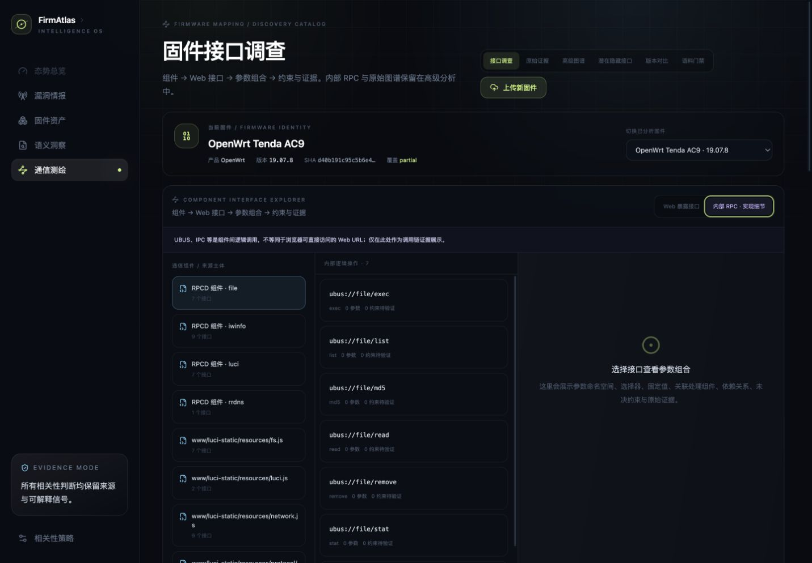
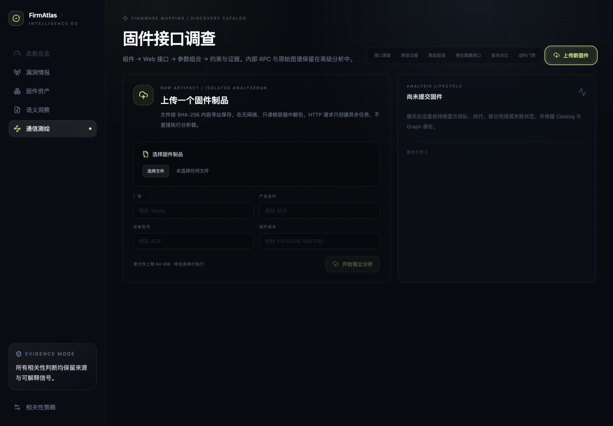

# 固件通信测绘产品功能与验收手册

> 验收版本：R2-38
>
> 验收日期：2026-08-20
>
> 典型样本：原厂 Tenda AC9 V15.03.05.19(6318)；OpenWrt 19.07.8 AC9 为内部 RPC 对照
>
> 服务入口：`http://127.0.0.1:18789/`

## 1. 产品用途

固件通信测绘从原始固件或已解包 rootfs 冷启动，不依赖漏洞文本或人工接口 seed，联合前端、Web 配置、脚本后端、Native ELF、访问策略与状态访问证据，发布不可变 Discovery Catalog 和通信架构图。每项事实保留来源制品、精确字节或行号定位、覆盖状态以及仍未解决的证据义务。

`partial` 表示分析已发布可用结果，但仍存在明确记录的覆盖缺口或开放义务；它不是失败，也不会被显示成“完整发现”。

## 2. 用户工作流

1. 点击页面右上角始终可见的“上传新固件”，选择不超过 64 MiB 的原始固件，并填写厂商、产品、设备型号和固件版本。
2. 服务按 SHA-256 内容寻址保存制品，将身份写入作业快照，并将隔离解包与 AnalyzeRun 放入单独工作线程。
3. 回到“接口调查”，从顶部确认当前固件身份或切换已分析固件。
4. 左侧选择通信组件，中间选择 Web 接口，右侧查看 HTTP 方法、参数组合、相关处理组件、依赖/约束和 EvidenceAtom。
5. 需要分析 UBUS/IPC 时显式切换“内部 RPC · 实现细节”；这些逻辑操作不会混入默认 Web 接口列表。
6. “原始证据”“高级图谱”“潜在隐藏接口”“版本对比”和“语料门禁”保留为进阶取证入口。

## 3. 已实现功能

| 功能 | 当前行为 | 证据或边界 |
| --- | --- | --- |
| 原始固件上传 | 64 MiB 有界、异步单 worker、内容寻址、厂商/产品/型号/版本持久化 | 固定摘要 Binwalk 镜像、禁网、只读输入/根、资源预算 |
| 固件身份 | 顶部持续显示 release context、SHA 与覆盖状态，并支持切换已分析固件 | 未登记身份时明确显示“待确认”，不从文件名猜测 |
| 接口调查 | 组件 → Web 接口 → 参数组合 → 约束与证据三栏调查 | Web 暴露面与内部逻辑调用分层，不混淆 URL 与 UBUS/IPC |
| 自动测绘编排 | Inventory → 多 Producer → Scheduler → Catalog → Graph | producer 失败进入 coverage，不伪装为空成功 |
| 目录浏览 | 候选类型筛选、全文搜索、参数/关联/义务详情 | 浏览器只读取服务端投影，不重新推断事实 |
| 通信图谱 | 四种证据约束视图、精确焦点、跳数/节点/边预算 | 子图无悬空边，侧栏保留 EvidenceAtom |
| 参数与状态 | 接口到参数、配置键、状态位置和线索的有向关系 | HTTP 参数与配置键保持不同身份 |
| 潜在隐藏接口 | Native 注册集合减去 completed 客户端覆盖集合 | coverage 不完整时不发布“隐藏”结论 |
| 版本对比 | 按稳定身份比较接口、参数和隐藏状态 | 少于两个目录时显示明确空态 |
| 历史漏洞对照 | 历史 expectation 只读叠加，不改写固件事实 | 未发布 overlay/ledger 时返回明确不可用状态 |
| 代表性语料门禁 | 表单、HNAP/SOAP、共享 CGI、脚本后端、纯 Native 五类 | 当前 5/5 通过，仍不宣称覆盖所有厂商和 ISA |
| MiniMax 建议 | 有界脱敏证据包、Evidence ID 白名单、proposal-only | 默认关闭；不能修改 Catalog、关闭义务或晋级事实 |

## 4. Tenda AC9 验收结果

默认样本切换为原厂 Tenda AC9 `V15.03.05.19(6318)`，SHA-256 为
`981ae43f0114432425f211783a4051a81f861b6f8208a9d80cb1528daf3bf296`。完整 rootfs 在
`auto-v21` 下重新分析并发布：

- 4,950 个候选、14,370 个 EvidenceAtom、696 个参数、78 个关联；
- 7,126 个图节点、9,329 条图边；
- 73 个开放义务，Inventory `completed`、Catalog `partial`、Graph `completed`；
- 134 个 request interface 候选一次返回，不再因 100 条查询上限截断；
- DLNA 组件恢复 `/goform/refreshDLNA`、`/goform/GetDlnaCfg`、`/goform/SetDlnaCfg`，其中 Set 接口展示 `deviceName`、`scanList`、`dlnaEn` 三个 form 参数。

### 固件身份与组件化 Web 接口



### 接口参数组合与约束



点击 `Web 模块 · dlna` 后只显示该组件的 3 个接口；选择 `/goform/SetDlnaCfg` 后，右栏显示
POST、三个 form 参数、后端执行与访问链和未决分析义务。界面不会从相邻线索猜测未证实的参数约束。

### Web 与内部 RPC 的边界



OpenWrt 19.07.8 AC9 仍作为对照。`ubus://file/exec` 在默认 Web 视图中不可见；只有切到
“内部 RPC · 实现细节”后才出现，并明确说明 UBUS/IPC 不等同于浏览器可访问 URL。

### 固件上传与身份登记



上传页同时显示文件、厂商、产品系列、设备型号和固件版本。API 使用四个独立身份请求头；仅填写
部分身份会返回 400，完整身份进入作业快照和发布后的 release context。

## 5. 2026-08-20 测试结果

| 验证层 | 命令或方式 | 结果 |
| --- | --- | --- |
| Python 全量回归 | `PYTHONPATH=src python3 -m unittest discover -s tests` | 最终 560/560 通过；首轮 3 个固定源码摘要失配及修复保留在 R2-38 进度记录 |
| Python 编译检查 | `python3 -m compileall -q src` | 通过 |
| Console 全量回归 | `pnpm test` | 30/30 通过，9 个测试文件；接口调查专项 13/13 |
| TypeScript | `pnpm exec tsc --noEmit` | 通过 |
| Console 生产构建 | `pnpm build` | 通过，1,801 modules transformed |
| API 验收 | health、最新 AC9 release context、134/134 request interfaces、作业身份合同 | 通过 |
| 浏览器交互 | 固件切换、组件选择、DLNA 接口、参数/约束、内部 RPC 边界、上传身份表单 | 通过，浏览器 Console 无错误 |

版本对比需要同型号至少两个已发布目录；当前 R2-37 验收数据库仅发布一个 AC9 目录，因此验证了预期空态和 API `404` 错误合同，而未把缺少对照数据误报为比较成功。历史 overlay 同理，当前数据库未发布该可选读模型，页面/API 均保持明确边界。

## 6. 本地启动

先构建 Console，并准备固定摘要的第一方 Binwalk 3.1.0 镜像。完整产品服务必须使用同时保存漏洞情报、固件资产和测绘投影的主数据库 `var/firmatlas.db`。`var/mapping-work/<round>/firmatlas.db` 只用于隔离研究回放，不能作为完整 Console 的服务数据库；需要展示的 Catalog、Graph、历史覆盖层和 corpus report 应先不可变发布到主库。随后运行：

```bash
PYTHONPATH=src python3 -m firmatlas intelligence serve \
  --database var/firmatlas.db \
  --host 127.0.0.1 --port 18789 \
  --static-dir apps/console/dist \
  --mapping-workspace var/mapping-jobs \
  --mapping-runtime /usr/local/bin/docker \
  --mapping-binwalk-image-ref 'sha256:<pinned-image-id>' \
  --mapping-binwalk-version 3.1.0 \
  --mapping-upload-max-bytes 67108864 \
  --mapping-analysis-max-seconds 900
```

验收检查：

```bash
curl -fsS http://127.0.0.1:18789/api/health
curl -fsS http://127.0.0.1:18789/api/mappings/catalogs
curl -fsS http://127.0.0.1:18789/api/mappings/graphs
curl -fsS http://127.0.0.1:18789/api/mappings/corpus-report
curl -fsS http://127.0.0.1:18789/api/mappings/jobs
```

服务恢复验收不能只检查 `/api/health`。至少还要断言漏洞情报非空、固件资产非空，并同时存在测绘目录、图谱与通过的 corpus gate。2026-08-20 曾因误用单轮测绘库导致通信测绘正常而漏洞工作台为 0；切回主库并发布最新 AC9 Graph/corpus 后恢复为 373,140 条漏洞、19,218 条固件相关漏洞、173,878 个固件候选、6 个测绘目录和 1 张当前图谱。

## 7. 安全与解释边界

- 不把静态注册等同于运行时可达、访问授权、漏洞或可利用性。
- 不把历史漏洞描述直接写成当前固件事实。
- 不把不完整前端覆盖下的 Native 差集命名为隐藏接口。
- 不在仓库、日志或文档中保存模型 API Key；只从环境变量读取并建议定期轮换。
- 固件通信测绘研究按仓库约定执行本地完整验收、提交和 GitHub 推送，不部署到 `satc_cloud`。

精确复验命令、API 断言、页面状态和交付边界见 [R2-37 服务与功能验收记录](./progress/2026-08-20-r2-37-service-functional-acceptance.md)。
