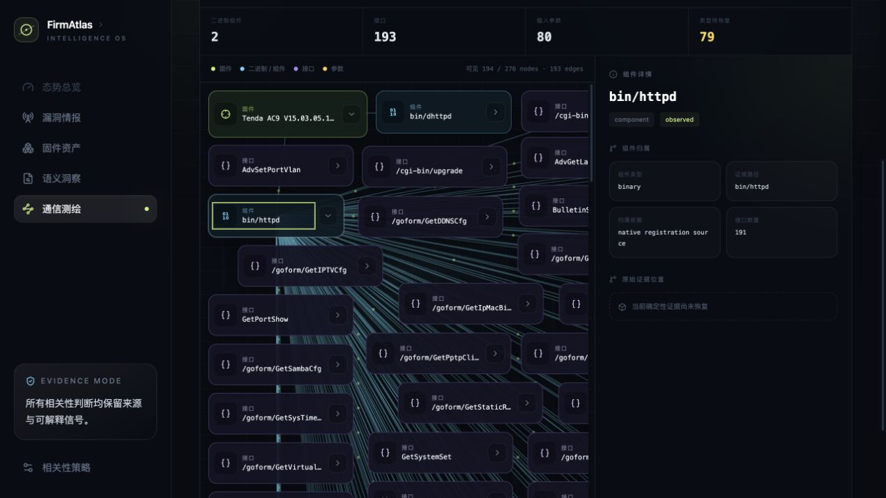
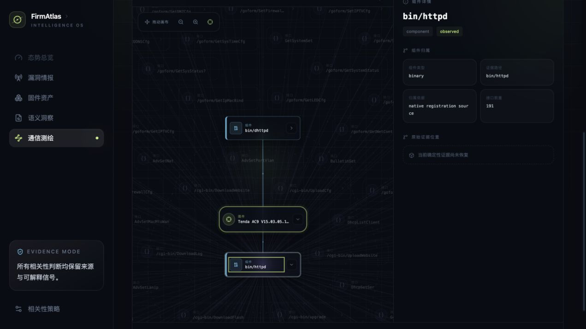
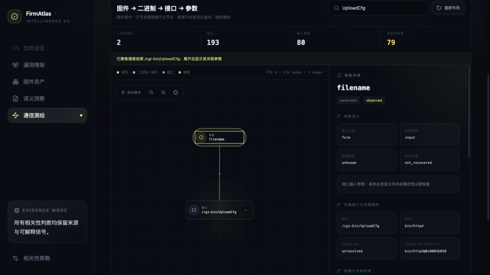
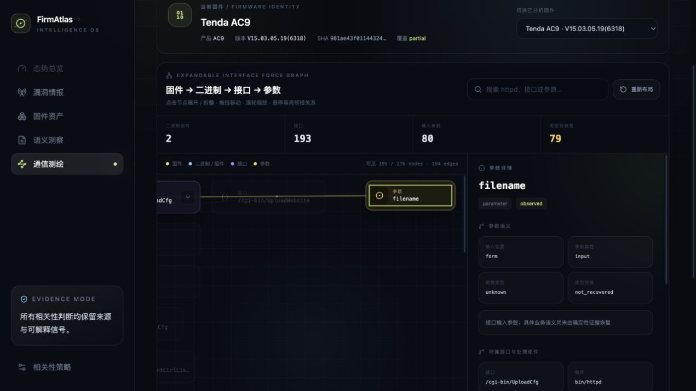

# 固件通信测绘产品功能与验收手册

> 验收版本：R2-44
>
> 验收日期：2026-08-21
>
> 典型样本：原厂 Tenda AC9 V15.03.05.19(6318)
>
> 服务入口：`http://127.0.0.1:18789/`

## 1. 产品用途

固件通信测绘从原始固件或已解包 rootfs 冷启动，不依赖漏洞文本或人工接口 seed。系统联合前端、
Web 配置、脚本后端、Native ELF、访问策略和状态访问证据，发布不可变 Discovery Catalog，再把事实
投影为面向调查的可折叠力导图。每项事实保留来源制品、精确字节或行号定位、覆盖状态以及尚未解决
的证据义务。

`partial` 表示结果可用但仍有明确覆盖缺口；`unknown / not_recovered` 表示当前证据没有恢复出类型或
约束。二者都不会被界面伪装成完整发现。

## 2. 用户工作流

1. 点击右上角“上传新固件”，选择不超过 64 MiB 的制品，并填写厂商、产品、型号和版本。
2. 服务按 SHA-256 内容寻址保存制品，隔离执行解包和 AnalyzeRun，并发布不可变 Catalog/Graph。
3. 进入“接口调查”，确认顶部固件身份，或切换到另一个已分析固件。
4. 点击节点主体或右侧箭头展开真实二进制，例如 `bin/httpd`；JavaScript/HTML/CSS 静态资源不会成为图节点。
5. 有子参数的接口才显示展开箭头；点击接口展开参数组合，再点击参数查看类型、作用、代码约束、依赖和精确证据。
6. 固件默认居中；组件围绕固件，接口围绕所属组件，参数围绕所属接口。展开哪个节点，下一层就以它为局部中心。
7. 使用滚轮或左上角按钮缩放，点击准星回到固件中心；碰撞层按卡片矩形自动分离。
8. 搜索会把画布自动移到最深层命中节点；展开命中接口后，其直接参数即使不含搜索词也会显示。
9. 使用“重置自动布局”重新计算位置；节点可随时折叠。
10. 需要 UBUS/IPC 等内部调用时进入“高级图谱”或“原始证据”。它们不会混入默认 Web 接口图。

## 3. 已实现功能

| 功能 | 当前行为 | 证据或边界 |
| --- | --- | --- |
| 原始固件上传 | 64 MiB 有界、异步单 worker、内容寻址、完整设备身份持久化 | 固定摘要 Binwalk、禁网、只读输入/根、资源预算 |
| 固件身份 | 持续展示 release context、SHA 和覆盖状态，支持切换已分析固件 | 未登记身份显示“待确认”，不从文件名猜测 |
| 接口力导图 | 固件 → 真实二进制 → Web 接口 → 参数；主体和箭头均可逐层展开/折叠 | 无子参数接口没有伪箭头；静态前端资源仅作 evidence locator；UBUS/IPC 不冒充 Web URL |
| 动态布局与搜索 | 父节点局部坐标：组件围绕固件、接口围绕 owner 组件、参数围绕 owner 接口；节点拖拽、画布平移、缩放和回中 | 不再把接口做成固件中心的全局对称环；四类对象造型不同，矩形零重叠 |
| 参数详情 | 语义、位置、数据类型及依据、约束、依赖、owner、EvidenceAtom | 只从字面域/selector 证据推断类型，不按参数名猜测 |
| 搜索与参数展开 | 搜索自动聚焦接口；展开后显示直接关联参数，参数围绕接口形成局部簇 | 参数不必匹配当前搜索词；无参数接口不显示伪展开按钮 |
| 自动测绘编排 | Inventory → 多 Producer → Scheduler → Catalog → Graph | Producer 失败进入 coverage，不伪装为空成功 |
| 高级图谱 | 四种证据约束视图、精确焦点、跳数/节点/边预算 | 子图无悬空边，UBUS/IPC 在这里保留取证价值 |
| 潜在隐藏接口 | Native 注册集合减去 completed 客户端覆盖集合 | coverage 不完整时不发布“隐藏”结论 |
| 历史漏洞对照 | 历史 expectation 只读叠加，不改写固件事实 | 分开显示发现状态与版本适用性 |
| MiniMax 建议 | 有界脱敏证据包、Evidence ID 白名单、proposal-only | 默认关闭，不能改写 Catalog 或关闭义务 |

## 4. Tenda AC9 力导图验收

样本 SHA-256：`981ae43f0114432425f211783a4051a81f861b6f8208a9d80cb1528daf3bf296`。当前 Catalog 为
`discovery-catalog:29081f8e9f48b65ee10c85b81cb73fbce5dffa26023726397ae691397e5373a4`。

接口调查读模型包含 276 个节点、275 条边：2 个真实二进制、193 个请求接口、80 个输入参数。
`bin/httpd` 拥有 191 个接口，`bin/dhttpd` 拥有 2 个接口；56 个只有前端静态文件引用、没有 Native
二进制 owner 的请求接口从默认图排除，但原始 EvidenceAtom 和 locator 完整保留。122 个仅由 Native 注册发现的接口保持 `native_registration_only`，
没有路径证据时显示 `path_status=unresolved`，不会擅自拼接 `/goform/...`。

### 4.1 固件根节点与二进制组件


初始画布只展开 2 个真实二进制。Tenda AC9 使用绿色双边框固定在视觉中心，`bin/dhttpd` 与
`bin/httpd` 使用青色实线侧条分布在第一环。左上角工具栏支持缩小、放大和回到固件中心；空白画布
本身可拖动，不会和节点拖拽混淆。

### 4.2 展开 httpd 接口与参数








点击 `bin/httpd` 主体后从 3 个可见节点直接变为 194 个，首屏同时保留固件、组件和接口卡片。
191 个接口中，28 个确实关联子参数并显示展开箭头，165 个无子参数接口不再显示无效箭头。
浏览器继续展开 `/cgi-bin/UploadCfg` 后得到 `filename` 参数，变为 195 nodes / 194 edges。

### 4.3 参数详情与证据边界



点击 `filename` 后，侧栏同时给出 owner `/cgi-bin/UploadCfg`、所属 `bin/httpd`、依赖线索和
前端/Native 精确位置。当前证据没有恢复整数范围、长度、格式或时间边界，因此数据类型和代码约束
诚实显示 `unknown / not_recovered`。80 个参数中有 79 个仍为未知类型；这是后续代码使用点分析
的明确任务，不是 UI 缺数或推断失败。

## 5. 测试结果

| 验证层 | 命令或方式 | 结果 |
| --- | --- | --- |
| Python 力导图专项 | `PYTHONPATH=src python3 -m unittest tests.test_mapping_interface_force_graph tests.test_intelligence_api.IntelligenceApiTests.test_mapping_catalog_force_graph_route_excludes_frontend_static_resources` | 4/4 通过 |
| Python 全量回归 | `PYTHONPATH=src python3 -m unittest discover -s tests` | 564/564 通过（468.416s） |
| Python 编译检查 | `python3 -m compileall -q src` | 通过 |
| Console 全量回归 | `pnpm test` | 39/39 通过，10 个测试文件 |
| TypeScript/生产构建 | `pnpm build` | 通过，1,802 modules transformed |
| API 验收 | AC9 force-graph endpoint | HTTP 200；276 nodes / 275 edges；2 个 binary；0 frontend module；排除 56 个静态资源接口 |
| 浏览器交互 | 父节点局部环绕、搜索聚焦、接口参数展开、参数详情 | `UploadCfg` 自动聚焦；展开后 3→4 nodes，出现 `filename`；参数距接口 226.8；详情侧栏通过 |

真实浏览器回放验证：首屏 3/276 可见节点、2 条边；点击 `bin/httpd` 主体后为 194/276 节点、193 条边，
固件逻辑中心保持在 `(0,0)` 附近，组件半径大于 160；接口箭头从错误的 191 个收敛到真实有参数的
28 个。空白画布平移更新 `translate(x y)`，回中恢复 `translate(0 0) scale(1)`。
逐轮矩形交叠检测从 194 对降为 98、23，最终为 0；拖动 `bin/dhttpd` 后出现释放回弹状态，悬停时
非邻接 `bin/httpd` opacity 从 1 降为 0.18。默认页面不存在 `webroot_ro/js` 或 `ubus://` 节点。

## 6. 本地启动与 API 验收

先构建 Console，并使用同时保存漏洞情报、固件资产和测绘投影的主数据库 `var/firmatlas.db`：

```bash
cd apps/console && pnpm build && cd ../..
PYTHONPATH=src python3 -m firmatlas intelligence serve \
  --database var/firmatlas.db \
  --host 127.0.0.1 --port 18789 \
  --static-dir apps/console/dist \
  --mapping-workspace var/mapping-jobs \
  --mapping-runtime /usr/local/bin/docker \
  --mapping-binwalk-image-ref 'sha256:<pinned-image-id>' \
  --mapping-binwalk-version 3.1.0 \
  --mapping-upload-max-bytes 67108864 \
  --mapping-analysis-max-seconds 900
```

```bash
curl -fsS http://127.0.0.1:18789/api/health
curl -fsS http://127.0.0.1:18789/api/mappings/catalogs
curl -fsS 'http://127.0.0.1:18789/api/mappings/catalogs/<catalog-id>/interface-force-graph'
curl -fsS http://127.0.0.1:18789/api/mappings/corpus-report
curl -fsS http://127.0.0.1:18789/api/mappings/jobs
```

`/api/health` 只证明进程存活。恢复服务还必须确认漏洞情报、固件资产、Catalog、Graph 和 corpus gate
均非空或处于预期状态，不能用单轮研究数据库代替主库。

## 7. 解释与交付边界

- 不把静态注册等同于运行时可达、访问授权、漏洞或可利用性。
- 不按参数名称猜测类型、范围或业务含义；未知事实明确显示为未恢复。
- 不把没有路径证据的 Native selector 拼装成 `/goform/...`。
- 不把历史漏洞描述直接写成当前固件事实。
- 不把 UBUS/IPC 当作 Web 接口；它们仍可在高级取证视图分析内部调用关系。
- 不在仓库、日志或文档中保存模型 API Key，只从环境变量读取。
- 通信测绘范围按仓库例外执行本地完整验收、提交和 GitHub 推送，不部署到 `satc_cloud`。

架构决策、迭代修正、反事实失败模式和完整复验记录见
[R2-44 接口参数展开记录](./progress/2026-08-21-r2-44-interface-parameter-expansion.md)。
