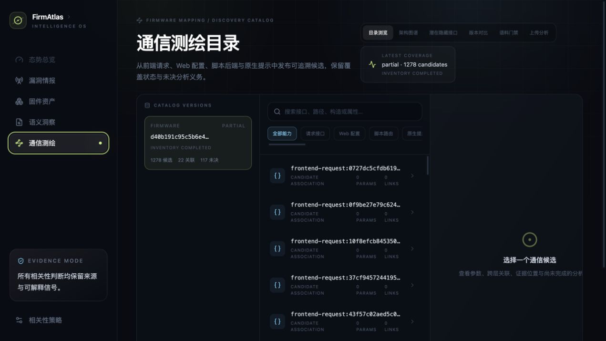
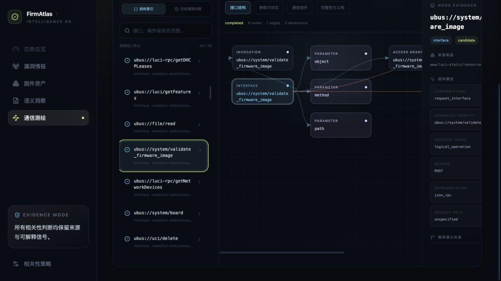
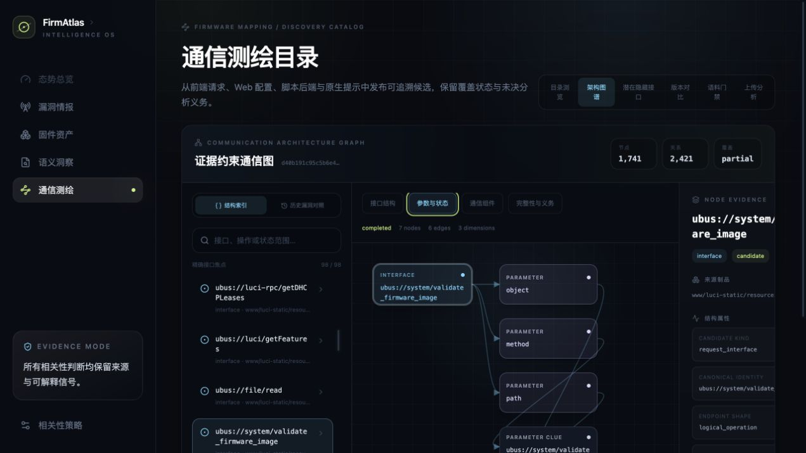
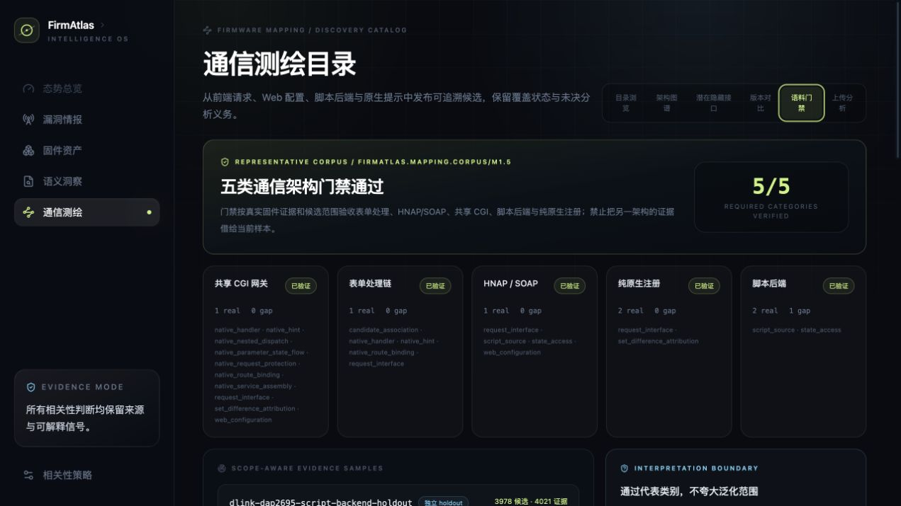

# 固件通信测绘产品功能与验收手册

> 验收版本：R2-37
>
> 验收日期：2026-08-20
>
> 典型样本：OpenWrt 19.07.8 Tenda AC9
>
> 服务入口：`http://127.0.0.1:18789/`

## 1. 产品用途

固件通信测绘从原始固件或已解包 rootfs 冷启动，不依赖漏洞文本或人工接口 seed，联合前端、Web 配置、脚本后端、Native ELF、访问策略与状态访问证据，发布不可变 Discovery Catalog 和通信架构图。每项事实保留来源制品、精确字节或行号定位、覆盖状态以及仍未解决的证据义务。

`partial` 表示分析已发布可用结果，但仍存在明确记录的覆盖缺口或开放义务；它不是失败，也不会被显示成“完整发现”。

## 2. 用户工作流

1. 在“通信测绘 → 上传分析”选择不超过 64 MiB 的原始固件。
2. 服务按 SHA-256 内容寻址保存制品，并将隔离解包与 AnalyzeRun 放入单独工作线程。
3. 作业完成后打开生成图谱；目录页可按能力和文本检索候选。
4. 在架构图谱中先选择精确接口，再切换“接口结构”“参数与状态”“通信组件”“完整性与义务”。
5. 点击节点查看来源制品、结构属性、相邻语义关系和 EvidenceAtom 定位。
6. 使用“潜在隐藏接口”“版本对比”“历史漏洞对照”和“语料门禁”检查跨固件差集、版本变化、历史分母与代表性样本覆盖。

## 3. 已实现功能

| 功能 | 当前行为 | 证据或边界 |
| --- | --- | --- |
| 原始固件上传 | 64 MiB 有界、异步单 worker、内容寻址、任务可恢复查询 | 固定摘要 Binwalk 镜像、禁网、只读输入/根、资源预算 |
| 自动测绘编排 | Inventory → 多 Producer → Scheduler → Catalog → Graph | producer 失败进入 coverage，不伪装为空成功 |
| 目录浏览 | 候选类型筛选、全文搜索、参数/关联/义务详情 | 浏览器只读取服务端投影，不重新推断事实 |
| 通信图谱 | 四种证据约束视图、精确焦点、跳数/节点/边预算 | 子图无悬空边，侧栏保留 EvidenceAtom |
| 参数与状态 | 接口到参数、配置键、状态位置和线索的有向关系 | HTTP 参数与配置键保持不同身份 |
| 潜在隐藏接口 | Native 注册集合减去 completed 客户端覆盖集合 | coverage 不完整时不发布“隐藏”结论 |
| 版本对比 | 按稳定身份比较接口、参数和隐藏状态 | 少于两个目录时显示明确空态 |
| 历史漏洞对照 | 历史 expectation 只读叠加，不改写固件事实 | 未发布 overlay/ledger 时返回明确不可用状态 |
| 代表性语料门禁 | 表单、HNAP/SOAP、共享 CGI、脚本后端、纯 Native 五类 | 当前 5/5 通过，仍不宣称覆盖所有厂商和 ISA |
| MiniMax 建议 | 有界脱敏证据包、Evidence ID 白名单、proposal-only | 默认关闭；不能修改 Catalog、关闭义务或晋级事实 |

## 4. Tenda AC9 验收结果

样本 SHA-256 为 `d40b191c95c5b6e43358785d6c6e9d7915296e9a954d27fbc1936bdf48568ec9`。页面上传后复用了相同内容身份，发布：

- 1,278 个候选、8,121 个 EvidenceAtom、220 个参数、22 个关联；
- 1,741 个图节点、2,421 条图边；
- 117 个开放义务，Catalog 覆盖为 `partial`；
- `ubus://system/validate_firmware_image` 参数状态焦点为 7 个节点、6 条边、90 个证据原子；
- 代表性语料门禁 5/5 通过。

### 目录浏览



### 接口结构与证据侧栏



界面将 `ubus://system/validate_firmware_image` 连接到前端 invocation、`object/method/path` 参数、访问授权和开放义务；右侧保留方法、表示形式、来源文件和精确定位。

### 参数与状态视图



### 代表性语料门禁



### 原始固件上传闭环


作业状态为 `partial`，同时具有可点击的 Catalog 和 Graph 身份。MiniMax 未配置时按钮安全禁用，确定性测绘不受影响。

## 5. 2026-08-20 测试结果

| 验证层 | 命令或方式 | 结果 |
| --- | --- | --- |
| Python 全量回归 | `PYTHONPATH=src python3 -m unittest discover -s tests -v` | 560/560 通过 |
| Python 编译检查 | `python3 -m compileall -q src` | 通过 |
| Console 组件测试 | `pnpm test -- --run` | 29/29 通过，9 个测试文件 |
| TypeScript | `pnpm exec tsc --noEmit` | 通过 |
| Console 生产构建 | `pnpm build` | 通过，1,801 modules transformed |
| API 验收矩阵 | 健康、目录、搜索、图谱、焦点、隐藏接口、语料、任务、模型边界、错误合同、SPA | 12/12 通过 |
| 浏览器交互 | 6 个页签、四图谱视图、证据下钻、真实 AC9 上传 | 通过 |

版本对比需要同型号至少两个已发布目录；当前 R2-37 验收数据库仅发布一个 AC9 目录，因此验证了预期空态和 API `404` 错误合同，而未把缺少对照数据误报为比较成功。历史 overlay 同理，当前数据库未发布该可选读模型，页面/API 均保持明确边界。

## 6. 本地启动

先构建 Console，并准备固定摘要的第一方 Binwalk 3.1.0 镜像。随后运行：

```bash
PYTHONPATH=src python3 -m firmatlas intelligence serve \
  --database var/firmatlas.db \
  --host 127.0.0.1 --port 18789 \
  --static-dir apps/console/dist \
  --mapping-workspace var/mapping-jobs \
  --mapping-runtime /usr/local/bin/docker \
  --mapping-binwalk-image-ref 'sha256:<pinned-image-id>' \
  --mapping-binwalk-version 3.1.0 \
  --mapping-upload-max-bytes 67108864 \
  --mapping-analysis-max-seconds 900
```

验收检查：

```bash
curl -fsS http://127.0.0.1:18789/api/health
curl -fsS http://127.0.0.1:18789/api/mappings/catalogs
curl -fsS http://127.0.0.1:18789/api/mappings/graphs
curl -fsS http://127.0.0.1:18789/api/mappings/corpus-report
curl -fsS http://127.0.0.1:18789/api/mappings/jobs
```

## 7. 安全与解释边界

- 不把静态注册等同于运行时可达、访问授权、漏洞或可利用性。
- 不把历史漏洞描述直接写成当前固件事实。
- 不把不完整前端覆盖下的 Native 差集命名为隐藏接口。
- 不在仓库、日志或文档中保存模型 API Key；只从环境变量读取并建议定期轮换。
- 固件通信测绘研究按仓库约定执行本地完整验收、提交和 GitHub 推送，不部署到 `satc_cloud`。

精确复验命令、API 断言、页面状态和交付边界见 [R2-37 服务与功能验收记录](./progress/2026-08-20-r2-37-service-functional-acceptance.md)。
