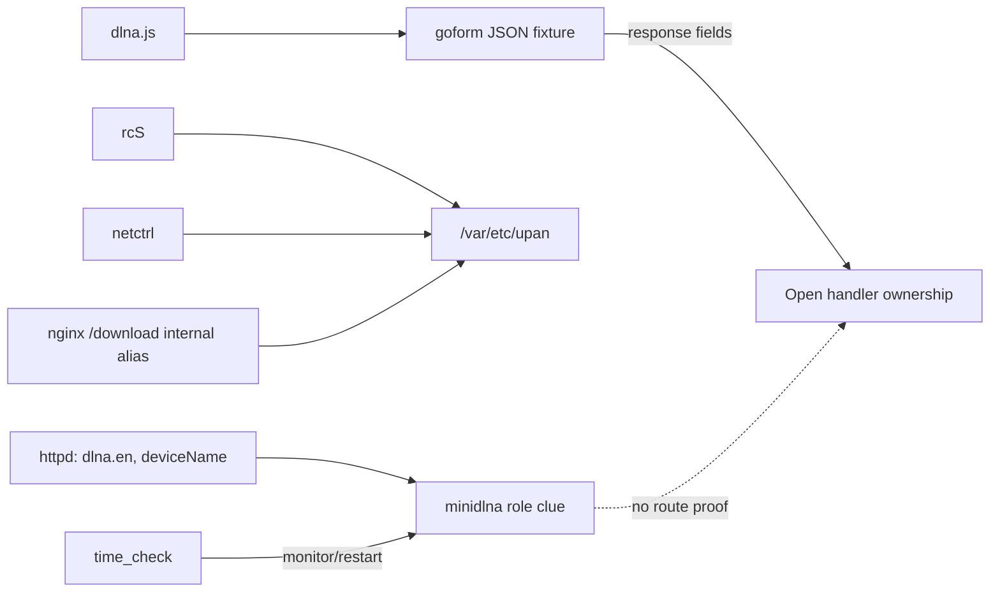

# R2-10 — AC9 响应 Fixture 契约与 DLNA 分裂架构

## 本轮结论

默认独立分析升级到 `auto-v7/builtin-v7`，新增 `response_fixture` producer。它从固件内 `goform/*.txt` 的合法 JSON 响应样例恢复 endpoint clue 和嵌套响应 JSON pointer，并投影成 Discovery Catalog 的 `response_fixture_contract` candidate 与 `response_json_pointer` parameter。所有结论标记为 `fixture_declared`，开放义务明确要求 route binding 或 runtime observation。

旧 `auto-v6/builtin-v6` 被显式冻结，R2-09 报告继续精确重放。新能力不依赖 AC9 seed：任何用户上传并解包的固件，只要 Inventory 中存在对应 JSON fixture，都通过同一个 `analyze-root` 入口分析。

## AC9 中间输出

| 阶段 | 输入 | 输出 | 覆盖 |
|---|---:|---:|---|
| Frontend | 130 | 119 requests | completed |
| Parameter clue | 451 | 135 assessments | completed |
| Response fixture | 111 | 553 response fields | completed |
| Set difference | 287 | 112 attributions | completed |
| Catalog | 529 planned sources | 4,247 candidates | completed |

AC9 `webroot_ro/goform` 共 114 个 `.txt`：111 个以 JSON object/array 开头且全部解析成功，3 个普通文本不进入该 producer。恢复的 DLNA 响应契约：

- `goform/GetDlnaCfg`：9 个字段路径，包括 `/dlnaEn`、`/deviceName`、`/dlnaScanStatus`、`/scanList`、`/deviceList/*/diskList/*/fileName`；
- `goform/expandDlnaFile`：4 个字段路径，包括 `/subfileList/*/fileName`、`/selectedFlag`、`/hasChildFile`；
- `goform/SetDlnaCfg`：`/errCode`。

三份 fixture 均与相同规范 endpoint 的前端 request candidate 关联。关联证明“客户端请求与样例契约名称相符”，不证明 fixture 被 Web server 使用。

## DLNA 通信结构证据

机器报告另外保存 8 个精确 EvidenceAtom：`rcS` 的媒体目录准备、nginx alias、netctrl 挂载字符串、`httpd` 的 `dlna.en/deviceName/minidlna`，以及 `time_check` 的 `minidlna` 和挂载检查。

## RED → GREEN 与工程反思

1. RED：公共 `discover_response_fixture` 不存在。
2. GREEN：恢复 endpoint clue、递归数组/对象字段、值类型、精确 key span、预算和失败诊断。
3. RED：fixture 结果无法进入 Catalog，也无法与前端请求关联。
4. GREEN：新增版本化 producer/candidate/response parameter；按去除前导 `/` 和 query 的规范 endpoint 关联请求证据。
5. 默认 Profile 升到 v7；v6 显式冻结，防止旧分析身份漂移。
6. 真实 AC9 回放确认 response fixture 阶段 completed，但 hidden-interface 仍为 107；fixture 没有越权关闭 Native-only/handler 义务。

逐字段证据采用标准 JSON 解析确定结构，再用原始 UTF-8 key token 定位。数组索引规范化成 `*`，重复数组元素合并到同一参数身份但保留多个 EvidenceAtom。

## 历史漏洞与漏检解释

R2-10 重新运行 13 条结构化 expectation 和 71 条产品漏洞范围审计：结果仍为 8 observed、5 not-assessable；精确制品 expectation 2/2 observed；产品范围仍分为 13 compared-interface、3 parameter-only、9 no-structured-communication、46 not-analyzed。新增 response parameters 没有被错误当成历史 request parameters，因此历史结果未虚增。

DLNA 当前最强漏检解释从“只有前端”细化为：

- 前端 request 存在；
- 固件内 response fixture 契约存在；
- 媒体挂载和 minidlna 守护架构存在；
- 但完整 Native registrar 与辅助范围仍没有四条 DLNA goform route 的精确注册或 handler。

因此不能把它简单叫 mapper miss，也不能宣称功能已删除。可能原因仍包括开发 fixture/死 UI、版本配套错误、哈希或生成式分发、条件组件缺失，以及当前静态 Profile 尚未覆盖的非字面 dispatch。

## 案例库与交接

该现象符合“多进程架构分裂 + 深分析后义务仍开放”的案例准入条件，已加入机器案例 `tenda-ac9-dlna-fixture-daemon-split`。Corpus 现有 3 个案例，validation `paper_ready=true`，案例保存 22 个精确证据引用、四条阶段性 claim、三个反事实和开放的 `obligation:dlna-handler-owner`。前端 claim 只引用 `expandDlnaFile` 本身，不借用另外两个 DLNA 请求扩大证据范围。

## 验证记录

- 首次直接运行系统 `pytest` 在收集期因仓库 `src/` 布局缺少 `PYTHONPATH=src` 失败，未进入产品代码；使用项目导入环境后针对性回归 37 项通过。
- 全量 mapping 回归 343 项通过（1 条既有 Python invalid-escape deprecation warning）；Console 9 个文件 19 项通过；TypeScript 检查和 Vite 生产构建通过。
- 真实 AC9 `auto-v7` 分析、报告生成、案例库生成连续执行两遍，两个产物逐字节稳定：报告 SHA-256 `e73ff6d0b9348f980476097e0e8fe3d98c99901b01ef5496ead15cd3719f9ca4`；案例库 SHA-256 `a59f600c0dca93b29dfb1c7198090f5606c80777afd391d6ca826a12e0ee72ca`。
- R2-09 生成器显式切到冻结的 `auto-v6/builtin-v6` 后复跑，与既有产物逐字节一致，SHA-256 `c88ef541aff4262b0372554345050530ad53f905501bc38308446d6587b6280f`。
- 案例库 validation：3 cases、10 independent evidence lines、`paper_ready=true`、0 issues；DLNA handler obligation 保持 open。

下一轮优先调查 `httpd` 中 `dlna.en/deviceName` 所在函数的调用者、`cfm post netctrl` IPC 与 `time_check_daemon_minidlna`，判断 UI contract 是否通过非 route 字面分发进入同一状态链。若仍无连接证据，应发布“条件组件/版本错配候选”而非猜测 handler。

本轮仅属于 mapping 研究范围，SSH 部署不适用。
