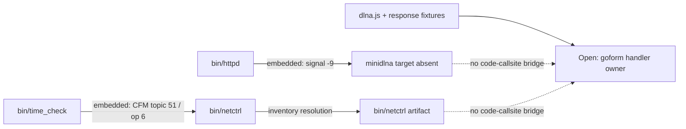

# R2-11 — AC9 Native 进程与 IPC 关系恢复

## 本轮结论

默认独立分析升级到 `auto-v8/builtin-v8`，新增 `native_relationship` producer。它从 ELF 中完整的内嵌命令恢复两类通信关系：`killall SIGNAL target` 的进程信号边，以及 `cfm post target topic?op=operation,...` 的 IPC 边。Catalog 为每条边保存 source component、target component、topic、operation、arguments、目标制品路径和精确 EvidenceAtom。

这不是 AC9 专用规则：任何用户上传并解包的固件都经既有 `analyze-root` 自动分类所有 ELF。producer 只接受完整命令语法，不根据相邻字符串猜关系；含 `%d/%s` 的命令标记为 `embedded_command_template`，常量命令标记为 `embedded_command`。两者都只是 candidate，开放义务要求代码 callsite 或运行时观察。

## AC9 中间输出

| 指标 | 结果 |
|---|---:|
| Native relationship 输入 ELF | 287 |
| 含关系的 source components | 17 |
| 总关系 | 101 |
| Process-control | 87 |
| CFM IPC | 14 |
| 完整常量命令 | 90 |
| 格式命令模板 | 11 |
| 目标可解析到同固件制品 | 92 |
| 目标制品缺失 | 9 |

`netctrl` 是最常见目标，共 15 条边。完整 Catalog 从 R2-10 的 4,247 candidates 增至 4,348；parameters 仍为 688，hidden-interface candidates 仍为 107。新增组件边没有伪装成 Web interface，也没有关闭 route/handler obligations。

## DLNA 深化结果

两条精确关系分别是：

- `bin/httpd → minidlna`，动作是 `signal`，参数 `-9`；但整个 rootfs 中没有 `minidlna` 制品。
- `bin/time_check → bin/netctrl`，动作是 `post`，topic `51`、operation `6`；目标制品解析成功。

这使漏检解释更具体：固件确实携带 DLNA 相关控制命令和 IPC 边，但媒体 daemon 制品缺失，而且尚无代码 callsite 把 topic 51/op 6 与 `time_check_daemon_minidlna` 或 response fixture 连接起来。当前最合理状态是“条件组件/版本配套缺失候选”，而不是 mapper miss、已删除功能或已证明 handler。

## RED → GREEN 与反思

1. RED：公共 `discover_native_relationships` 不存在。
2. GREEN：恢复固定 process/IPC 命令，保存精确二进制 span，并明确 callsite/runtime 开放义务。
3. 真实样本反思：`killall -SIGUSR2` 不能统称 terminate，因此动作统一为精确的 `signal`；信号值保存在 arguments。
4. RED：格式模板与常量命令无法区分。
5. GREEN：新增 `embedded_command_template`，避免把 `%d` 当成实际 topic/op。
6. RED：Catalog 只有目标名称，无法判断组件是否属于同一固件。
7. GREEN：Catalog 按 basename 将 target 解析回本轮 producer 覆盖的 source paths；空列表成为明确的缺失组件线索。
8. `auto-v7/builtin-v7` 显式冻结；R2-10 报告重放 SHA-256 仍为 `e73ff6d0b9348f980476097e0e8fe3d98c99901b01ef5496ead15cd3719f9ca4`。

## 历史漏洞与案例时间线

13 条结构化 expectation 仍为 8 observed、5 not-assessable；71 条产品漏洞范围仍为 13 compared-interface、3 parameter-only、9 no-structured-communication、46 not-analyzed，精确制品 expectation 2/2 observed。组件关系不会被错误计为历史 Web 接口或 request parameter。

研究案例 `tenda-ac9-dlna-fixture-daemon-split` 增加第 4 阶段、两条 Native relationship evidence 和一条目标解析 coverage ledger，现有 25 个证据引用、5 条 claims；`claim:dlna-native-relationships` supported，`claim:dlna-handler-owner` unresolved。Corpus validation 为 3 cases、11 independent evidence lines、`paper_ready=true`、0 issues。

## 确定性与交接

真实 AC9 R2-11 分析、报告和案例库连续运行两遍并逐字节一致：

- R2-11 报告 SHA-256：`7beba6946739c7852ca92c9d355955803b27882fe415038bb8953f39fb954bc9`
- 案例库 SHA-256：`125e061f49198d4f9cfe31d3f0c7dbd2305e9c00401a2896979fd3d0d34d4ac4`

回归验证：公共 producer/Catalog/AnalyzeRun/案例针对性测试 39 项通过；全量 mapping 347 项通过；Console 9 个文件 19 项通过；TypeScript 检查和 Vite 生产构建通过。

下一轮应对 `time_check` 中 `time_check_daemon_minidlna`、`/var/etc/upan` 和 topic 51/op 6 做 ARM32 代码引用/调用路径恢复；若能证明同一函数或可达调用链，才将“DLNA supervision → netctrl IPC”晋级。之后可直接用 Catalog 的 `source_component/target_component/target_artifact_paths` 构建 UI 组件图。

本轮仅属于 mapping 研究范围，SSH 部署不适用。
