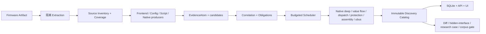

# 固件通信测绘第一轮基线研究

> 轮次：R1 / baseline research
> 日期：2026-08-09
> 范围：`firmatlas.mapping`、关联的 intelligence 数据、测试、样本与 UI
> 性质：只读审计；本记录不把设计目标记为实现，不包含用户提供的任何凭据
> 部署：不适用；本研究轨道由用户明确排除 SSH 部署

## 1. 结论摘要

FirmAtlas 当前已经不是概念原型，而是一组证据优先、可重放、按分析能力拆分的静态测绘组件：安全 Inventory、隔离解包、精确 EvidenceAtom、前端/配置/脚本/Native producers、义务调度、不可变 Discovery Catalog、版本差异、潜在隐藏接口、SQLite/API/UI，以及 AC9、DAP-3520、X5000R、OpenWrt AC9 双版本的真实回放。主控文档仍准确地把整体阶段标为 M1，后续 M2--M7 尚未完成（`docs/firmware-mapping/README.md:112-124`）。

当前最重要的工程断点有四个：

1. `python -m firmatlas.mapping` 只有 `validate-snapshot` 和 `inventory`，不存在“上传/输入固件 → 解包 → 自动选择源文件 → 执行全部 producers → 固定点深化 → 发布目录”的公共编排入口（`src/firmatlas/mapping/__main__.py:71-110`）。
2. producers 已丰富，但若干 Native 深分析器依赖样本特定 Profile/Anchor，架构覆盖集中在 ARM32 PIC 与 MIPS32；这还不是跨厂商通用恢复器（例如 `src/firmatlas/mapping/native_deep.py:411-557,661-886,1079-1244`）。
3. 代表性 corpus gate 仍为 `partial`：真实 `/goform`、HNAP/XGI、共享 CGI 已验证；脚本后端是 coverage gap，Native-only 是 acquisition gap（`docs/firmware-mapping/samples/m1-11-representative-corpus-report.json`；生成规则见 `src/firmatlas/mapping/corpus_report.py:220-279`）。
4. mapping 领域虽预留 `model_suggested` 和 `allow_model`，尚无 `MiniMaxReasonerAdapter` 的 mapping 实现；现有 OpenAI-compatible 调用属于历史漏洞语义抽取，不是固件 Evidence Bundle 推理（`src/firmatlas/mapping/domain.py:35-40,75-80,293-361`；`src/firmatlas/intelligence/semantic.py:504-685`；设计见 `docs/firmware-mapping/model-reasoning.md:1-105`）。

因此第一阶段不应继续堆孤立 analyzer，而应先形成可验证的纵向产品闭环，并以漏检分类驱动下一个 analyzer。

## 2. 调查方法与证据边界

本轮以仓库源代码、测试、机器可读样本报告和项目自身设计/进度记录为一手证据。历史漏洞数据来源实现指向 NVD CVE 2.0 API、NVD feed 和 CISA KEV；其 URL 与规范化逻辑见 `src/firmatlas/intelligence/sources.py:17-22,90-171,173-302` 和 `src/firmatlas/intelligence/feeds.py:19-23,51-138`。本轮未联网补充二手文章，也未运行用户提供的模型凭据。

“存在代码”只证明实现面；“已验证”以对应合同测试与真实机器可读回放同时存在为准。fixture、derived firmware、external lead 不替代真实固件 gate，这一层级由 `CorpusEvidenceTier` 和 gate 计算显式编码（`src/firmatlas/mapping/corpus_report.py:20-39,41-162,220-279`）。

## 3. 当前端到端设计

### 3.1 事实与覆盖合同

`FirmwareMappingSnapshot` 把 artifact/inventory SHA、policy、budget、analyzer、证据、实体、关系、Coverage Ledger、未决义务和诊断绑定在不可变 dataclass 中（`src/firmatlas/mapping/domain.py:69-88,91-207,224-239`）。合同强制唯一 ID、摘要格式、置信度范围、失败诊断和 success 所需的完整 required coverage（同文件 `241-304`）；仅由模型建议支持的实体/关系不会被当作确定事实（同文件 `305-361`）。

EvidenceAtom 保存文本或二进制精确 span、源摘要、producer/version、capability 和 observation kind（`src/firmatlas/mapping/domain.py:91-157`）。捕获与重放会核对源内容和 excerpt，见 `src/firmatlas/mapping/evidence.py:40-172,174-217`。

### 3.2 制品获取与清单

Inventory v1alpha2 对目录、zip/tar、预算、路径规范化和固件 chroot symlink 建模（`src/firmatlas/mapping/inventory.py:19-91,102-260,262-445,447-650`）。Extraction 使用 Protocol 隔离 worker、保存工具身份/执行指纹/诊断，并允许 partial output（`src/firmatlas/mapping/extraction.py:17-138,140-340`）。生产容器 worker 设置禁网、只读输入、资源/日志预算和进程组终止边界（`src/firmatlas/mapping/container_worker.py:32-68,70-134,136-280`）。已知工程缺口是固定发布镜像仍待重建（`docs/firmware-mapping/README.md:143-144`）。

### 3.3 冷启动 producers 与深化器

| 能力 | 当前实现 | 输出/边界 | 主要证据 |
| --- | --- | --- | --- |
| Frontend | HTML form、Tenda page/module model、jQuery、custom request/file upload、shared-CGI asset binding、LuCI `rpc.declare` | endpoint shape、读写角色、method、representation、query/form/json/header 参数、request/response 方向、selector；动态 RPC 保持 partial | `src/firmatlas/mapping/frontend.py:24-129,701-803,1360-1630` |
| Web config | nginx、lighttpd、shell 启动、proprietary httpd | listener、docroot、namespace、auth、service/handler binding | `src/firmatlas/mapping/web_config.py:1-170,760-900` |
| Script backend | PHP、ASP、Lua、Shell/CGI | entry、保守 route、GET/POST/REQUEST/JSON/header/cookie/CLI/env 参数、状态访问与 template read | `src/firmatlas/mapping/script_backend.py:17-158,187-364,381-470` |
| Native shallow | ELF32/64 metadata、strings、dynamic symbols | route/server/symbol hint；明确不等价于 handler binding | `src/firmatlas/mapping/native.py:1-86,170-408` |
| Correlation | exact endpoint 或末段 component 的大小写敏感匹配 | candidate association，并创建 route/handler obligations | `src/firmatlas/mapping/correlation.py:16-102,112-161,163-298` |
| Scheduler | analyzer seam、去重、预算、失败隔离、固定点 | `fixed_point` / `budget_exhausted`；保留开放义务 | `src/firmatlas/mapping/scheduler.py:1-99,133-291` |
| Native deep | 命名 pointer table、ARM32 PIC callsite、MIPS inline table | route → handler 确定绑定；要求多段原始 ELF 证据 | `src/firmatlas/mapping/native_deep.py:22-171,411-557,661-886,1079-1244` |
| MIPS value flow | getter 返回值 provenance 到 state setter | parameter → state，遇分支/未知指令保守截断 | `src/firmatlas/mapping/native_value_flow.py:26-129,385-590` |
| Nested dispatch | shared CGI upload 外/内 selector、suffix、table/handler | 针对 MIPS32 Profile 的确定路径 | `src/firmatlas/mapping/native_nested_dispatch.py:35-188,420-590` |
| Request protection | path/suffix gate、auth call、cookie、redirect | 支持“受保护/明确排除/未决”而非猜测认证 | `src/firmatlas/mapping/native_request_protection.py:41-187,342-560` |
| Service assembly | init/service launcher/argv/config/CGI namespace | 启动主体到 endpoint executable 的静态装配 | `src/firmatlas/mapping/native_service_assembly.py:1-209,430-680` |
| ubus backend | frontend logical operation、rpcd principal、Lua/native candidate、ACL | ACL 不冒充 handler；动态 owner 保留义务 | `src/firmatlas/mapping/ubus_backend.py:28-148,150-175,225-384,386-590` |
| Set difference | frontend/native 双向集合与归因 | coverage 不完整时结果继承 partial | `src/firmatlas/mapping/set_difference.py:1-175,330-531` |
| Hidden interfaces | native registration + handler + completed frontend scope + zero observed reference | 只发布 potential hidden，不宣称后门/可达 | `src/firmatlas/mapping/hidden_interface.py:17-67,69-160` |
| Version diff | release context + stable identity + coverage-aware changes | 区分 firmware-supported 与 coverage-confounded | `src/firmatlas/mapping/snapshot_diff.py:1-95,160-280` |

Discovery Catalog 已能投影上述 13 类 producer 和 20 类 candidate（`src/firmatlas/mapping/discovery_catalog.py:33-78`），并验证参数归属、Evidence/Obligation 引用和覆盖状态；它是当前最接近统一 read model 的对象，但不是统一执行引擎。

### 3.4 持久化、接口与可视化

SQLite repository 支持内容寻址目录发布、列表、候选过滤/聚合、潜在隐藏接口和版本对比（`src/firmatlas/mapping/repository.py:1-420`）。HTTP 目前是只读查询：

- `GET /api/mappings/catalogs`
- `GET /api/mappings/catalogs/{catalog_id}`
- `GET /api/mappings/catalogs/{catalog_id}/candidates`
- `GET /api/mappings/catalogs/{catalog_id}/candidates/{candidate_id}`
- `GET /api/mappings/potential-hidden-interfaces`
- `GET /api/mappings/compare`

路由证据见 `src/firmatlas/intelligence/api.py:117-167`。前端已有 catalog → candidate → evidence 下钻、隐藏接口集合和版本比较，但没有上传、任务进度、拓扑图、参数流图或漏洞路径图（客户端请求见 `apps/console/src/api/client.ts:173-204`，主工作区见 `apps/console/src/components/MappingCatalogWorkspace.tsx`）。

## 4. 接口、参数与通信类别能力矩阵

| 维度 | 已恢复 | 当前不完整/未覆盖 |
| --- | --- | --- |
| HTTP endpoint | literal、prefix、shared endpoint、logical ubus operation/template | 路由变量/框架级 AST 泛化、rewrite 全语义、运行时生成路由 |
| Method/representation | GET/POST/ajax/form/json/multipart、部分 HNAP/SOAP | HTTP headers/cookies 的端到端约束、XML schema、multipart 文件约束 |
| Operation identity | path action、form/json selector、SOAPAction、XGI action、nested selector、ubus object/method | selector alias、条件分派、动态字符串实例化、跨版本身份演化 |
| Parameter identity | query/form/json/header；script cookie/CLI/env；request/response；selector；literal | 类型、required/default/range/enum、嵌套对象/数组、encoding、跨层 alias、响应 schema |
| Backend | PHP/ASP/Lua/Shell、ARM/MIPS route-handler、rpcd/ubus | C/C++ 通用 getter/validator/sink、其他 ISA、Java/Servlet、Go/Rust、proprietary bytecode |
| Non-HTTP | ubus logical RPC | UPnP/SOAP control、TR-069/CWMP、MQTT、CoAP、WebSocket、DNS/TFTP/FTP、raw TCP/UDP、Unix socket、D-Bus、BLE/Zigbee/serial 等尚无完整 producer |
| Security/behavior | 某 MIPS Profile 的 session gate、ACL grant、parameter→state | authorization 全路径、crypto/session 生命周期、input→dangerous sink、运行时 reachability |
| Analysis state | evidence、coverage、obligation、conflict/unknown、case timeline | 用户级 job lifecycle、可恢复执行、统一 provenance graph 查询 |

通信类别优先级已有历史漏洞平台统计：goform 驼峰 318 个独立接口/828 CVE，共享 CGI 6/331，未定型管理路由 133/142，CGI executable 55/111，boafrm 41/96，页面控制器、HNAP、分层 API 等长尾也已列出（`docs/firmware-mapping/samples/README.md:47-69`）。这些数字只能做采样优先级，不能成为目标固件真值。

## 5. 历史漏洞数据如何与固件证据关联

当前 intelligence 层先从 NVD/CISA 获取并规范化 CVE、CPE、厂商/产品、CVSS、受影响版本（`src/firmatlas/intelligence/sources.py:90-171,173-302,347-458`），再由规则与可选 OpenAI-compatible 模型从漏洞描述抽取 interface/parameter/attack type（`src/firmatlas/intelligence/semantic.py:69-103,105-230,504-685`）。类别规则包含 goform、CGI、页面控制器、HNAP、API 等 style/subtype（同文件 `232-438`）。

但当前 mapping catalog 与 vulnerability observations 之间缺少一个正式的、版本感知且证据分级的关联实体。正确闭环应是：

1. 历史漏洞接口/参数只产生 `historical_expectation`，不注入 discover seed；
2. 冷启动 mapping 完成后做 set comparison：发现、未发现、身份歧义、范围不可判定；
3. 对“历史有、mapping 无”的项目创建带原因码的 obligation；
4. 只有 artifact 版本、接口身份和固件证据匹配时，才能形成 supported linkage；
5. 漏洞描述/PoC、补丁差异、运行时验证分别保留独立证据层。

这与主控原则“漏洞文本只用于发现候选类别，不作为目标真值”一致（`docs/firmware-mapping/samples/README.md:43-45`）。

## 6. 代表样本现状与下一批建议

### 6.1 已有强样本

| 样本 | 代表机制 | 已有可解释中间结果 | 仍可追问 |
| --- | --- | --- | --- |
| Tenda AC9 | `/goform`、split nginx/FastCGI 与 native httpd、ARM PIC registrar | 395 candidates；5 个真实 route-handler binding；完整证据/案例 | 更广 handler、参数 getter/validator、认证与运行时可达 |
| D-Link DAP-3520 A1 | `/HNAP1` + proprietary httpd + PHP-XGI | completed 753-node inventory；273 candidates / 288 evidence | SOAP body 参数、hnap native operation table、版本/补丁差异 |
| TOTOLINK X5000R | shared CGI、JSON/multipart nested selector、MIPS tables、session scope | 697 candidates / 223 parameters / 1684 evidence；10 个 potential hidden | 77 frontend-only/11 native-only 残差的最终归因、危险 sink、真实动态验证 |
| OpenWrt AC9 18.06.7/19.07.8 | Lua route → LuCI JSON-RPC/ubus 迁移 | 53 ubus logical operations、principal/binding/ACL、coverage-aware diff | `hostapd.{dynamic}` 实例与 native plugin registration owner |

机器可读索引及数值来源见 `docs/firmware-mapping/samples/README.md:7-36,72-157`。

### 6.2 建议的新样本队列

按“补类别缺口”而不是按品牌堆数量：

1. **真实脚本后端**：优先取得 DSL2877AL 原始 artifact 并完成隔离解包、Inventory、Catalog 发布，关闭当前 corpus coverage gap。
2. **Native-only**：选择无完整 Web 前端但存在明确 route registry 的固件，关闭 acquisition gap；可从已有 intelligence 的 CGI executable/boafrm 高 CVE 类别筛选，但隐藏其接口清单。
3. **UPnP/SOAP 独立服务**：TP-Link VN020 类样本，验证 service/control URL、SOAPAction、XML argument 到 native handler。
4. **boafrm**：nextu Fleta AX1500 或同构真实样本，验证 path + form name 的身份是否不同于 goform。
5. **现代 JSON API**：Circle `/api/CONFIG/restore` 类样本，验证版本化 namespace、nested JSON 和响应 schema。
6. **同厂商/跨版本 holdout**：Tenda AC18 与 D-Link DIR-823G；后者保留 PoC/补丁盲测，用于真实 recall 与 miss analysis。
7. **非 HTTP 控制面**：各选一个 TR-069、UPnP、MQTT/CoAP 或 raw socket 固件；当前工具对“通信”仍明显偏 Web 管理面。

每个样本必须登记 artifact SHA-256、许可/来源、内部版本、架构、角色（development/validation/holdout）、允许模型看到的字段、人工真值构建协议。

## 7. 漏检假设与诊断顺序

对“历史漏洞里存在但没发现”的接口，先分类原因，避免立即加路径正则：

| 原因码 | 假设 | 判别证据 | 合理下一步 |
| --- | --- | --- | --- |
| `artifact_mismatch` | CVE 对应型号/版本不是当前 artifact | CPE、内部版本、hash、release context | 修正版本关联，不改 analyzer |
| `inventory_gap` | 解包层选错、加密/嵌套 FS、预算或 symlink 未覆盖 | Extraction/Inventory coverage 和 diagnostics | 修复 extraction/coverage |
| `scope_gap` | producer 没扫描依赖 asset、生成文件、locale/模板 | completed scope 清单与 asset graph | 扩大可证明的依赖闭包 |
| `syntax_gap` | 已扫描但不支持构造/语言 | source span 存在，producer diagnostic unsupported | 添加语法/AST Profile 与合同 fixture |
| `dynamic_identity` | endpoint/selector 运行时拼接 | template candidate、unresolved symbol/object | 有界字符串/常量传播；保留 template |
| `dispatcher_gap` | shallow strings 可见但 route-handler 未绑定 | Native hint + open obligations | 新 dispatcher Profile/Ghidra candidate seam |
| `parameter_gap` | route 已发现，getter/decoder/schema 未识别 | handler evidence，无参数 evidence | getter/validator/sink family analyzer |
| `dead_or_optional` | 漏洞路径在条件编译、废弃代码、插件/地区包 | registration 缺失或 feature gate | 保留 refuted/unknown，不强行补发现 |
| `external_component` | 接口由运行时挂载、云组件或另一个 artifact 提供 | service assembly/namespace 断链 | 建模多 artifact/service boundary |
| `historical_text_error` | CVE/PoC 路径不精确或被归一化误伤 | primary advisory/patch 与 target binary 冲突 | 降低历史 expectation 置信度 |

X5000R 已证明这一诊断方法有效：最初差集反向揭示前端 asset scope gap，扩展 `kr.js`、`wan_ie.html`、`advance/config.html` 后 operation 从 199 到 203，且仍保留 77/11 残差，而不是把此前阶段重写成成功（`docs/firmware-mapping/samples/README.md:29-30`）。

## 8. 第一轮可执行改进建议

按依赖顺序建议下个实现轮次拆成以下可独立验收的纵向项：

1. **统一 AnalyzeRun 编排合同**：输入 artifact/rootfs、policy、budget；输出 append-only run manifest、阶段事件、Inventory、producer batches、scheduler、Catalog 和失败诊断。先支持 extracted root，再接 ContainerBinwalkWorker。增加 CLI `mapping analyze`，不要让 UI 直接拼 producers。
2. **自动 artifact 分类与 source selection**：基于 Inventory MIME/magic/ELF metadata/路径角色生成 analysis plan；每个 skipped/unsupported 文件进入 Coverage Ledger。避免全靠脚本手选 source。
3. **历史漏洞 expectation/diff**：新增显式实体与原因码，实现“历史接口/参数 vs mapping catalog”的发现/漏检/不可判定报告；所有项可下钻到漏洞来源与固件 EvidenceAtom。
4. **真实脚本与 Native-only corpus gate**：优先修 corpus 的两个硬缺口，再扩大通信类别。每个规则修改执行现有全部 mapping tests 和 corpus report digest。
5. **参数约束 v1**：先统一 namespace、direction、required/default/literal/enum/type/confidence/alias；从 HTML、JS、PHP/XGI 与已绑定 native getter 做四源对照。
6. **Model obligation seam**：实现供应商无关 `ReasonerAdapter` + deterministic fake；模型只能接收有界 Evidence Bundle 和枚举 obligation，只能引用已有 entity/evidence ID，输出 JSON Schema，核心 validator 拒绝无来源实体。MiniMax 最后作为 adapter 配置，密钥只从环境/secret store 读取。
7. **通信图 read model 与 UI**：后端生成稳定的 graph nodes/edges/view presets；UI 优先实现接口→selector→handler→parameter/state/ACL 的证据图、coverage/unknown overlay、点击下钻和大型图聚合，再补上传与 job timeline。

### 建议的 R2 验收门

- CLI 对一个小 fixture root 和一个真实 extracted root 可一键产出 run + catalog；
- 任一 producer 失败仍产出 partial catalog，且 Coverage/diagnostic 可解释；
- 同输入/版本/policy/budget 产物 digest 稳定；
- 历史 expectation 报告至少覆盖 discovered/missed/indeterminate 三态；
- 后端 mapping tests、全量 backend、frontend tests、production build 全过；
- 固定 corpus report 不发生未解释退化；
- 生成一份带阶段计数、耗时、coverage、obligation 演进和示例证据 span 的中间输出；
- 仅 mapping 研究变更：commit + push，SSH deployment 标为不适用。

## 9. 模型接入与凭据安全

用户要求 MiniMax 仅用于工具完成后的持续业务功能，这与现有设计一致。现有 semantic analyzer 已证明 OpenAI-compatible `/chat/completions`、JSON 提取、字段上限和置信度封顶的最小技术路径（`src/firmatlas/intelligence/semantic.py:504-637`），但 mapping 不能直接复用其“合并即加入 observations”的语义；mapping 必须再过 entity/evidence/capability validator。

本轮未保存、调用或回显会话中提供的 API key。由于该 key 已以明文出现在对话中，应视为已暴露并尽快在 MiniMax 控制台吊销/轮换；新 key 只能通过环境变量或密钥管理注入，不能写入仓库、fixture、日志、cache fingerprint 或报告。设计文档也要求 cache fingerprint 不包含 key，key 缺失时降级为 `skipped_by_policy`/`unsupported`（`docs/firmware-mapping/model-reasoning.md:51-68`）。

## 10. 测试资产与质量基线

仓库当前有 27 个 `tests/test_mapping*.py` 文件，覆盖 snapshot、inventory/extraction、evidence、各 producer、correlation/scheduler/catalog/repository/API/UI、corpus/case、Native 深化、差集、隐藏接口、版本 diff 和 ubus。代表 fixture 为 `tests/fixtures/mapping/tenda_ac9_m1_snapshot.json`；大量真实中间产物集中在 `docs/firmware-mapping/samples/`。

风险是测试数量和样本 JSON 并不自动等于端到端产品完成：多数 producer tests 直接构造 `SourceArtifactEntry`/Profile，缺统一真实运行计划；corpus gate 的 `partial` 正是比“全测试通过”更严格的外部信号。每轮验证应同时记录：命令、退出码、测试数、fixture/real 层级、artifact/catalog digest、coverage 改变、obligation 改变、差集改变和已知限制。

本研究文档本身未执行回归测试，因为父任务明确要求只读审计加单一 Markdown；后续实现轮必须遵循 `docs/firmware-mapping/evaluation-and-regression.md` 的 backend/frontend/build/API/browser/corpus 门禁。

## 11. 跨会话交接摘要

下一会话开始时按顺序读取：

1. `AGENTS.md`、`CONTEXT.md`；
2. `docs/firmware-mapping/README.md`；
3. 本文；
4. `docs/firmware-mapping/domain-and-evidence-model.md`、`architecture.md`、`evaluation-and-regression.md`、`delivery-playbook.md`；
5. 与当前工作项直接相关的最后一份 progress 记录和机器可读 sample。

建议下一工作项：**R2 / AnalyzeRun vertical slice**。开始前先检查工作树；本轮审计时已观察到其他并行工作正在修改 `src/firmatlas/mapping/__init__.py` 并新增 `native_ubus_registration.py` 及其测试，不得覆盖或误纳入本工作项。R2 先写失败测试冻结 run manifest、失败隔离、稳定 digest 与 partial semantics，再实现最小 extracted-root 编排；不要先接模型、上传 UI 或新增特定厂商正则。

每轮结束必须追加：目标、假设、代码/测试、真实样本输入、关键中间输出、前后指标、反例、未决义务、commit/push、部署 N/A 依据。复杂架构分裂或义务状态演进应进入 `research-casebook.md`，保留阶段时间线与反事实，不写成 hindsight-only 成功故事。
