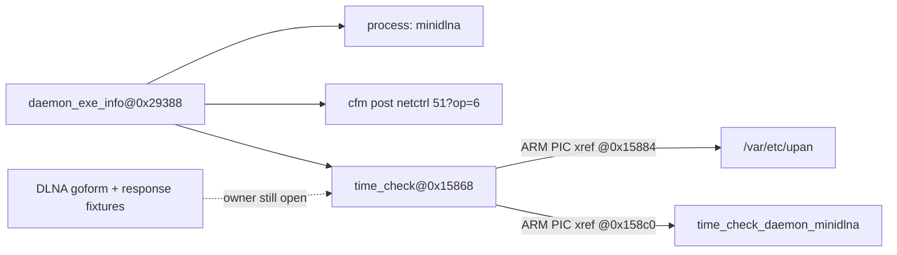

# R2-12 — AC9 Daemon 命令表与回调函数链

## 本轮结论

默认独立分析升级到 `auto-v9/builtin-v9`。新增两个通用、证据优先的 Native producer：

- `native_command_binding` 解析 ARM32 ELF 动态符号描述的固定记录表，只在进程名、完整命令、可执行 handler 指针和表布局同时成立时发布 binding；
- `arm_literal_xref` 从已绑定 handler 出发，在候选函数边界内重放 ARM PIC/GOT 指令，只发布精确的 instruction→literal xref，不用字符串距离替代调用关系。

公开分析缝为
`discover_native_command_table_bindings(source, content, profile, policy)`、
`discover_arm_literal_xrefs(source, content, anchors, profile, policy)` 和函数定界封装
`discover_arm_function_literal_xrefs(...)`。默认 Profile 会自动分析用户上传固件中的适用
ELF；当前命令表 Profile 是有版本号的 `daemon-exe-info-arm32/v1`，不是按 AC9 路径硬编码。

## AC9 中间过程与证据

`bin/time_check` 的动态符号 `daemon_exe_info` 位于 `0x29388`，大小 372 字节。记录布局和
解析结果如下：

| 记录偏移 | 语义 | AC9 值 |
|---:|---|---|
| `+0` | managed process | `minidlna` |
| `+112` | bound command | `cfm post netctrl 51?op=6` |
| `+368` | handler pointer | `0x00015868` |

handler `bin/time_check@0x15868` 建立 PIC base 后，产生两条可复核引用：

| 指令地址 | literal 地址 | literal |
|---:|---:|---|
| `0x00015884` | `0x0001f810` | `/var/etc/upan` |
| `0x000158c0` | `0x0001fca8` | `time_check_daemon_minidlna` |

这条链证明静态监督命令与其回调函数、DLNA 状态/路径字面量属于同一函数。它不证明
命令实际执行、缺失的 `minidlna` 制品在运行时存在、三个 DLNA goform 操作到达该函数，
也不证明漏洞或可利用性。

## 完整 Catalog 与历史漏洞对照

真实 AC9 自动分析完成，得到 4,351 candidates、688 parameters、11,549 EvidenceAtom、
59 个 open obligations 和 107 个潜在隐藏接口；其中新增 1 条命令表 binding 与 2 条
handler literal xref。13 条结构化历史 expectation 仍为 8 observed / 5 not-assessable；
71 条产品漏洞范围仍为 13 compared-interface、3 parameter-only、9 no-structured-
communication、46 not-analyzed，精确制品 expectation 保持 2/2 observed。Native 监督链
没有被错误计为历史 Web 接口或请求参数。

研究案例 `tenda-ac9-dlna-fixture-daemon-split` 现在保存 37 个证据引用、6 条 claims。
新 `claim:dlna-supervision-command-handler` 为 supported；
`obligation:dlna-supervisor-ipc-binding` 由 12 条表/xref 证据关闭；原有
`claim/obligation:dlna-handler-owner` 仍 unresolved/open。Corpus gate 为 3 cases、
13 independent evidence lines、`paper_ready=true`、0 issues。

## RED → GREEN、反思与护栏

1. RED：公共 ARM literal-xref 接口和命令表 binding 不存在；仅能看到同一 ELF 中的命令与字符串。
2. GREEN：用合成 ARM32 ELF 固定表布局、PIC base、load/add xref、函数边界和 EvidenceAtom 合同。
3. RED：一次 source SHA 不匹配仍可能被函数封装吞掉并返回空成功。
4. GREEN：函数封装先执行 source probe；source/content 不一致 fail closed 为 `failed`。
5. 负例：没有指令引用的 literal 不产生 xref；指向非执行段的 handler 不产生 binding。
6. Profile 隔离：`auto-v8/builtin-v8` 显式冻结，R2-11 报告重放仍为原 SHA；自定义 Profile 未启用 xref 时不执行该深化。
7. 认识状态不倒写：R2-11 的 candidate 仍是当时正确状态，R2-12 只以更强结构和指令证据晋级。

## 确定性、验证与交接

真实 AC9 报告和研究案例库连续生成两遍，逐字节一致：

- R2-11 冻结报告 SHA-256：`7beba6946739c7852ca92c9d355955803b27882fe415038bb8953f39fb954bc9`
- R2-12 报告 SHA-256：`fc92b84e358819eac6f9a21903fae690d65f77eb35ebfea6b4da1e84b4bbc4e9`
- 案例库 SHA-256：`6f2c05f823c9b70d0c8a04f6d9f7cdaeb76e8cf67ebbf896d8c2b592df81a200`

验证覆盖 producer 合同、失败关闭、Catalog 投影、AnalyzeRun 自动选择、真实 AC9 链、案例
obligation 状态和确定性报告：针对性测试 29 项通过；全量 mapping 355 项通过；Console
9 个文件 19 项通过；TypeScript 检查和 Vite 生产构建通过。`py_compile`、JSON 语法、
`git diff --check` 和敏感 key 扫描通过。本轮仅属于 `firmatlas.mapping`、mapping
tests/scripts 和 `docs/firmware-mapping`，SSH 部署不适用。

下一轮优先从 `bin/httpd` 中 DLNA 状态处理函数和三条 Frontend-only route 继续反向定位，
目标是寻找或明确拒绝 route registration/dispatcher，从而处理仍 open 的
`obligation:dlna-handler-owner`。图谱 UI 应在这条语义链稳定后直接消费 Catalog 的
component、binding、xref 和 obligation 节点，不重新猜关系。
