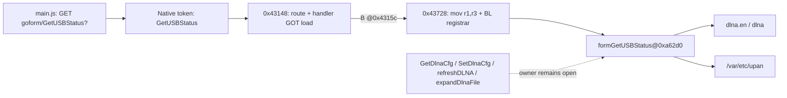

# R2-13 — AC9 Tail-merged Route 与 USB/DLNA 状态链

## 本轮结论

默认独立分析升级到 `auto-v10/builtin-v10`。本轮不是找到了三个缺失 DLNA route 的
同名 handler，而是解释并修复了两种更基础的漏检：

1. `main.js` 中一个包含引号的 JavaScript regex 使旧 tokenizer 错把后续约 11KB 内容当作
   字符串，七条 `$.getJSON` 请求因此没有进入前端覆盖；
2. `GetUSBStatus` 的 ARM 注册把 route/handler 装载与 registrar call 拆到两个非连续基本块，
   旧 v3 只识别连续 `route → handler → BL`，因此漏掉该 binding。

修复后，独立 `analyze-root` 自动形成：

## 前端覆盖修复

R2-13 从 `webroot_ro/js/main.js` 恢复七条 GET literal-prefix：

| endpoint |
|---|
| `goform/GetAdvanceStatus?` |
| `goform/GetParentCtrlList?` |
| `goform/GetSysStatus?` |
| `goform/GetUSBStatus?` |
| `goform/GetVpnStatus?` |
| `goform/GetWrlStatus?` |
| `goform/WifiGuestGet?` |

词法规则只在 `return`、赋值或明确前缀运算符等表达式起点识别 regex，并处理转义和字符类。
第一次 GREEN 后，X5000R 的 HTML `</script>` 被误当作 regex 起点，使
`upload/setUploadSetting` 消失；移除 `<`/`>` 作为 regex 起点后，AC9 regex→getJSON 与
X5000R multipart nested selector 同时恢复。这个跨样本反例已成为回归测试，而不是隐藏在
一次 AC9 成功结果中。

## Tail-merged 注册证明

ARM v4 要求以下证据同时成立：

- route 通过 PIC/GOT delta 装入 `r0`；
- handler GOT slot 由 `R_ARM_GLOB_DAT` relocation 解析到可执行动态符号；
- source block 以无条件 `B` 到有界尾块；
- 尾块严格为 `mov r1,r3` 后 `BL` 到已由至少两个独立 pair 验证的 registrar；
- 跳转源与尾块分别保存 EvidenceAtom，不用跨越 1.5KB 的大 span 伪装精确证据。

AC9 得到唯一 tail-merged binding：

| 字段 | 结果 |
|---|---|
| route | `GetUSBStatus` |
| branch registration site | `0x0004315c` |
| shared tail | `0x00043728` |
| registrar | `0x00017134` |
| registrar verified pairs | 167 |
| handler | `formGetUSBStatus@0x000a62d0` |

该 handler 的 12 条函数级 xref 为：`usb.ippd.enable`、`usb.ftp.remote.acess`、
`dlna.en`、两处 `printer`、两处 `fileshare`、`/var/etc/upan`、两处 `hasusb` 和两处
`dlna`。其中 DLNA 相关指令地址为 `0xa6364`、`0xa6478`、`0xa652c`、`0xa655c`。

## Catalog、历史漏洞与完整性边界

| 指标 | R2-12 | R2-13 | 变化 |
|---|---:|---:|---:|
| candidates | 4,351 | 4,369 | +18 |
| parameters | 688 | 696 | +8 |
| EvidenceAtom | 11,549 | 12,080 | +531 |
| open obligations | 59 | 64 | +5 |
| potential hidden interfaces | 107 | 84 | -23 |

open obligations 增加不是退化：新进入覆盖的请求必须生成待验证后端义务；其中
`GetUSBStatus` 已由 v4 binding 关闭 route/handler 义务。潜在隐藏接口减少二十三条，说明旧
Native-only 分类的一部分确由前端 tokenizer scope gap 造成。

13 条结构化历史 expectation 保持 8 observed / 5 not-assessable；71 条产品漏洞范围仍为
13 compared-interface、3 parameter-only、9 no-structured-communication、46 not-analyzed，
精确制品 expectation 为 2/2 observed。新 USB 状态链没有被错误计为缺失 DLNA 配置接口，
也没有生成漏洞或可利用性结论。

研究案例现在保存 60 个证据引用、7 条 claims、6 个阶段；
`claim:dlna-usb-status-route-handler` supported，`claim:dlna-handler-owner` 仍 unresolved，
`obligation:dlna-handler-owner` 仍 open。Corpus gate 保持 3 cases、13 independent evidence
lines、`paper_ready=true`、0 issues。

## RED → GREEN、版本隔离与交接

1. RED：tail-merged 合成 ARM fixture 返回 0 bindings。
2. GREEN：v4 恢复 branch source→shared tail→registrar，并发布六类精确证据。
3. RED：含引号 regex 后的 getJSON 返回 0 candidates。
4. GREEN：regex-aware tokenizer 恢复请求；X5000R 回放随即暴露 HTML closing-tag 误判。
5. GREEN refinement：收紧 regex 起点，AC9 与 X5000R 代表性路径同时通过。
6. RED：动态防缓存查询串虽已恢复为前端证据，set-difference 仍把固定 action 判为 Native-only。
7. GREEN：仅在 `?` 前 action 可证明固定时纳入 route set；AC9 hidden index 从 103 降到 84。
8. 第一次 R2-12 重放产生 SHA
   `0a098624de81da8a22e6820f67fe67732356735f9825c87e9e245c2ef29a8c13`，暴露出仅冻结 ARM
   profile 仍会让共享 frontend/set-difference 实现改写旧结果。随后把 regex lexer 与固定
   action 动态 query 规则都纳入 Profile policy：`auto-v1`–`auto-v9` 使用 legacy 行为，
   `auto-v10` 使用修复行为。最终 R2-12 重放恢复原 SHA
   `fc92b84e358819eac6f9a21903fae690d65f77eb35ebfea6b4da1e84b4bbc4e9`。

机器报告：[R2-13 AC9 tail-merged USB 状态链](../samples/r2-13-vendor-tenda-ac9-tail-merged-usb-status.json)。
R2-13 两次独立重放 SHA 均为
`fe394848a6d056e8bd96e94f8c9d1a6549d427e0e85d8508329cb308c66668a5`；案例库两次 SHA
均为 `ac7d5c1edccd2372627fe182a1d964da6d0ba758926b4e35b8048c2489f68b31`。
最终全量 mapping 回归为 `359 passed`；Console 为 9 files / `19 passed`，TypeScript check
与 Vite production build 通过。Python compile、两份 JSON parse、`git diff --check` 与明文
MiniMax key 扫描均通过。

下一轮仍应处理四条 DLNA operation 的真实 owner：优先检查是否存在 hashed/generated
dispatcher、条件组件或版本错配证据，而不是把已证明的 `GetUSBStatus` 共享状态访问当别名。
本轮仅属于 mapping 研究范围，SSH 部署不适用。
