# R2-14 — AC9 Disabled DLNA Feature 与残留请求归因

## 本轮结论

默认独立分析升级到 `auto-v11/builtin-v11`。Tenda AC9 的四条 DLNA Frontend-only
operation 并非只是一组“Native 没找到”的孤立字符串：固件自身保存了一条完整的产品
功能开关链，证明它们所在的声明 UI 路径在当前 build 中被关闭。

```mermaid
flowchart LR
    M["macro_config.js: CONFIG_DLNA_SERVER=n"] --> F["main.js: usb_dlna maps to symbol"]
    F --> P["only value y reveals target"]
    P --> R["usb_dlna routes to dlna.html"]
    R --> S["dlna.html loads js/dlna.js"]
    S --> Q["four DLNA requests"]
    Q --> D["frontend_feature_disabled"]
    D -. "does not prove backend absence" .-> O["Open: handler owner"]
```

这是一条差集归因，不是后端否定证明。直接调用、替代客户端、条件打包组件、生成式或
哈希分发以及匹配版本 build 仍需后续检查。

## 五段证明与保守边界

Producer 只在以下五类 EvidenceAtom 同时存在时发布 gate：

| 顺序 | capability | AC9 证据 |
|---:|---|---|
| 1 | `declares_feature_value` | `CONFIG_DLNA_SERVER=n` |
| 2 | `maps_feature_to_ui_target` | `usb_dlna → CONFIG_DLNA_SERVER` |
| 3 | `reveals_feature_target` | 仅 `modulesObj[prop] == "y"` 显示 target |
| 4 | `routes_feature_target_to_page` | `usb_dlna → webroot_ro/dlna.html` |
| 5 | `loads_feature_script` | `dlna.html → webroot_ro/js/dlna.js` |

脚本归属限定为页面同 stem 的 `dlna.js`，共享库中的请求不会因被页面加载而自动归入
该功能。真实 AC9 同时恢复两个启用对照：`CONFIG_PRINTER_SERVER=y` 和
`CONFIG_FILE_SHARE=y`；因此输出为 3 个 gate、1 个 disabled gate。

被解释的四条 operation 为 `GetDlnaCfg`、`SetDlnaCfg`、`refreshDLNA` 和
`expandDlnaFile`。每条 set-difference 候选继承 gate 原子与对应请求原子，并显式携带
开放义务：UI 禁用不能判定后端不存在。

## RED → GREEN 与真实样本修正

1. RED：公共 discovery API 缺失；GREEN：合成五段链输出 1 个 disabled gate 和 5 类证据。
2. 真实 AC9 初次返回 0：`showIframe(_("DLNA"), "dlna.html", ...)` 含嵌套调用，旧正则
   误把第一个右括号当作结束；改为有界 route 扫描后恢复。
3. 第一次真实 GREEN 把页面加载的共享库请求也归入 DLNA；同 stem 归属规则收紧后只保留
   `webroot_ro/js/dlna.js` 的四条请求。
4. RED：Catalog 没有 feature-gate batch；GREEN：候选、证据和请求引用进入统一目录。
5. RED：AnalyzeRun 无对应 stage；GREEN：`auto-v11` 在 frontend graph 后执行 producer。
6. RED：set-difference 不接受 gate；GREEN：四条 Frontend-only operation 获得
   `frontend_feature_disabled` 归因，旧 `auto-v10` 继续冻结。

这些中间失败被保留，因为它们分别暴露嵌套语法、共享依赖误归属和版本隔离三个真实工程
风险；不能把最终一次成功倒写成初始规则已经完整。

## Catalog、历史漏洞与完整性结果

| 指标 | R2-13 | R2-14 | 变化 |
|---|---:|---:|---:|
| candidates | 4,369 | 4,372 | +3 |
| parameters | 696 | 696 | 0 |
| EvidenceAtom | 12,080 | 12,095 | +15 |
| open obligations | 64 | 64 | 0 |
| potential hidden interfaces | 84 | 84 | 0 |

13 条结构化历史 expectation 仍为 8 observed / 5 not-assessable；71 条产品漏洞范围仍为
13 compared-interface、3 parameter-only、9 no-structured-communication、46 not-analyzed，
精确制品 expectation 为 2/2 observed。本轮没有把 feature gate 变成漏洞、认证、运行时可达
或可利用性结论。

研究案例现在保存 68 个证据引用、8 条 claims、7 个阶段；新
`claim:dlna-feature-disabled-ui-path` supported，`claim:dlna-handler-owner` 仍 unresolved，
`obligation:dlna-handler-owner` 仍 open。Corpus gate 为 3 cases、14 independent evidence
lines、`paper_ready=true`、0 issues。

## 可重复性、回归与交接

机器报告：[R2-14 AC9 disabled DLNA feature](../samples/r2-14-vendor-tenda-ac9-disabled-dlna-feature.json)。

R2-14 两次独立真实 AC9 重放字节一致，SHA 均为
`b02c346ba6615402f4bb8c9361ee71325fda7941df77238eb3fbfcf410bce9a5`；R2-13
`auto-v10/builtin-v10` 冻结重放仍为
`fe394848a6d056e8bd96e94f8c9d1a6549d427e0e85d8508329cb308c66668a5`。
研究案例 corpus 两次生成一致，SHA 为
`99d198603f503c82440bf377bb8d025f49fbc0da8f812a1b9f4c68f272bd262d`，且
`paper_ready=true`、0 issues。

最终全量 mapping 回归为 `364 passed`。Console 为 9 files / `19 passed`，TypeScript
check 与 Vite production build 通过。Console 首次在非登录 shell 中因 PATH 不含 Node
失败；使用工作区固定 Node runtime 后同一门禁通过，这属于环境诊断而非代码失败。
Python compile、两份 JSON parse、`git diff --check` 与明文 MiniMax key 扫描均通过。

下一轮优先直接检验后端所有权的替代假设：匹配版本或邻近产品 build、条件组件、哈希/生成式
dispatcher 和授权环境中的直接请求。不能把本轮 feature-disabled 解释提升成 backend-absent。
本轮仅属于 mapping 研究范围，SSH 部署不适用。
