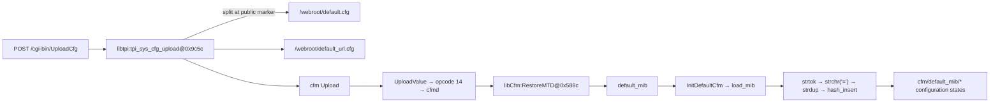

# R2-25：AC9 配置文本导入与逐键状态修正

状态：实现、真实样本独立回放、完整本地回归、生产构建与本地页面交互均已验证；Git 提交/推送记录见文末。固件通信测绘研究按仓库例外不进行 SSH 部署。

## 1. 本轮为什么必须修正 R2-24

R2-24 可靠证明了 `UploadValue` 的 opcode 14/15 IPC、payload offset 516、literal `0` 和
`cfmd → atoi → RestoreMTD`。但从函数名 `RestoreMTD` 与 selector `0` 继续推断
`configuration_partition[0] / whole_configuration_image`，超过了当时证据。

本轮查看 `lib/libCfm.so` 的实际实现后发现：`RestoreMTD@0x588c` 没有直接调用
`write/ioctl/mtd`，而是设置 `default_mib`，调用 `restore_config_type`、`RestoreNvram` 与
`InitDefaultCfm`。因此 selector 0 更合理且已验证的语义是“选择默认 MIB 恢复路径”，不是裸分区号。

R2-24 文档与 `auto-v16` 机器回放被保留为当时阶段；当前 `auto-v17` 不再运行该 Producer，
避免在最新 Catalog/图谱继续发布互相矛盾的 whole-image 节点。

## 2. 自动恢复出的完整静态链

关键来源：

- `lib/libtpi.so:tpi_sys_cfg_upload@0x9c5c` 同时包含两个目标路径、分隔符、`fopen/strstr/fwrite` 和 `doSystemCmd("cfm Upload")`；
- `lib/libCfm.so:RestoreMTD@0x588c` 选择 `default_mib` 并调用 `InitDefaultCfm`；
- `load_mib@0x8c74` 把 `/webroot/default.cfg` 交给内部 parser `0x7314`；
- parser 以换行切分，helper 用 `strchr('=')` 分离键值，最终调用 `hash_insert`；
- `etc_ro/init.d/rcS:15` 的 `cp -rf /webroot_ro/* /webroot/` 证明只读源文档怎样成为运行时路径；
- `webroot_ro/default.cfg` 产生 1015 条有序声明、1013 个唯一键，重复声明不会被静默抹掉。

## 3. 历史漏洞线索的类型边界

历史材料中的 `security.ddos.map` 和 `sys.schedulereboot.*` 现在不再只是“同固件字符串命中”，
而是带源文件精确行证据的 configuration-state 节点，并由配置导入 flow 以 `imports_state` 连接。
这解决了“上传文档如何进入配置键空间”的义务，但不证明某个历史漏洞存在、可利用，也不把这些键提升成 HTTP body/query 参数。

精确键：`security.ddos.map`，以及 `sys.schedulereboot.enable/end_time/interval/max_speed/start_time/type/wday`。

## 4. 设计与工程边界

- 新公开 seam：`discover_arm_configuration_text_import_flows(artifacts)`；输入来自用户上传并解包后的 Inventory，不含 AC9 seed。
- Source Plan 只选择含关键导出/命令的 ARM ELF、`webroot_ro/default.cfg` 与启动 materialization 脚本。
- 每条架构事实和每条配置键声明都有可内容校验、可 replay 的 EvidenceAtom。
- Catalog 保存导入 flow 与有序 key schema；Graph 才投影精确 STATE 节点，Catalog parameters 保持为零。
- `auto-v16/builtin-v16` 冻结；默认切到 `auto-v17/builtin-v17`，以修正后的 Producer 替代旧解释。
- `default_url.cfg` 的独立 parser/consumer、运行时实际执行、每个键的全部下游 reader 仍是开放义务。

## 5. 回归与中间结果

机器报告：[r2-25-vendor-tenda-ac9-configuration-text-import.json](../samples/r2-25-vendor-tenda-ac9-configuration-text-import.json)。

- 新 Producer、Catalog、Graph、fail-closed 与 profile 冻结合同：4 passed；真实冷启动用例约 139.70 秒。
- Research case 时间线与义务迁移：14 passed。
- AnalysisRun/Graph 定向回归：19 passed；旧 R2-24 报告通过显式 `auto_v16()` 保持精确重放。
- 两个独立进程生成 R2-25 报告逐字节一致；最终报告 SHA-256：`504bcdf5d16dc61a5d28682865b1268bdb61f8f6c40f2a8ea8142f5050512db2`。
- 完整 Python：512 passed（642.81 秒）；Console：9 files / 23 tests passed；TypeScript check 与 production Vite build 通过（1801 modules，主 JS 396.77 kB / gzip 109.71 kB）。

## 6. 页面验收门

本轮最终使用独立数据库 `var/mapping-work/r2-25-final-browser/firmatlas.db` 启动本地服务。页面验收必须确认：

1. 图谱页能搜索 `security.ddos.map` 并显示 STATE 节点与 `imports_state`；
2. 能搜索 `sys.schedulereboot.enable`；
3. 搜索 `configuration_partition[0]` 没有当前节点；
4. 证据抽屉显示 `webroot_ro/default.cfg` 的精确行；
5. 浏览器控制台无 error/warning，图谱/API 返回当前 `auto-v17` 数据。

实际结果：本地 `/api/health` 返回 `ok`，graph id 为
`communication-graph:b60085d0e9158469848cc54793e9cfd1bf723f81b3045dd9d1f13c0ef568e354`，
总计 7,092 nodes / 9,275 edges。页面搜索两个历史键各精确返回 1 个 STATE；旧
`configuration_partition[0]` 返回 0。证据抽屉显示 `webroot_ro/default.cfg` line 242 与
`declares_configuration_state_key`，相邻关系为 `imports_state`。首次点击暴露了 3-hop 会扩散到
全部 sibling keys 并触发 160-node partial；本轮随即把 state focus 收紧为 1-hop / 32-node budget，
复验得到 completed、2 nodes、1 edge，浏览器日志 0 warning / 0 error。

## 7. 下一轮

优先沿 `/webroot/default_url.cfg` 恢复第二配置文档的 parser/consumer，并把精确配置键进一步绑定到
历史漏洞对应 handler 的读写 flow；继续保持状态键、HTTP 参数、运行时观测和漏洞判断四层分离。

## 8. Git 与部署

- Git revision：待本轮提交后补充；
- GitHub push：待本轮提交后补充；
- SSH：不适用（仅 mapping 代码、测试与研究文档，且用户明确暂不远程部署）。
