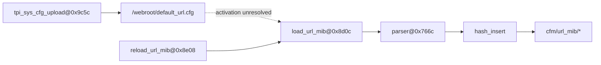

# R2-26：AC9 独立 URL 配置文档消费者

状态：实现、真实样本独立回放、完整本地回归、生产构建与本地页面交互均已验证；Git 提交/推送记录见文末。固件通信测绘研究按仓库例外不进行 SSH 部署。

## 1. 本轮问题与结论边界

R2-25 证明 `/webroot/default.cfg` 会逐键导入 `cfm/default_mib/*`，但同一上传函数还会写出
`/webroot/default_url.cfg`。本轮没有把它误并入默认 MIB，而是恢复了独立 URL 配置域：

writer 与 consumer 两端均有静态证据，但全固件调用扫描没有恢复从上传/恢复路径到
`load_url_mib` 或 `reload_url_mib` 的触发边。因此当前只发布 candidate `imports_state`，并保留
`binds_configuration_url_loader_activation` 开放义务；不虚构确定性调用关系。

## 2. 原始证据与反例

- `lib/libtpi.so:tpi_sys_cfg_upload@0x9c5c` 写 `/webroot/default_url.cfg`；
- `lib/libCfm.so:load_url_mib@0x8d0c` 读取文档并进入 parser `0x766c`；
- parser 的 entry helper 最终调用 `hash_insert`，状态域是 `cfm/url_mib/*`；
- `reload_url_mib@0x8e08` 两处调用 loader，但 287 个 ELF 中 257 个可解析对象的静态扫描没有找到它的 importer/caller；
- rootfs 不含静态 `default_url.cfg`，所以本轮精确 URL key 数必须是 0，不能借用 `default.cfg` 的 1013 个键；
- cfm 日常 URL IPC 的 Get/Set/Unset/Commit/Show opcode 与 `httpd` 的 `urlgroup.*` 消费线索存在，但还未证明它们就是上传文档的声明或激活入口。

原始来源审计见 [AC9 default_url primary sources](../research/2026-08-13-ac9-default-url-primary-sources.md)。

## 3. 工具固化

- 新公开 seam：`discover_arm_configuration_url_document_flows(artifacts)`；只接收 Inventory 制品，不含 AC9 seed；
- Source Plan 自动选择包含 writer/loader/reload 特征的 ARM ELF；
- Catalog 新增 `native configuration url document flow` 候选、结构属性、EvidenceAtom 和 producer obligation；
- Graph 投影独立 `cfm/url_mib/*` STATE 与 candidate `imports_state`；
- Scheduler 对同一义务稳定去重，当前 Catalog coverage 正确保持 `partial`；
- 默认分析配置升级到 `auto-v18/builtin-v18`，历史 R2-23/R2-25 报告显式固定旧 profile，确保可重放；
- 该“writer/consumer 独立成立、激活边未恢复”的阶段变化已追加到 research case 时间线，保留反事实失败模式与论文用途。

机器报告：[r2-26-vendor-tenda-ac9-configuration-url-document.json](../samples/r2-26-vendor-tenda-ac9-configuration-url-document.json)，SHA-256：
`36dc10a9db723d33ef6105b46948d3a0dadbf5a00d320e85c08270294da4b72c`。

## 4. TDD、回归与确定性

- RED：先写真实 AC9 冷启动、缺失文档 partial、预算 fail-closed、Catalog/Graph 和报告重放合同；
- GREEN：新 Producer 4 passed，真实冷启动约 144.85 秒；
- Research/report/case：16 passed；AnalysisRun/Graph 定向组合：20 passed；
- 首次完整 Python 回归只暴露 R2-19/R2-20 两份旧机器报告内的前端源码 SHA 漂移；复核当前源码与 Git 历史后只更新 provenance 字段；
- 最终完整 Python：517 passed（449.63 秒）；
- Console：9 files / 23 tests passed；两个 TypeScript 配置检查通过；production Vite build 通过（1801 modules，主 JS 396.81 kB / gzip 109.73 kB）；
- 报告由先前生成与测试中的独立冷启动重建逐字节比较，确定性合同通过；`git diff --check` 通过。

首次 Console 命令因非交互环境 PATH 没有 Node 而无法启动；加载仓库绑定的 Node runtime 后，同一套测试、类型检查与生产构建全部通过。该环境问题没有被记成产品失败。

## 5. 本地服务与页面交互验收

使用独立数据库 `var/mapping-work/r2-26-final-browser/firmatlas.db` 启动本地服务，并实际操作“通信测绘 → 架构图谱/目录浏览”：

1. `/api/health` 返回健康；当前 Catalog 为 `partial · 4933 candidates`，78 associations、65 unresolved；
2. 图谱显示 7,095 nodes / 9,278 edges；
3. 搜索 `cfm/url_mib/*` 后精确收敛到 1/1，展开为 completed、2 nodes、1 edge；边为 `imports_state · candidate`；
4. 状态证据抽屉显示 writer、loader、reload、parser、entry split、hash import 的二进制字节定位；
5. 目录搜索 `/webroot/default_url.cfg->cfm/url_mib/*`，详情显示 writer `libtpi.so@0x9c5c`、loader `libCfm.so@0x8d0c`、parser `0x766c`、reload `0x8e08`、`activation status: unresolved`；
6. 同一详情展示 1 个 P90 开放义务，并明确解释“两端独立证明、触发边未恢复”；
7. 浏览器控制台日志为空，无 warning/error。

一个可视化边界也被确认：图谱左侧搜索只索引接口/状态，不直接索引 obligation capability；义务通过 Catalog 候选详情展示。这是当前交互模型，不是分析漏失，后续可考虑增加“义务直达搜索”。

## 6. 下一轮

优先恢复 URL 日常 IPC（Get/Set/Unset/Commit/Show）与 `httpd urlgroup.*` 的消费者关系，并用调用图、启动路径或运行时证据寻找 `reload_url_mib` 激活主体；只有获得直接证据后才把 candidate 升级为 supported。同步把“义务直达搜索”列为图谱 UI 小幅改进候选。

## 7. Git 与部署

- Git revision：提交后回填；
- GitHub push：提交后通过已配置的 SSH 公私钥推送并复核远端 revision；
- SSH：不适用（仅 mapping 代码、测试与研究文档，且用户明确暂不远程部署）。
