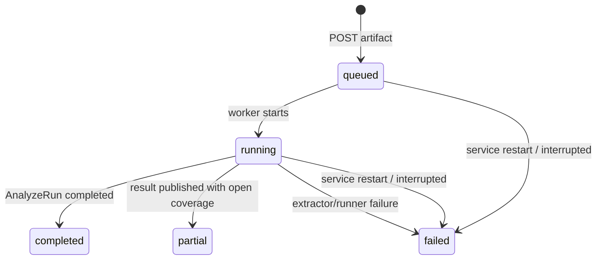

# R2-31：Tenda AC9 浏览器上传作业生命周期

> 日期：2026-08-18
> 状态：已验证
> 主样本：OpenWrt 19.07.8 bcm53xx Tenda AC9 `squashfs.trx`
> 前序：[R2-30 原始制品 AnalyzeRun](./2026-08-17-r2-30-raw-artifact-analyze-run.md)

## 1. 本轮问题与出口

R2-30 已证明命令行能够把原始固件制品送入固定容器，选择 rootfs 并生成 AnalyzeRun 与
Communication Graph，但用户工作流仍断在命令行：浏览器无法上传固件，也看不到排队、运行、
部分完成、失败和发布身份。本轮出口冻结为一条产品纵切：

```text
浏览器 raw upload
→ 有界流式保存
→ 内容寻址 Artifact
→ 持久化 Job
→ 单 worker 隔离分析
→ AnalyzeRun
→ 不可变 Catalog + Graph
→ Console 轮询与图谱跳转
```

HTTP handler 不执行 Binwalk；它只验证媒体类型、长度和文件名并创建任务。固定镜像摘要、禁网、
只读根、资源预算及提取谱系继续由 R2-30 的 Container Binwalk 边界承担。

## 2. 深模块合同

`FirmwareMappingJobService` 是本轮唯一作业编排 Interface：

```python
submit(stream, original_filename, content_length) -> FirmwareMappingJobSnapshot
get(job_id) -> FirmwareMappingJobSnapshot | None
list(limit=20) -> tuple[FirmwareMappingJobSnapshot, ...]
```

核心不变量：

- 默认单文件上限 64 MiB，1 MiB 分块，长度不足或超预算在分析前失败；
- 文件名只保留 basename，控制字符、空值和超过 255 字符的值被拒绝；
- Artifact 以 SHA-256 命名，作业身份由 `artifact SHA + runner identity` 确定；
- 同一制品与同一 runner 只执行一次，Catalog/Graph 仍遵循不可变发布；
- SQLite 只保存可变编排状态，事实文档保存在独立 `analysis.json` / `graph.json`；
- 服务重启时残留 `queued/running` 显式转为 `failed + job.interrupted`；
- runner 异常只发布稳定错误码 `job.runner_failed`，不把内部异常暴露给页面；
- `completed` 只表示整个制品分析完成；任何上游 coverage 缺口都保持 `partial`。

状态机为：



## 3. HTTP 与 Console 产品行为

新增三个 HTTP 读写面：

- `POST /api/mappings/jobs`：`application/octet-stream` 上传，返回 `202`；
- `GET /api/mappings/jobs`：返回能力、上传预算和最近任务；
- `GET /api/mappings/jobs/{job_id}`：返回单任务生命周期与发布身份。

只有显式配置 `--mapping-binwalk-image-ref` 才启用上传。未配置时 Console 展示能力缺失，不会
偷偷改为宿主机 Binwalk。Console 新增“上传分析”视图，展示安全边界、文件选择、预算、终态、
Artifact SHA、Catalog/Graph 身份，并能直接进入刚发布的图谱。

## 4. 真实 Tenda AC9 页面回放

启动命令：

```bash
PYTHONPATH=src python -m firmatlas intelligence serve \
  --database var/mapping-work/r2-31-ac9-upload/firmatlas.db \
  --host 127.0.0.1 --port 18789 \
  --static-dir apps/console/dist \
  --mapping-workspace var/mapping-work/r2-31-ac9-upload/jobs \
  --mapping-runtime /usr/local/bin/docker \
  --mapping-binwalk-image-ref k4l1xx/binwalk@sha256:03d1560ae439250f69a73f3d0bacff45cf1c04d8b0d0cbdf7d0170aa7e0cf303 \
  --mapping-binwalk-version 2.2.1 \
  --mapping-analysis-max-seconds 600
```

在 `http://127.0.0.1:18789/` 实际执行“通信测绘 → 上传分析 → 选择固件 → 开始独立分析”。
页面先显示 `running` 与等待发布，约 35 秒后显示 `partial`、完整 Catalog/Graph 身份；点击
“查看生成图谱”成功进入本轮产物。

| 字段 | 实际值 |
| --- | --- |
| 文件大小 | 4,657,152 bytes |
| Artifact SHA-256 | `d40b191c95c5b6e43358785d6c6e9d7915296e9a954d27fbc1936bdf48568ec9` |
| Job | `firmware-mapping-job:6addf3318c8b11cc80ff405027b9247bc13de3d8ec1c07264b1244f95500b3a2` |
| Analysis | `firmware-artifact-analysis:f9a3498dee6924e1ff211feebd8cbff46d05e106536042a07ea849bb9746302a` |
| Catalog | `discovery-catalog:e1e06e0f9c15567ef088689896a7cc9e975b8f84a5069c901ef249d36eaff933` |
| Graph | `communication-graph:28161bc5edf299b6e171e8d3c92a2e49f04f9901bb3814ad1ea089604e77acf5` |
| 候选 / 参数 / 关联 | 1,202 / 220 / 22 |
| 开放义务 | 117 |
| 图节点 / 关系 | 1,665 / 2,273 |
| 页面精确接口焦点 | 74 / 74 |

可复查的中间输出已固化为
[R2-31 AC9 浏览器上传 Job 样例](../samples/r2-31-openwrt-ac9-browser-upload-job.json)，完整 AnalyzeRun
仍由内容寻址的本地 job workspace 保存，避免在 Git 中重复提交 26 万行派生事实。

终态为 `partial` 的直接原因是 frontend、ubus backend、set difference 与 correlation 仍携带
预算或范围缺口；native shallow、script backend、web configuration 和 ARM PIC 注册分析已完成。
这保持了“未知不是未发现”的证据语义。

## 5. 回归与交互验证

本轮最终验证结果：

- 作业/API 定向测试：17/17 通过；
- Console：9 个测试文件、28/28 测试通过；两套 TypeScript 配置检查通过；Vite production build 通过；
- 第一轮 Python 全量：545 项中 542 通过，3 项失败；失败均为旧报告绑定了修改前的
  `api/client.ts` / `types.ts` / `MappingCatalogWorkspace.tsx` SHA，而非行为回归；
- 更新三个 checked-in report 的源码摘要后，6/6 报告合同测试通过；
- 最终 Python 全量：545/545 通过，`1278.983s`；
- `compileall`、JSON 解析与 `git diff --check` 通过；
- `/api/health`：`status=ok`；
- 浏览器：真实 AC9 上传、running→partial、Catalog/Graph 身份、图谱跳转与规模均已核验；
- 最终代码重启服务后再次进入上传终态与图谱，浏览器 warning/error 日志为 0。

## 6. 反思、边界与下一步

本轮没有把分析器放进 HTTP 请求线程，也没有为获得“绿色成功”而吞掉 open obligations。这两点
分别保护服务可用性和研究可信度。内容寻址复用使同一 AC9 回放稳定，但当前失败任务不会自动
重试；未来若需要重试，应引入显式 attempt identity 与审计记录，不能覆写原失败状态。

下一轮应从 AC9 单样本深挖切换到代表性 corpus gate，并接入只生成“解释/检索建议”的 MiniMax
业务 Adapter。模型输出必须保持 proposal，不得越过 EvidenceAtom/Validator 自动晋级为结构事实。

## 7. 发布与交接

- SSH 部署：不适用；用户明确排除通信测绘研究的 SSH 远程部署。
- Git revision：本文所在 `feat(mapping): add firmware upload jobs` 提交；以 `git log -1` 为准。
- 服务：本轮结束时保持 `127.0.0.1:18789` 开启，便于继续页面验收。
- 后续会话入口：先读本文、[主控文档](../README.md)、`CONTEXT.md`，再核对服务和 Git revision。
