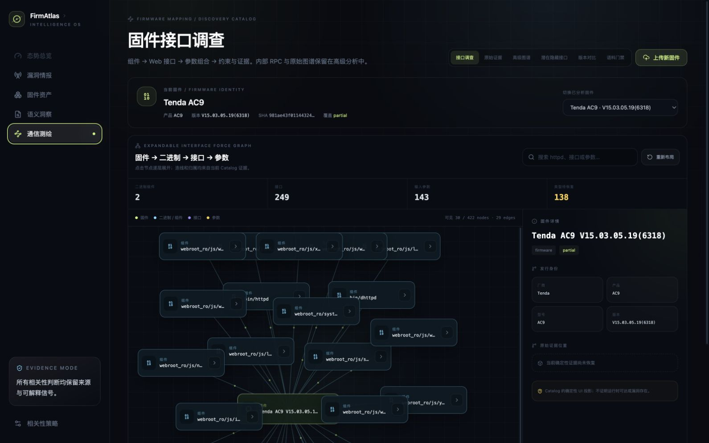
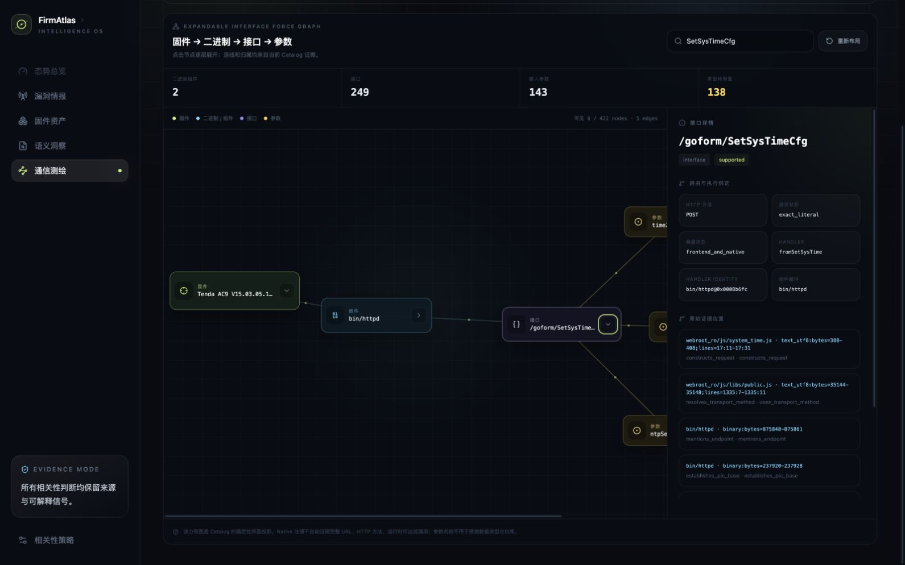
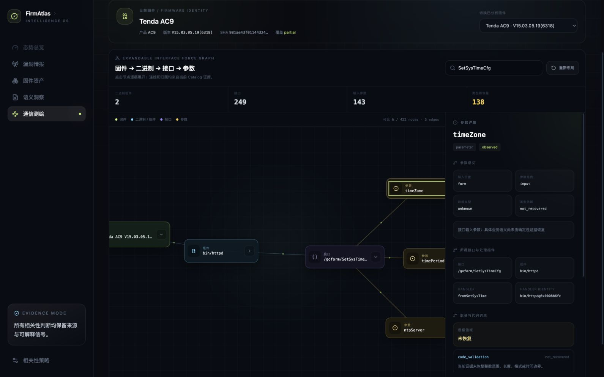

# R2-39：可折叠接口力导图

## 1. 本轮目标

把 R2-38 的三栏接口浏览器改造成以固件为根的交互式力导图，让调查者沿着
`固件 → 二进制/组件 → Web 接口 → 参数` 逐层展开，并在稳定侧栏查看参数类型、功能、约束、依赖
和 EvidenceAtom。默认图不得把 `ubus://` 或 IPC 逻辑操作展示成 Web 接口。

主回归样本固定为原厂 Tenda AC9 V15.03.05.19(6318)。本轮属于 firmware mapping 产品读模型与
Console 交互，不需要 SSH 部署；仍需完成本地页面验收、全量回归、提交和 GitHub 推送。

## 2. 设计与实现

### 2.1 独立读模型

新增 `firmatlas.mapping.interface-force-graph/v1alpha1` 投影，不让浏览器从原始候选重新推断 owner、
类型或约束。API 为：

```text
GET /api/mappings/catalogs/{catalog_id}/interface-force-graph
```

投影规则：

- 根节点来自 Catalog firmware identity 与 release context；
- 有 Native owner 的接口按真实 `source_path` 聚合到二进制，如 `bin/httpd`；
- 没有 Native owner 的请求接口按前端来源模块保留，并明确标为 `frontend_module`；
- 只纳入 Web-like request interface 和 Native CGI/route 注册，排除 UBUS/IPC logical operation；
- frontend/native 只通过 Catalog 已有 association 或 target reference 连接；
- Native-only selector 没有路径证据时保留 `path_status=unresolved`，不合成 `/goform/...`；
- 参数只能通过精确 owner identity 连接到接口；
- 类型只根据已观察 literal/selector domain 判断 boolean、integer 或 string，其余为
  `unknown/not_recovered`；
- 约束只发布固定 literal、selector domain 或已恢复的代码验证；没有证据就显示未恢复；
- 单节点最多返回 12 条 EvidenceAtom locator，并给出 `additional_evidence_count`，避免 UI 载荷失控。

### 2.2 前端交互

新增 `FirmwareInterfaceForceGraph` 深模块：

- 首屏只展开固件到组件，避免 249 个接口一次铺满；
- 点击可展开/折叠子层级，组件和接口节点显示子节点数量；
- 确定性力模拟组合节点斥力、边弹簧和层级横向偏置，支持“一键重置自动布局”；
- 搜索把画布收敛到命中节点、后代和祖先，不只是给原图叠加高亮；
- 点击任一节点在右侧展开固件、组件、接口或参数的专用详情；
- 参数详情同时展示类型依据、约束、依赖、owner、handler 与证据位置；
- “原始证据”和“高级图谱”仍保留完整取证入口。

## 3. 迭代与反思记录

### 阶段 A：从三栏列表改成关系图

R2-38 已能按组件、接口和参数下钻，但用户无法直观看到层级和依赖，也容易把内部 RPC 列表误认为
Web 暴露面。本轮先建立独立投影合同，再替换默认接口调查视图；通用通信图没有删除，而是降为高级
证据入口。

### 阶段 B：真实 AC9 暴露载荷问题

第一版在真实 Catalog 上把某些节点的全部 EvidenceAtom 写入响应，载荷约 2.3 MB。回放表明大量重复
locators 对首屏没有额外解释价值，因此改成每节点最多 12 条，并保留剩余数量。最终响应约 1.06 MB，
最大已截断证据余量为 283 条，事实计数和可追溯性不变。

### 阶段 C：修正搜索语义

第一版搜索仅强制加入命中节点，未隐藏无关已展开分支，结果仍然拥挤。修正后搜索生成命中分支闭包：
目标、必要祖先和目标后代可见，其余分支隐藏。真实页面搜索 `SetSysTimeCfg` 从 221 个可见节点收敛到
3 个；展开目标接口后为 6 个。

### 阶段 D：参数解释保持证据诚实

`timeZone` 的名字容易诱导系统直接标记为时间或整数，但当前 Catalog 只证明其被接口读取，并没有恢复
范围、格式或时间边界。最终 UI 显示 `unknown / not_recovered`，同时给出前端和 `bin/httpd` 证据位置，
把缺口变成后续代码使用点分析的任务。

## 4. AC9 实证

Catalog：
`discovery-catalog:29081f8e9f48b65ee10c85b81cb73fbce5dffa26023726397ae691397e5373a4`

| 指标 | 数值 |
| --- | ---: |
| 力导图节点 / 边 | 422 / 421 |
| 组件 | 29 |
| Native 二进制组件 | 2 |
| `bin/httpd` 接口 | 191 |
| `bin/dhttpd` 接口 | 2 |
| 请求接口 | 249 |
| 输入参数 | 143 |
| Native-only 注册 | 122 |
| 未恢复类型的参数 | 138 |

浏览器真实交互：

1. 初始固件根图为 30/422 可见节点、29 条边；
2. 展开 `bin/httpd` 为 221/422 可见节点、220 条边；
3. 搜索 `SetSysTimeCfg` 收敛为 3 节点、2 边；
4. 展开接口得到 `ntpServer`、`timePeriod`、`timeZone`，为 6 节点、5 边；
5. 点击 `timeZone` 后侧栏展示 owner、handler、未知类型依据、未恢复约束、依赖和精确 locator；
6. 自动布局重置有明确状态反馈；折叠接口恢复 3 节点、2 边；
7. 浏览器 Console 0 errors。







## 5. 回归验证

| 验证 | 结果 |
| --- | --- |
| 投影 + API 专项 | 3/3 通过 |
| Python 全量 | 最终 563/563 通过（619.028s） |
| Python compileall | 通过 |
| Console 全量 | 33/33 通过，10 个测试文件 |
| Console production build | 通过，1,802 modules transformed |
| AC9 API | HTTP 200，422 nodes / 421 edges，约 1.06 MB |
| 浏览器 | 展开、折叠、搜索、布局、侧栏均通过，0 Console errors |

新增测试覆盖：Web/UBUS 边界、Native source path 分组、Native-only unresolved path、基于证据的参数
类型与约束、API route、默认加载策略、展开/折叠、搜索和参数侧栏。

首轮全量为 560/563：三项失败均为历史 HTTP/Console 验收报告仍绑定修改前的 `client.ts` SHA-256，
没有功能断言失败。更新三份报告后，第二次专项检查又发现同一变更集内 `MappingCatalogWorkspace.tsx`
与 `types.ts` 的旧摘要；同步全部当前源码摘要后，6/6 报告合同测试和最终 563/563 全量回归通过。
前端首次从登录 shell 执行时因本机 `.zprofile` 引用不存在的 Homebrew 路径而找不到 Node；改用工作区
固定 Node/pnpm runtime 后，33/33 测试和生产构建通过。两类环境/合同偏差均保留，不倒写成一次成功。

## 6. 反事实失败模式

- 如果按任意 `source_path` 分组，会把 JavaScript 文件错误叫作二进制；当前显式区分
  `binary` 与 `frontend_module`。
- 如果把 Native selector 自动前缀为 `/goform/`，会制造固件中没有证明的 URL；当前保持 unresolved。
- 如果按 `timeZone`、`enable` 等名字推断数据类型，会把语义直觉冒充代码事实；当前只用 literal domain。
- 如果首屏展开 `httpd` 的全部 191 个接口，用户会失去固件和组件上下文；当前逐层按需展开。
- 如果复用包含全部通信类别的通用图，`ubus://file/exec` 会再次与 Web 接口并列；当前采用目的明确的
  接口调查读模型，高级图仍保留完整事实。
- 如果把所有证据 locator 内嵌到每个节点，会增加约一倍响应体而没有首屏价值；当前有界返回并报告余量。

## 7. 限制与下一轮入口

- 138/143 个参数仍缺可靠数据类型，需增加跨 ISA 的消费者使用点与比较/转换分析。
- 多数参数尚未恢复业务语义、整数范围、长度、格式或组合条件；MiniMax 只能基于 EvidenceAtom 提建议，
  不能把建议晋级为事实。
- 未关联 Native owner 的前端接口仍按来源模块展示；后续可通过 dispatcher/handler 对齐减少该集合。
- `httpd` 全展开仍是高密度场景；后续可增加拖拽、缩放、按 handler family 聚类和局部冻结布局。
- 本轮没有产生新的固件架构事实，故不新增 research casebook 条目；阶段时间线、误导路径和反事实已在
  本记录保存，后续会话可直接复现。

## 8. 交付状态

- 本地服务：`http://127.0.0.1:18789/`，最终代码启动并完成真实浏览器验收；
- SSH：不适用，符合 firmware mapping research exception；
- Git：本记录、源码、测试与截图纳入同一提交并推送；revision 以最终交付记录为准。
