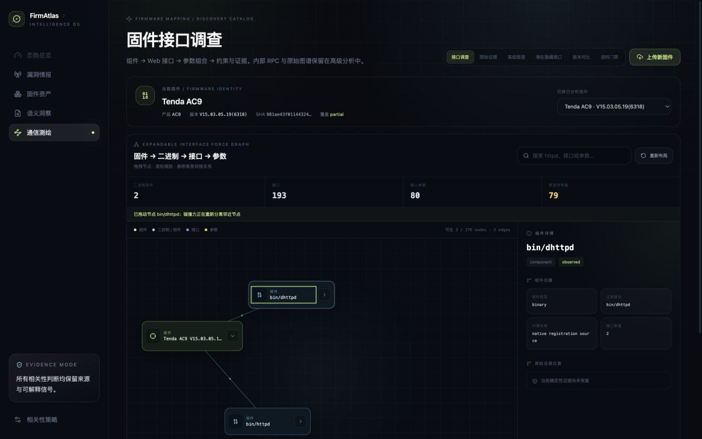

# R2-40：静态资源边界与动态碰撞力导图

## 1. 目标

根据真实页面反馈完成两项修正：

1. JavaScript、HTML、CSS 等静态资源文件不作为通信组件展示；默认图只保留有 Native 证据归属的
   真实二进制、接口和参数。
2. 力导图必须与鼠标交互并持续自动布局；节点可拖拽，释放后邻居回弹避让，卡片不能堆叠。

主回归样本继续使用原厂 Tenda AC9 V15.03.05.19(6318)。本轮属于 firmware mapping 产品范围，
按仓库例外不执行 SSH 部署；必须完成本地服务、真实页面、全量回归、提交和 GitHub 推送。

## 2. 一手来源选型

独立研究见
[动态力导向图一手来源研究](../research/2026-08-20-r2-40-dynamic-force-layout-primary-sources.md)。

结论：

- 首选 `react-force-graph-2d`，通过 `d3Force()` 注入显式 collision；它原生支持拖拽、hover、点击、
  zoom/pan 和 simulation reheat。
- Cytoscape.js + fCoSE 适合作为 compound node 或复杂约束布局备选。
- Sigma.js/Graphology 更适合超大图 WebGL 渲染，但当前接入成本高，Sigma v4 仍需谨慎评估。
- 静态资源排除必须发生在后端读模型，而不是由前端隐藏，否则 API 计数和其他消费者仍会混淆。

本机 pnpm 配置的腾讯镜像与官方 npm registry 均在元数据获取阶段被代理阻断。为避免 CDN、未锁定
源码或手工 vendoring，本轮先用零新增依赖实现相同交互合同；projection、expanded/search 和
NodeDetail 边界保持不变，网络恢复后可替换为推荐库而不改 API。

## 3. 实现

### 3.1 后端静态资源边界

`interface-force-graph/v1alpha1` 只为已绑定 Native registration 的 request interface 建立二进制
owner。没有 Native owner 的前端引用不再调用 `ensure_component()`，其参数也不会进入默认图。

新增摘要字段：

```text
excluded_static_resource_interface_count
```

排除只影响 UI 读模型；原 Catalog candidate、parameter 和 EvidenceAtom 不删除，仍可在“原始证据”
和“高级图谱”检查。

### 3.2 动态模拟与鼠标交互

- requestAnimationFrame 持续推进斥力、link spring、层级引力和阻尼；
- pointer down 固定节点，pointer move 按缩放比例更新坐标，pointer up 释放并 reheat；
- wheel 在 0.45–1.8 范围缩放；
- hover 保留目标和一跳邻居 opacity，其余节点降至 0.18，非邻接边降至 0.12；
- 重置布局更换确定性 seed 并重新启动模拟；
- 画布宽高根据每个 depth 的节点数与可用列数扩容，不再把 191 个接口压入窄列；
- 每 tick 最后执行最多 16 轮矩形位置投影，把卡片不重叠作为硬约束，而不是视觉近似。

## 4. 红绿迭代记录

### Slice A：排除静态资源

新增后端测试输入：只有 `webroot_ro/js/status.js` 的 `/goform/GetStatus` 与 `_` 参数，没有 Native
binding。红灯时返回 firmware/component/interface/parameter；实现边界后绿灯只返回 firmware，
摘要报告排除 1 个静态资源接口。API route 合同同步改为相同行为。

### Slice B：拖拽交互

先增加公开行为测试：拖动 `bin/httpd` 后页面出现“已拖动节点 …；碰撞力正在重新分离邻近节点”，
并明确显示拖拽、滚轮、hover 操作提示。红灯缺少 status；接入 pointer + dynamic simulation 后绿灯，
Console 回归从 33 增至 34。

### Slice C：真实 AC9 碰撞收敛

仅靠中心点斥力无法证明不重叠。真实浏览器按 SVG `foreignObject` 的 x/y/width/height 枚举全部节点，
两两计算矩形交集：

| 迭代 | 可见节点 | 重叠对 | 原因与修正 |
| --- | ---: | ---: | --- |
| 初始动态碰撞 | 194 | 194 | 191 个接口仍被强列引力压进窄画布 |
| 按 depth 容量扩展画布 | 194 | 98 | 面积足够，但 velocity-only collision 收敛慢 |
| 4 轮位置投影 | 194 | 23 | 大部分消除，局部链弹簧仍重新引入交叠 |
| 16 轮早停位置投影 | 194 | **0** | 非重叠成为每 tick 的硬不变量 |

这条时间线保留中间失败，不把最终零重叠改写为一次成功。

## 5. AC9 最终实证

Catalog：
`discovery-catalog:29081f8e9f48b65ee10c85b81cb73fbce5dffa26023726397ae691397e5373a4`

| 指标 | R2-39 | R2-40 |
| --- | ---: | ---: |
| 总节点 / 边 | 422 / 421 | 276 / 275 |
| 展示组件 | 29 | 2 |
| Native 二进制 | 2 | 2 |
| 接口 | 249 | 193 |
| 参数 | 143 | 80 |
| 排除静态资源接口 | 未统计 | 56 |
| Native-only 接口 | 122 | 122 |
| 未恢复参数类型 | 138 | 79 |

最终组件只有 `bin/httpd`（191 接口）和 `bin/dhttpd`（2 接口），`frontend_module` 数量为 0。
首屏 3/276 nodes、2 edges；展开 `httpd` 为 194/276 nodes、193 edges，矩形交叠 0 对。

拖动 `bin/dhttpd` 后，页面状态为：

```text
已拖动节点 bin/dhttpd；碰撞力正在重新分离邻近节点
```

悬停 `bin/dhttpd` 时，固件根和该节点 opacity=1，非邻接 `bin/httpd` opacity=0.18。默认页面未出现
`webroot_ro/js` 或 `ubus://`。



## 6. 验证

| 验证层 | 结果 |
| --- | --- |
| Backend/API 专项 | 4/4 通过 |
| Console | 34/34 通过，10 files |
| TypeScript + production build | 通过，1,802 modules transformed |
| Python compileall | 通过 |
| Python 全量 | 564/564 通过（617.191s） |
| AC9 API | 276 nodes / 275 edges；2 binary；0 frontend module；56 excluded |
| 真实浏览器 | 拖拽、reheat、hover、zoom 提示、194-node 展开、零矩形交叠通过 |

## 7. 解释边界与下一步

- “静态资源不展示”不等于丢弃前端证据；它们仍是接口/参数证据 locator。
- Native registration 仍不证明运行时可达、鉴权、漏洞或完整 URL。
- 当前自研模拟对 194 个可见节点已验证；更大图应按研究文档的 POC 门槛评测 Canvas/WebGL 方案。
- 鼠标局部排斥尚未默认开启；拖拽 + hover 已满足可控交互，局部排斥应作为可关闭实验，避免节点
  在用户阅读时持续逃离指针。
- 网络恢复后优先 POC `react-force-graph-2d + collision`，但只有在零重叠、详情可访问性、展开状态
  和真实 AC9 性能同时通过后才替换当前引擎。

## 8. 交付状态

- 本地服务：`http://127.0.0.1:18789/`，最终构建运行并完成真实浏览器验收；
- SSH：不适用，符合 firmware mapping research exception；
- Git：源码、研究、测试、截图和文档纳入同一提交并推送，revision 见最终交付。
