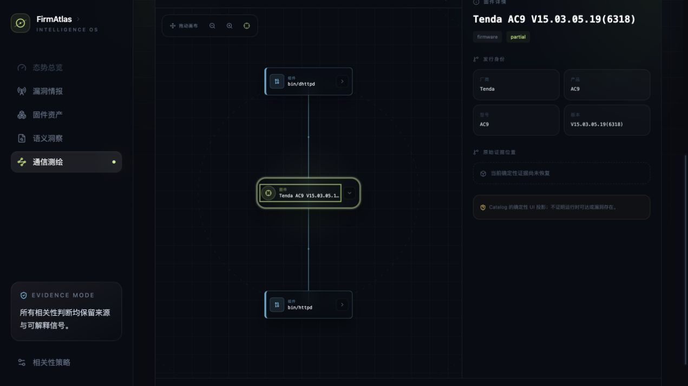
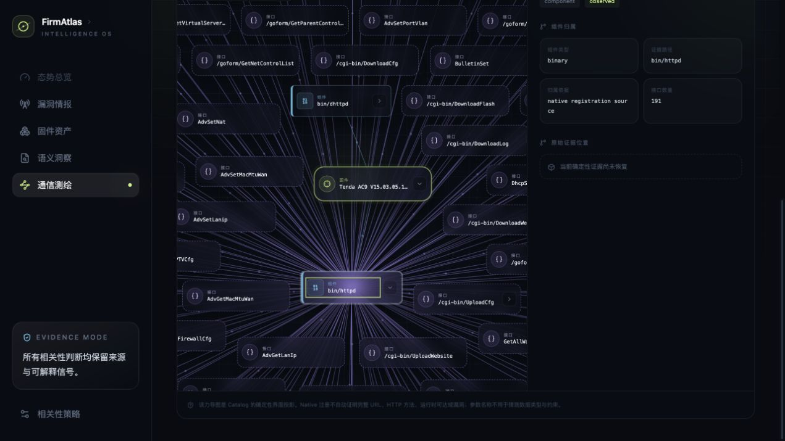

# R2-42：固件居中环绕、类别造型与画布平移

## 1. 用户目标

Tenda AC9 接口力导图需要从“分层列表落点”升级为更接近图数据库探索的空间结构：

1. 固件默认位于画布中心，组件、接口和参数在外层环绕；
2. 固件、组件、接口、参数必须一眼可区分，而不只依赖很小的文字标签；
3. 节点可以拖动，空白画布也可以拖动平移；
4. 自动布局、碰撞分离、展开/折叠、详情侧栏和证据边界必须保持。

本轮属于 firmware mapping 产品范围，按仓库例外不部署到 `satc_cloud`；仍完成本地最终服务、
真实浏览器、全量测试、截图、文档、提交和 GitHub 推送。

## 2. 设计与实现

### 2.1 分层环绕目标

- firmware：逻辑锚点 `(0,0)`，使用更强回中力；
- component：半径 245 的第一环；
- interface：从半径 500 开始，按周长容量分配到多个同心环；
- parameter：围绕所属 interface，以 215 起始半径形成局部卫星环。

link spring 按节点 degree 归一化，避免 `httpd` 的 191 条边把高连接度组件拖离其环形目标。每 tick
继续执行最多 16 轮矩形投影，因此环形目标是布局偏好，零重叠仍是硬约束。

### 2.2 类别视觉语法

| 对象 | 轮廓 | 色彩与含义 |
| --- | --- | --- |
| 固件 | 绿色双边框、圆角中心卡、外层光晕 | 图谱根和当前发行身份 |
| 组件 | 青色实线卡、左侧 4px 色条 | 真实二进制/执行 owner |
| 接口 | 紫色虚线圆角卡 | Web 暴露接口或 Native 注册入口 |
| 参数 | 琥珀色胶囊 | 接口输入、selector 或固定字面量 |

边也按语义区分：contains 为青色，exposes 为紫色，accepts 为琥珀色。两条低对比同心辅助线提示
组件环与接口环，但不参与证据语义。

### 2.3 可平移视窗

SVG 使用固定 `680×800` 逻辑 viewBox，在当前响应式两栏宽度下保持卡片可读。空白 SVG 区域接收
pointer capture，更新图层 `translate(x y)`；节点按钮继续使用独立 pointer capture，因此两种拖拽
不会竞争。左上角工具栏提供缩小、放大与回到固件中心，重置布局同时重置 pan/zoom。

## 3. 红绿迭代

### Slice A：固件中心与外环

公开 DOM 测试从 `foreignObject` 的渲染位置计算卡片中心。旧列布局红灯为 firmware x=129.45；
环绕 geometry 后 firmware 的 x/y 绝对值均小于 60，component 与 firmware 距离大于 160。

### Slice B：空白画布平移

测试向 SVG 空白画布发送 `(240,180) → (340,240)` pointer 序列。红灯没有 status；实现后图层变为
`translate(100 60) scale(1)` 并显示“已平移画布”。点击回中后恢复 `translate(0 0)`。

### Slice C：真实 AC9 视觉校准

首版 `1200×800` viewBox 虽然中心正确，但在实际两栏宽度下卡片偏小。实拍后先收敛为 `840×800`，
再次确认仍偏保守，最终固定 `680×800`；这个过程保留了“关系正确但不可读”的中间失败。

## 4. AC9 真实页面结果

| 状态 | 节点 / 边 | 页面结果 |
| --- | ---: | --- |
| 初始 | 3 / 2 | 固件中心，2 个二进制位于组件环 |
| 展开 `bin/httpd` | 194 / 193 | 191 个紫色接口分布于多层同心环 |
| 缩小一次 | 不变 | 图层 `scale(0.9)` |
| 回到固件中心 | 不变 | `translate(0 0) scale(1)` |

浏览器枚举 194 个 `foreignObject` 的 x/y/width/height，两两计算得到 **0 对矩形重叠**。

## 5. 测试

| 验证层 | 命令或方式 | 结果 |
| --- | --- | --- |
| Console | `pnpm test` | 38/38 通过，10 files |
| TypeScript + production build | `pnpm build` | 通过，1,802 modules transformed |
| Python 编译检查 | `PYTHONPATH=src python3 -m compileall -q src` | 通过 |
| Python 全量回归 | `PYTHONPATH=src python3 -m unittest discover -s tests` | 564/564 通过，453.584s |
| 真实浏览器 | 初始/展开、真实鼠标拖动画布、缩放/回中 | 194 节点环绕；平移 `translate(107.37 71.58)`，回中恢复 `translate(0 0) scale(1)` |
| 碰撞检查 | 浏览器枚举 194 个节点矩形 | 0 overlap |
| 本地 API | health、catalog、graph、corpus、job、AC9 force graph | 全部 HTTP 200；8 catalogs、3 graphs、gate passed；AC9 276 nodes / 275 edges |
| 前端文档 | `GET /` | HTTP 200；加载 `index-OiFlkoZZ.js` / `index-zFIYH0w8.css` |

## 6. 边界与后续

- 环绕位置是 UI read model 的布局结果，不创造新的 Catalog 关系或运行时拓扑。
- 同心辅助线只帮助阅读，不表示网络边界、信任区或进程隔离。
- 画布平移改变观察视角，不改变节点坐标事实或证据定位。
- 超过当前 AC9 规模时仍需评估 Canvas/WebGL；本轮 SVG 在 194 可见节点下完成零重叠验收。

## 7. 交付

- 本地服务：`http://127.0.0.1:18789/`；
- SSH：不适用，符合 firmware mapping research exception；
- Git：源码、测试、README、部署说明、产品手册、截图和本轮记录进入同一提交并推送。
