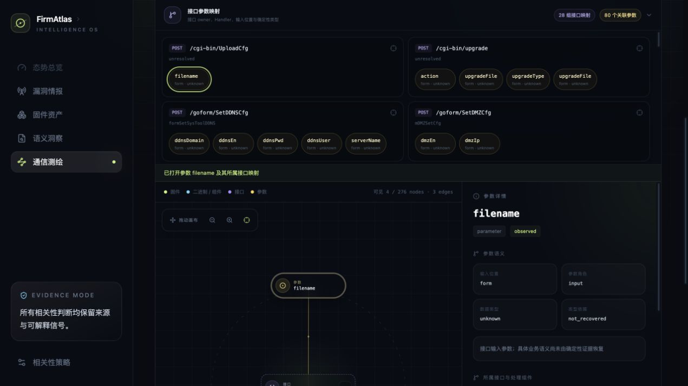

# R2-45：接口—参数映射索引

## 1. 用户问题

AC9 图谱虽然支持逐级展开，但接口—参数关系只有用户找到接口并展开后才出现。面对 193 个接口和
80 个参数，用户无法在首屏确认哪些接口有参数、每个接口对应哪些参数，也无法快速进入某组关系。

## 2. 产品设计

在力导图指标和画布之间新增默认展开、可折叠的“接口参数映射”索引：

- 只展示 Catalog 中 `interface.child_ids → parameter` 的确定性 owner 关系；
- 每张映射卡显示 HTTP 方法、接口路径和 Handler；
- 参数以琥珀色胶囊显示名称、输入 namespace 和已恢复类型；
- 点击映射卡会设置接口查询、展开该接口并聚焦图谱；
- 点击参数胶囊会展开 owner 接口、选择参数并打开右侧详情；
- 响应式使用单列、双列、三列网格，索引内部限高滚动，不无限推挤画布。

索引是既有 Catalog read model 的 UI 投影，不按名称拼接关系，也不创造参数类型或约束。

## 3. TDD

新增用户可见行为测试，要求初始页面直接出现：

- `接口参数映射`；
- `1 组接口映射` / `1 个关联参数`；
- Handler `formSetTimeCfg`；
- 参数元数据 `form · integer`；
- 聚焦映射后图中出现 `timezone`；
- 点击参数胶囊后出现参数详情。

测试先因映射索引不存在而红灯，完成实现后专项 10/10、Console 全量 40/40 通过。

## 4. AC9 页面验证

| 验证项 | 结果 |
| --- | --- |
| 映射组 | 28 |
| 参数胶囊 | 80 |
| `UploadCfg` 聚焦 | 查询自动设为 `/cgi-bin/UploadCfg`，图中 4 nodes / 3 edges |
| `filename` 参数 | 图中可见；点击后右侧标题 `filename`，owner 与组件关系可见 |
| 前端资源 | `index-6brChzN0.js` / `index-COfVYI7p.css` |

## 5. 验证与交付

| 验证层 | 结果 |
| --- | --- |
| Console | 40/40，10 files |
| TypeScript / production build | 通过，1,802 modules transformed |
| 真实浏览器 | 28 组、80 参数、映射聚焦、参数详情通过 |
| Python compileall | 通过 |
| Python 全量 | 564/564，588.743s |
| 本地 API | health/catalogs/graphs/corpus/jobs 均 HTTP 200；8 catalogs、3 graphs、gate passed |
| AC9 force graph | HTTP 200；276 nodes / 275 edges |

最终 Git 状态在提交前复验并回填。

本轮属于 firmware mapping 产品范围，按仓库例外不部署 `satc_cloud`；完成本地验证后提交并推送。
