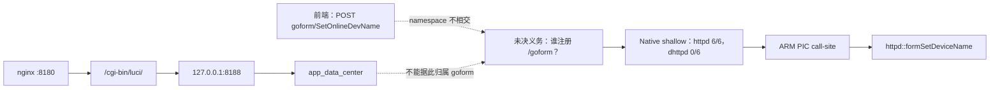
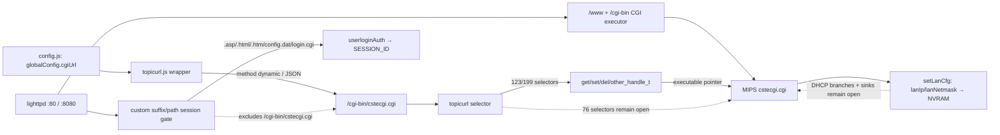

# 通信测绘研究案例库

> 文档 ID：FM-CASEBOOK
> 状态：持续追加
> 首个案例：Tenda AC9 split Web stack

研究案例库用于保存“为什么必须做固件内部测绘”以及“系统如何避免错误归属”的
可复现实例。它不是成功截图集合，也不是漏洞故事集。每个案例同时保存初始可见
事实、当时不能下结论的原因、产生的未决义务、后续关闭义务的证据、反事实错误
路径和结论局限。

机器可读 Interface 是：

```text
build_research_case(ResearchCaseInput) -> ResearchCase
validate_research_case_corpus(tuple[ResearchCase, ...]) -> CorpusValidation
```

案例为内容寻址对象。未知证据引用、重复身份、阶段乱序、在创建前关闭义务、已
解决义务缺少证据都会拒绝构建。Corpus gate 要求至少两条独立证据线，并要求
反事实、论文用途和局限，避免把单一字符串命中包装成论文案例。

## 1. AC9：同一固件内的两套 Web 通信分支

### 1.1 研究问题

前端明确构造 `POST goform/SetOnlineDevName`，但已发现的 nginx 配置只暴露
`/cgi-bin/luci/` 和 `/download/`。此时究竟应分析 `app_data_center`、`dhttpd`
还是 `httpd`？

### 1.2 证据演进



| 阶段 | 可以发布的结论 | 必须保留的限制 |
| --- | --- | --- |
| Frontend | UI 构造了 `/goform/SetOnlineDevName` | 不知道后端进程和 handler |
| Configuration | `:8180 → /cgi-bin/luci/ → 127.0.0.1:8188 → app_data_center` 是独立支持链 | nginx namespace 不包含 `/goform`，不能强行合并 |
| Native shallow | `httpd` 含 6/6 选定 action component，`dhttpd` 为 0/6 | 只用于排序，字符串和符号名不能证明 binding |
| Native deep | 同一 ARM PIC registrar call-site 将 route 放入 `r0`、handler 放入 `r1` | 证明静态注册，不等于运行时可达或认证状态 |
| 最终 | `SetOnlineDevName → bin/httpd → formSetDeviceName@0x60ee8` | 不外推为全部 AC9 route 的动态行为 |

关键点是 M1-05 的“未决”并没有被后来的成功覆盖。它记录了在仅有配置证据时
正确的认识状态；M1-10B 用更强证据关闭同一个 obligation。这种时间线可以在论文
中展示方法如何控制过早归因，而不仅是展示一个最终答案。

### 1.3 如果没有测绘会发生什么

- 只看前端路径，知道接口名却不知道应反编译哪个二进制；
- 只看 nginx，容易把同一固件内并存的 FastCGI 分支误当成 `/goform` 后端；
- 只看文件名，可能优先分析看起来更像 Web daemon 的 `dhttpd`；
- 只做 strings，能选出 `httpd` 候选，但仍无法证明 route 和 handler 的关系；
- 只有跨前端、配置、覆盖账本和 Native call-site 的证据链，才能把分析目标收敛到
  `bin/httpd` 内的具体 handler。

严谨的论文表述应是“在该案例中，缺少跨层测绘时，现有单线证据不足以确定目标
二进制；完整测绘恢复了可验证归属”，而不是无法由单个案例证明的绝对命题。

### 1.4 可用于论文的实验设计

该案例适合作为：

1. motivating example：展示路径风格和固件共存关系不足以确定后端；
2. ablation：Frontend-only、Config-only、+Native shallow、+Native deep 四级对照；
3. obligation-preservation case：衡量系统是否诚实保存未知，而不是输出空成功；
4. target-selection case：比较目标二进制 Top-K、定位时间和无效深分析预算；
5. false-merge case：验证 namespace 不相交时不会按厂商或 `/goform` 风格合并。

不能从此案例单独声称跨厂商泛化、动态可达性或漏洞存在。后续必须用共享 CGI、
HNAP、脚本—Native 混合、反向代理多跳和 Native-only 样本形成多案例证据。

## 2. X5000R：一个 CGI 入口承载多个逻辑操作

TOTOLINK X5000R V9.1.0u.6118 的页面不是为每个功能构造独立路径，而是把
`POST /cgi-bin/cstecgi.cgi` 作为物理入口，再在 JSON 的 `topicurl` 字段中选择
`getInitCfg`、`setLanCfg` 等逻辑操作。lighttpd 同时在 80/8080 提供 `/www/`，并
对 `/cgi-bin/` 启用 CGI 执行；对应的 MIPS ELF `www/cgi-bin/cstecgi.cgi` 中可重放
`getInitCfg` 和大量相邻动作字符串。



这个案例证明路径本身不是完整接口身份：若只按 URL 聚类，所有逻辑操作会被压成
一个接口；若只做 strings，又会把 selector 的存在误写成 handler binding。当前
系统已用 Frontend Asset Graph 将 `config.js` 中的 `globalConfig.cgiUrl` 绑定到
`topicurl.js` wrapper，并恢复 199 个静态枚举 operation；定义端与消费端仍保存为
不同 EvidenceAtom。真实 wrapper 通过 `this.type` 动态选择方法，因此不能把所有动作
写成 POST。随后 MIPS Inline Table Profile 从四个带大小的动态符号恢复 138 条注册，
为 123/199 个前端 selector 建立 124 条 handler proof；`getTelnetCfg` 的两条相同注册
作为重复事实保留。系统进一步对 76 个 Frontend-only 与 14 个 Native-only operation
做了有界归因：38 个由辅助功能页消费但 dispatcher 无注册、38 个只有 wrapper 声明、
3 个是原三文件前端图的范围缺口、1 个是 `loginAuth` / `userloginAuth` 后缀变体、10 个
只有 native registration 且无前端引用。这些是静态证据形状，不是版本、死代码或
替代处理主体的因果证明。随后系统将 `kr.js`、`wan_ie.html` 与
`advance/config.html` 纳入一等前端范围，分别恢复显式 `kr.request`、继承缺省 URL
且 payload 通过局部变量传递的 `kr.request`，以及 multipart upload property URL。
三个 scope gap 因此全部关闭，前端 operation 从 199 增至 203，差集变为 77/11。
新增的 `action=upload` 是外层 selector，`setting/setUploadSetting` 是内层 selector。
MIPS Nested Dispatch Profile 随后证明 `main` 以 `action=upload` 进入上传分支，提取
第二个 `&` 分段，经 `cutUploadFile` 处理 body，把该分段写入 JSON `topicurl`，在读取后
选择 `/` 后缀 `setUploadSetting`，再进入 `set_handle_t@0x0044a124` 并调用
`handler@0x0042bf14`。随后 Request Protection Profile 在另一个执行主体
`usr/sbin/lighttpd` 中证明五个 suffix/path gate、`userloginAuth → checkLoginUser`、
`SESSION_ID → form_get_idx_by_sessionid` 和 HTTP 302 拒绝链；`/advance/config.html`
进入该门，而 `/cgi-bin/cstecgi.cgi` 不匹配任何 gate。由此“upload 被这一个静态门
保护”的义务被证据拒绝，但真实服务装配、外部中介、运行时可达与漏洞可利用性仍未
确认。随后系统从 `sbin/rc:init_router` 进入 `start_services_once → start_httpd`，重放
`/usr/sbin/lighttpd -f /lighttp/lighttpd.conf` 的 argv 与 `_eval` 调用，再连接
`:80/:8080 → /www/ → /cgi-bin/ → www/cgi-bin/cstecgi.cgi`，关闭静态服务装配义务；
真实启动与请求可达仍保持开放。对
`setLanCfg@0x004209b8`，系统进一步从
dynamic MIPS GOT、`jalr` delay slot 和寄存器 provenance 证明
`lanIp→lan_ipaddr`、`lanNetmask→lan_netmask` 两条请求参数—配置状态链，并在
`0x00420ad8` 的首个条件分支停止；DHCP 分支和敏感 sink 仍未确认。

论文中可将它用于 shared-endpoint operation identity、path-only/单资源消融，以及
“跨资源义务关闭、Native 子集绑定、差集反向驱动 Producer 深化、multipart nested dispatch 关闭、跨二进制保护范围排除、静态服务装配关闭、局部 value-flow 关闭但分支后缀仍开放”的阶段性案例。完成前端范围后仍有 10 个具备 native registration 和 handler、但没有已观察前端引用的 operation；它们作为“潜在隐藏接口”首个集合持续记录，而不是被自动解释为后门。不能据此声称动态 selector 全集、77/11 剩余差集的运行时原因、真实运行时可达、整体认证状态或漏洞数据流已确认。`loginAuth` 负例还可用于说明 substring 搜索为何不能替代接口身份边界。

## 3. OpenWrt AC9：URL 消失不等于功能删除

同一 Tenda AC9 target 的 OpenWrt 18.06.7 与 19.07.8 提供了版本通信架构迁移案例。旧版可见 `/admin/status/realtime/*`、network status、flashops 与 UCI confirm 等服务端 LuCI Lua route；新版的前端资源则大量声明 `rpc.declare({object, method, params})`，形成 system、network、file、uci、iwinfo、luci-rpc 等 `ubus://object/method` 逻辑操作。

如果只比较 URL，结论会是“22 个路由删除”；加入前端 RPC 语义后，更合理的研究假设是控制面从服务端 Lua 路由向前端 JSON-RPC/ubus 迁移。M1-25 又把其中 53 个去重逻辑操作继续向后端推进：`ubus://luci/getFeatures` 可静态绑定到 `usr/libexec/rpcd/luci` 的 Lua method table；`ubus://luci-rpc/getBoardJSON` 与 `ubus://file/read` 分别只形成 `luci.so`、`file.so` Native plugin 候选，等待注册表或调用点确认；`ubus://hostapd.{dynamic}/del_client` 则与 `luci-base.json` 的 `hostapd.* / del_client / write` ACL 相交，但没有在声明制品范围中找到 owner，因此保留运行时归属义务。

这个链条提供了另一个适合论文的反例：ACL 允许某操作，不等于 ACL 文件实现该操作；二进制内同时出现 `file` 与 `read`，也不等于任意包含这些字符串的插件就是 handler。系统曾观察到 `luci.so` 的偶然字符串共现，最终用保守插件身份先验排除了这条噪声关系。当前报告包含 25 条静态 exec-plugin binding、30 条 Native plugin candidate、72 条 ACL grant、18 条 runtime-owner obligation 与 30 条 Native registration-table obligation。

这个假设仍受 coverage 约束：动态模板只证明接口族，不证明具体 `hostapd` 实例；Native 候选未经过 Ghidra 注册表重放，`request.* / L.url` 也尚未完整恢复。因此当前目录保持 partial，不能声称完整功能对应、运行时可达、认证结果、漏洞修复或可利用性。

论文可用它展示 path-only diff、ACL-as-owner 与 string-co-occurrence 三种消融失败，以及 Coverage Ledger 如何阻止“分析器漏报 → 固件功能删除”的错误因果。固定制品、解包谱系、候选与参数差异见 [M1-24 机器报告](./samples/m1-24-openwrt-ac9-version-diff.json)，执行主体与访问链见 [M1-25 机器报告](./samples/m1-25-openwrt-ac9-ubus-backend.json)。

## 4. AC9：历史参数“漏检”如何反向修正 Producer

原厂 AC9 `15.03.05.19` 的 13 条版本化历史 expectation 首次与整根 Catalog 对照时，
`SetIPTVCfg/list`、`AdvSetLanip/lanMask`、`WifiBasicSet/security` 和
`SetRemoteWebCfg/remoteIp` 都呈现“接口已发现、参数未发现”。回到精确源码后发现，参数分别
位于 `R.pageModel.beforeSubmit` 或 `R.moduleModel.getSubmitData` 的对象载荷中；旧 Producer
只支持 module-model 内的查询串，因此这是 analyzer 语法覆盖缺口，不是固件缺少参数。

加入有界对象键提取后，当前 Catalog 从 79 增至 130 个参数，前三条 obligation 关闭；
RemoteWeb 的 `remoteIp` 也恢复。R2-04 随后从 `public.js` 的
`$.post(pageModel.setUrl, ...)` 建立跨资源 framework EvidenceAtom，为 31 个 page-model 接口
证明 POST，关闭最后一个结构化 method gap。时间线、Catalog Evidence ID、
13 条 expectation 与 exact/out-of-scope 版本依据见
[R2-03 完整记录](./progress/2026-08-09-r2-03-historical-expectation-diff.md)及
[机器差异报告](./samples/r2-03-vendor-tenda-ac9-historical-diff.json)。

更深一轮审计没有把 13 条结构化记录当作“全部历史漏洞”：平台中 AC9 产品级分母是 71 条，
其中 46 条尚无当前语义分析，9 条虽有分析但没有结构化通信事实，3 条只有参数，13 条才能进入
接口对照。当前 FirmEmuHub 制品另有 30 条高置信 `reproduced_on` 关联；这是样本级事实，不能与
71 条产品级集合相互替代。13 条历史路由中只有 3 条形成验证过的 route→handler binding；
精确版本 `SetSambaCfg` 虽有接口和参数，却仍只有 Native route clue，没有 handler binding。
完整阶段输出见 [R2-04 记录](./progress/2026-08-09-r2-04-ac9-framework-history-audit.md)。

R2-05 沿这个未决义务继续检查指令编码，发现旧 Adapter 只接受 `LDR [PC, +offset]`，而 Samba
注册块用 `LDR [PC, -offset]` 回指前方 literal pool。加入带 profile 版本隔离的双向解析后，
`SetSambaCfg → formSetSambaConf` 由 relocation、动态符号和同一 registrar callsite 共同证明；
AC9 已验证绑定从 45 增至 59，历史路由绑定从 3/13 增至 5/13。这个状态迁移证明上一阶段保留
“字符串不足以绑定”的判断是必要护栏，而不是失败：只有补齐指令级证明后才能晋级。

R2-06 又推翻了“59 条已绑定路由就是 registrar 全貌”：这 59 条仍由前端关联触发。新增无 anchor
枚举后，`httpd/dhttpd` 共恢复 185 条指令验证注册；与 completed `/goform/` 前端 action scope
比较得到 110 条 Native-only。`QuickIndex` 从 R2-03 的单一 symbol clue 先在 R2-05 获得绑定，
再在 R2-06 因前端 absence 进入潜在隐藏接口索引；`WizardHandle` 则暴露历史期望 handler 与当前
`fromWizardHandle` 的明确 mismatch。这个时间线不能倒写成初始分析已完整，也不能把 Native-only
直接解释为后门、活代码或未授权接口。

反事实包括：只展示最终 130 个参数会把初次失败倒写成始终成功；把所有 AC9 CVE 当当前制品
oracle 会把 `.14/.13` 接口误报成 `.19` 漏检；只做字符串搜索则会把
`/cgi-bin/DownloadCfg` 静默等同于历史 `.jpg` 路径。论文可用它展示 version-scoped oracle、
history-guided analyzer development 和 obligation 状态迁移。限制是未验证运行时、漏洞存在、
可利用性或跨版本代码谱系；历史记录本身也可能省略参数或 method。

## 5. 后续案例准入触发器

每轮测绘出现下列任一现象时，必须评估是否加入案例库：

- 同一固件存在多个 listener、Web daemon、代理或 IPC 分支；
- Frontend endpoint 与配置 namespace 不相交；
- 一个接口候选同时出现在多个二进制，负面覆盖证据改变了目标排序；
- 多个逻辑操作共享一个 CGI/HNAP/API endpoint，并由 selector 二次分发；
- 页面、脚本、模板、配置和 Native 之间存在三层以上跨制品链；
- 浅层证据看似充分，但深分析推翻候选或改变 handler 归属；
- 未决义务跨越多个分析阶段后被解决、拒绝或保持开放；
- 漏洞描述中的接口与真实固件内部实现、版本或补丁结构存在明显偏差。

准入不是要求案例必须成功解决。一个证据充分、局限明确且仍然 open 的案例同样
有研究价值；但不得把 open 写成 supported。

## 6. 案例模板

每个案例至少包含：

| 字段 | 含义 |
| --- | --- |
| Firmware Artifact SHA-256 | 固定样本身份，不能只写型号和文件名 |
| architecture tags | 通信结构，不是漏洞功能分类 |
| research question | 当时真正未知的问题 |
| evidence references | 捕获后的来源制品 SHA、规范相对路径、精确 locator、Producer/version、capability；外部公告也必须先成为可寻址制品，不直接保存易变 URL |
| claims | `supported / unresolved / rejected`，逐条引用证据 |
| stages | 按发生顺序保存认识演进 |
| obligations | 创建、关闭或保持开放的能力缺口 |
| counterfactuals | 不做该层分析时会出现的具体错误 |
| paper uses | 可支撑的图、实验或论点 |
| limitations | 案例不能证明的内容 |

生成命令：

```bash
PYTHONPATH=src python scripts/build_mapping_research_cases.py
```

当前机器可读记录见
[AC9/X5000R research-case corpus](./samples/m1-12-research-case-corpus.json)。
