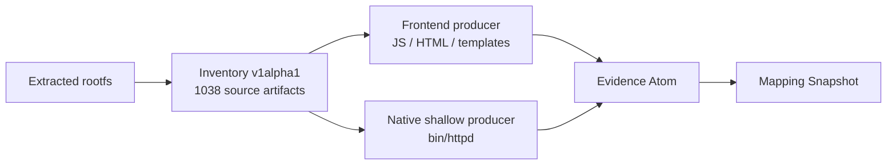

# Tenda AC9：M1-02 完整 rootfs 清单说明

> 工作项：M1-02
> 样本角色：development
> 机器可读摘要：[`tenda-ac9-m1-inventory-summary.json`](./tenda-ac9-m1-inventory-summary.json)

## 1. 输入边界

输入是 FirmEmuHub `BM-2024-00012` 的已解包 `squashfs-root`，不是原始厂商固件。因此本例能验证“安全生成源制品清单”，不能验证“自动解密、分区和 SquashFS 解包”。

运行：

```bash
PYTHONPATH=src python3 -m firmatlas.mapping inventory \
  ../iot_seedintelligentanalysis/_tenda_ac9.zip.extracted/squashfs-root \
  --sample-limit 3
```

## 2. 中间输出

```json
{
  "coverage_status": "completed",
  "inventory_sha256": "f425a98b9b7f4143a3b6b979631abe0715e3fc03773a656e1ee4455716ca8b4d",
  "observed_count": 1038,
  "processed_count": 1038,
  "processed_bytes": 73075984,
  "expanded_bytes": 0,
  "diagnostic_codes": []
}
```

`observed_count == processed_count` 且没有诊断，所以声明范围为 `completed`。这只表示完成了已解包目录的清单策略，不表示已识别其中所有组件、接口或通信关系。

## 3. 与 M1-01 证据重放的衔接

| 路径 | 大小 | SHA-256 | 后续用途 |
| --- | ---: | --- | --- |
| `webroot_ro/js/static_route.js` | 11,206 | `9bd1ff64…82b` | Frontend 请求与 `list` 参数 |
| `webroot_ro/js/online_list.js` | 15,385 | `dd06a5b7…f87` | `mac` / `devName` 参数 |
| `bin/httpd` | 982,880 | `2fd5c92e…02b` | Native handler 名称与绑定义务 |

三个摘要与 M1-01 人工重放一致，证明后续 EvidenceSpan 可以通过完整 Inventory 定位同一内容，不再依赖临时三文件清单。



## 4. 样本驱动的设计微调

首次列表中出现了 `_init.extracted/57145.tar` 等带 `.tar` 后缀的文件。内容检查显示它们不是可识别归档，所以 Inventory 正确保留为普通 `file`，没有根据扩展名盲目展开。这验证了“不信任扩展名”的必要性。

同时，fixture 反向推动了以下微调：

- symlink 逃逸和归档路径穿越会安全拒绝并降级为 `partial`；
- hardlink 保留两个路径，但相同 inode 只读取一次；
- ZIP 成员使用临时文件分块摘要，不把大成员整体留在内存；
- 文件数、原始读取、归档展开和递归深度分别受限；
- CRC 损坏、路径 collision 和特殊节点不会伪装成空结果。

## 5. 已知限制与下一步

- 内置递归归档识别当前只支持 ZIP；
- TAR、cpio、SquashFS、UBI/UBIFS 和厂商封装需要隔离解包 Adapter；
- Inventory 尚未发布 MIME/文件类型、权限位、uid/gid 或 ELF 架构；
- M1-03 需要将 Inventory entry 与类型化 EvidenceSpan 绑定；
- AC9 是 development 样本，该结果不能代替 HNAP、共享 CGI 和脚本后端验证。
