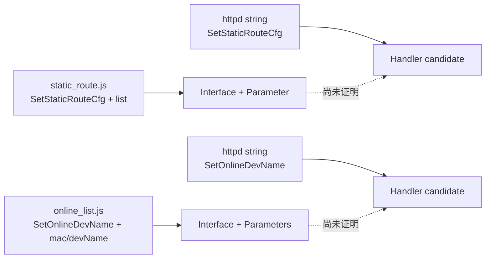

# Tenda AC9：M1 Snapshot 中间过程说明

本例用于解释 Mapping Snapshot 合同和“线索—证据—义务”过程，不是自动 mapper 的性能结果。完整机器可读输出位于 [`tests/fixtures/mapping/tenda_ac9_m1_snapshot.json`](../../../tests/fixtures/mapping/tenda_ac9_m1_snapshot.json)。

## 1. 输入范围

候选来源是 FirmEmuHub `BM-2024-00012`。本地已有解包目录，M1 人工回放只检查三个制品：

| 制品 | SHA-256 | 目的 |
| --- | --- | --- |
| `webroot_ro/js/static_route.js` | `9bd1…82b` | 静态路由请求与 `list` 序列化 |
| `webroot_ro/js/online_list.js` | `dd06…f87` | 在线设备改名请求和参数 |
| `bin/httpd` | `2fd5…02b` | Native route/handler 名称线索 |

该选定清单的规范摘要为 `84747a…3f0`。它不是完整 rootfs inventory，因此 Snapshot 必须是 `partial_success`。

## 2. 前端线索

`static_route.js` 的页面模型直接出现：

```text
getUrl: goform/GetStaticRouteCfg
setUrl: goform/SetStaticRouteCfg
```

同一文件把多条路由编码为：

```text
list=<network>,<mask>,<gateway>,<wan>~...
```

因此可以支持：

- POST form 接口候选 `/goform/SetStaticRouteCfg`；
- request/form 参数 `list`；
- Interface `accepts` Parameter 关系。

但前端的 IP/掩码校验不能直接证明后端实施同样约束，这部分后续必须单独恢复。

`online_list.js` 构造：

```text
mac=<macAddress>&devName=encodeURIComponent(<newName>)
POST goform/SetOnlineDevName
```

由此确认 `mac` 与 `devName` 的位置、方向和编码线索。其他页面也引用相同接口，未来 producer 应将它们作为多源证据合并，而不是创建重复接口。

## 3. Native 线索

32-bit ARM stripped `bin/httpd` 的字符串区域同时出现：

```text
SetStaticRouteCfg
SetOnlineDevName
GetStaticRouteCfg
...
```

它能支持 `mentions_handler_name`，但字符串共现不能证明：

- 哪个函数注册该名字；
- `/goform/<name>` 是否直接映射同名函数；
- handler 是否读取前端观察到的参数；
- auth、状态和危险 sink 是否可达。

所以输出只创建两个 `handler_identity` 候选，状态为 `unknown`，没有创建 `binds_to` 关系。

## 4. 线索汇合与未决义务



虚线被表达为两个 `binds_handler` Obligation，而不是关系事实。另一个 Obligation 要求恢复后端如何解析 `list` 元组。

## 5. 可复现输出

运行：

```bash
make mapping-example
```

摘要应包含：

```json
{
  "status": "partial_success",
  "interface_count": 2,
  "parameter_count": 3,
  "handler_count": 2,
  "relation_count": 3,
  "evidence_count": 7,
  "open_obligation_count": 3
}
```

这里最重要的结果不是“发现了两个接口”，而是系统能够准确解释：哪些已经有直接证据、哪些只是候选、还需要什么分析才能晋级。

## 6. 本轮反思

### 已验证的设计

- Interface、Parameter、Handler candidate 可以在同一 Snapshot 表达不同证据状态；
- Coverage 能说明这是三文件人工回放，不冒充全固件扫描；
- Obligation 可以把跨层缺口转成下一轮可调度工作；
- 模型完全关闭时仍可发布有效部分结果。

### 需要微调

- 后续需要把 `Exposed Interface` 和共享 endpoint 内的 `Interface Operation` 分开落到实体字段，而不只编码在 canonical string；
- `locator` 当前是可读字符串，M1-03 应升级为类型化 text/binary/AST locator；
- 参数 `list` 的复合 schema 需要独立 Message Shape，而不是塞进 `object_value`；
- handler candidate 与已绑定 Handler 的状态最好使用 binding 轴，而不只依靠统一 ClaimStatus；
- 完整 Snapshot 还需要开始/结束时间、父快照和 analyzer cache fingerprint。

这些调整已进入下一轮 M1-02/M1-03 的设计输入，不能在后续实现中静默改变合同。

